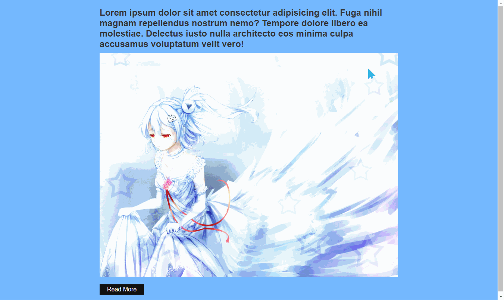

# 快视弹窗
==教程地址==：[原文地址（YouTube）](https://www.youtube.com/watch?v=snhpoxtLugU)

==B站教程==：[原文转载（bilibili）](https://www.bilibili.com/video/av80334574/)

**两个视频的内容相同，第二个为转载**

## 效果图
>

## 代码区

### html
```html
<div class="container" id="blur"> <!---主窗体-->
  <div class="content">
    <h2>Lorem ipsum dolor sit amet consectetur adipisicing elit. Fuga nihil magnam repellendus nostrum nemo? Tempore dolore libero ea molestiae. Delectus iusto nulla architecto eos minima culpa accusamus voluptatum velit vero!</h2>
    
    <a href="#" onclick="toggle()">Read More</a> <!--主窗体触发事件（显示弹窗）-->
  </div>
</div>
<div id="popup"> <!---弹出窗体-->
  <h2>Lorem ipsum dolor sit amet</h2>
  <p>Lorem ipsum dolor sit amet consectetur adipisicing elit. Fuga nihil magnam repellendus nostrum nemo? Tempore dolore libero ea molestiae. Delectus iusto nulla architecto eos minima culpa accusamus voluptatum velit vero!</p>
  <a href="#" onclick="toggle()">Close</a><!--弹出窗体触发事件（关闭）-->
</div>
```
### CSS
```css
*{
    margin: 0; /*外边距*/
    padding: 0; /*内边距*/
    box-sizing: border-box; /*设置border为宽高内部*/
    font-family: Arial, Helvetica, sans-serif; /*字体*/
}
.container{
    position: relative; /*元素定位为相对定位*/
    width: 100%; /*宽度*/
    min-height: 100vh; /*最小高度*/
    display: flex; /*弹性盒*/
    justify-content: center; /*弹性盒主轴（X）对其方式*/
    align-items: center; /*弹性盒交叉轴（Y）对齐方式*/
    background: rgb(116, 185, 255);/*背景颜色*/
    transition: 0.5s; /*过度时间（此处为简写）全写：transition-duration*/
    padding: 20px; /*内边距*/
}
.container#blur.active{
    filter: blur(20px); /*滤镜：模糊20px*/
    pointer-events: none; /*阻止元素的点击事件*/
    user-select: none; /*用户是否可以选择文本*/
}
.container .content{
    position: relative; /*生成相对定位*/
    max-width: 800px; /*最大宽度*/
}
h2{
    font-weight: 600; /*字体粗细*/
    margin-bottom: 10px; /*内下边距*/
    color: #333; /*字体颜色*/
}
.container .content img{
    max-width: 100%; /*最大宽度*/
    display: block; /*块元素*/
}
a{
    position: relative; /*相对定位*/
    padding: 5px 20px; /*内边距 上下5px 左右20px*/
    display: inline-block;/*行内块元素*/
    margin-top: 20px; /*外上边距*/
    text-decoration: none; /*文本修饰（无下划线）*/
    color: #fff;/*字体颜色*/
    background: #111;/*背景颜色*/
}
#popup{
    position:fixed; /*绝对定位*/
    top:40%; /*距上部*/
    left: 50%; /*距左部*/
    transform: translate(-50%,-50%); /*2D转换*/
    width: 600px; /*宽度*/
    padding: 50px; /*内边距*/
    box-shadow: 0 5px 30px rgba(0,0,0,0.30); /*元素阴影 X偏移 Y偏移 阴影模糊半径 阴影颜色*/
    background-color: #fff; /*背景颜色*/
    visibility: hidden; /*隐藏元素*/
    opacity: 0; /*不透明度*/
    transition: 0.5s; /*过渡时间*/
}
#popup.active{
    top:60%; /*距上部*/
    visibility: visible; /*显示元素*/
    opacity: 1; /*不透明度*/
    transition: 0.5s; /*过渡时间*/
}
```
### JS
```javascript
function toggle () {
  var blur=document.getElementById("blur"); // 根据id获取元素
  blur.classList.toggle("active"); // 切换指定id对应的class
  var popup=document.getElementById("popup"); // 同上
  popup.classList.toggle("active"); // 同上
}
```
## 效果图请看原文地址或者B站转载
==教程地址==：[原文地址（YouTube）](https://www.youtube.com/watch?v=snhpoxtLugU)

==B站教程==：[原文转载（bilibili）](https://www.bilibili.com/video/av80334574/)