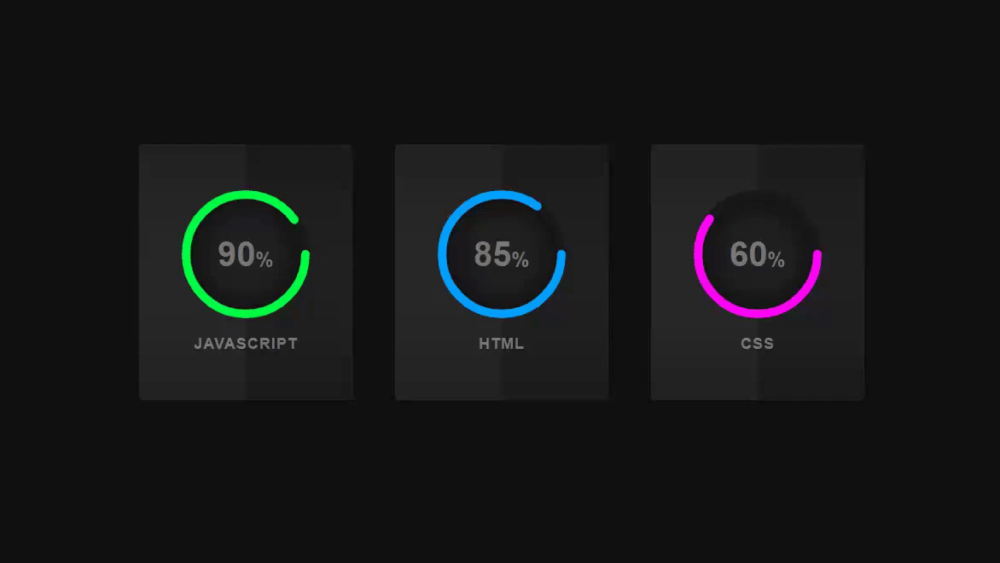

# 快视弹窗
==教程地址==：[原文地址（YouTube）](https://www.youtube.com/watch?v=Ft73g5Kyknw)
==B站教程==：[原文转载（bilibili）](https://www.bilibili.com/video/av80334574/)
## 效果图


**两个视频的内容相同，第二个为转载**

## 代码区

### html
```html
<div class="container">
    <!--第一个圆-->
    <div class="card">  
        <div class="box">
            <div class="percent">
                <svg> <!--图形容器-->
                    <circle cx="70" cy="70" r="70"></circle>
                    <!--x,y为圆心定位，r为半径--> <!--底圆-->
                    <circle cx="70" cy="70" r="70"></circle> <!--进度条圆-->
                </svg>
                <div class="number">
                    <h2>90<span>%</span></h2> <!--圆内百分比-->
                </div>
            </div>
            <h2 class="text">JavaScript</h2> <!--圆下文字-->
        </div>
    </div>
    <!--第二个圆-->
    <div class="card">
        <div class="box">
            <div class="percent">
                <svg>
                    <circle cx="70" cy="70" r="70"></circle>
                    <circle cx="70" cy="70" r="70"></circle>
                </svg>
                <div class="number">
                    <h2>85<span>%</span></h2>
                </div>
            </div>
            <h2 class="text">Html</h2>
        </div>
    </div>
    <!--第3个圆-->
    <div class="card">
        <div class="box">
            <div class="percent">
                <svg>
                    <circle cx="70" cy="70" r="70"></circle>
                    <circle cx="70" cy="70" r="70"></circle>
                </svg>
                <div class="number">
                    <h2>60<span>%</span></h2>
                </div>
            </div>
            <h2 class="text">CSS</h2>
        </div>
    </div>
</div>
```

### CSS
```css
*{ /*所有元素*/
    margin: 0; /*外边距*/
    padding: 0; /*内边距*/
    font-family: Arial, Helvetica, sans-serif; /*字体样式*/
}
body{
    display: flex; /*盒模型*/
    justify-content: center; /*主轴排序（X）*/
    align-items: center; /*子项Y轴排序*/
    min-height: 100vh; /*最小高度*/
    background-color: #101011; /*背景原色*/
}
.container{
    position: relative; /*相对定位*/
    display: flex; /*盒模型*/
    width: 900px; /*宽度*/
    justify-content:space-around; /*X轴排序各项留有空白*/
}
.container .card{
    position: relative; /*相对定位*/
    width: 250px; 
    background: linear-gradient(0deg,#1b1b1b,#222,#1b1b1b); /*线性渐变:(角度，色值1,....,色值n)*/
    display: flex;
    justify-content: center; /*X轴对齐方式*/
    align-items: center; /*纵轴子项对齐方式*/
    height: 300px;
    border-radius: 4px; /*圆角边框*/
    text-align: center; /*文本对齐方式*/
    overflow: hidden; /*溢出隐藏*/
    transition: 0.5s; /*动画过渡事件*/
}
.container .card:hover{ /*鼠标悬停时*/
    transform: translateY(-10px); /*Y轴偏移*/
    box-shadow: 0 15px 135px rgba(0,0,0,0.5); /*阴影:(水平阴影，垂直阴影，阴影大小，阴影颜色)*/
}
.container .card::before{ /*元素之前插入内容*/
    content: ''; /*插入元素内容*/
    position: absolute; /*绝对定位*/
    top:0; /*距上部*/
    left: -50%; /*距左部*/
    width: 100%; 
    height: 100%;
    background: rgba(255,255,255,0.03); /*带透明度的背景色*/
    pointer-events: none; /*鼠标事件禁用*/
    z-index: 1; /*重叠时位置（越小越在下面）*/
}
.percent{
    position: relative; /*相对定位*/
    width: 150px;
    height: 150px;
    border-radius:50% ; /*边框圆形角度*/
    box-shadow: inset 0 0 50px #000; /*阴影*/
    background: #222;
    z-index: 1000; /*重叠时位置（越小越在下面）*/
}
.percent .number{
    position: absolute; /*绝对定位*/
    top:0;
    left: 0;
    width: 100%;
    height: 100%;
    display: flex;
    justify-content: center; /*X轴排序方式*/
    align-items: center; /*纵轴子元素排序方式*/
    border-radius: 50%;

}
.percent .number h2{
    color: #777; /*字体颜色*/
    font-weight: 700; /*字体粗细*/
    font-size: 40px; /*字体大小*/
    transition: 0.5s; /*过渡时间*/
}
.card:hover .percent .number h2{ /*当鼠标悬停到card上时*/
    color: #fff;
    font-size: 60px;
}
.percent .number h2 span{
    font-size: 24px;
    color: #777;
}
.card:hover .percent .number h2 span{ /*当鼠标悬停到card上时*/
    color: #fff;
}
.text{
    position: relative; /*相对定位*/
    color: #777;
    margin-top: 20px;
    font-size: 18px;
    font-weight: 700;
    letter-spacing: 1px; /*字符间间距*/
    text-transform: uppercase; /*转换为大写字母*/
    transition: 0.5s;
}
.card:hover .text{ /*当鼠标悬停到card上时*/
    color: #fff;
}
svg{
    position: relative; /*相对定位*/
    width: 150px;
    height: 150px;
    z-index: 999;

}
svg circle{
    width: 100%;
    height: 100%;
    fill: none;
    stroke: #191919; /*线的颜色*/
    stroke-width: 10; /*线的宽度*/
    stroke-linecap: round; /*线的两端样式，此种为半圆线头*/
    transform: translate(5px,5px); /*2D变换（x,y）*/
}
svg circle:nth-child(2){ /*为底的线*/
    stroke-dasharray:440; /*创建背景圆*/
    transition: 0.5s;
}
/*此处的440为长度，单数值代表实线的长度，双数值代表虚线的长度，一个值时自动复制双数*/
.card:nth-child(1) svg circle:nth-child(2){
    stroke-dashoffset: calc(440 - (440 * 90) / 100); /*相对于绘制的起点偏移的量*/
    stroke:#00ff43; /**/
}
.card:nth-child(2) svg circle:nth-child(2){
    stroke-dasharray: 440; /**/
    stroke-dashoffset: calc(440 - (440 * 85) / 100);
    stroke:#00a1ff; 
}
.card:nth-child(3) svg circle:nth-child(2){
    stroke-dashoffset: calc(440 - (440 * 60) / 100);
    stroke:#ff04f7;
}
.card:hover:nth-child(1) svg circle:nth-child(2){
    stroke-dashoffset: calc(-440 + (440 * 90) / 100); /*相对于绘制的起点偏移的量*/
    stroke:#FF00BC; /**/
}
.card:hover:nth-child(2) svg circle:nth-child(2){
    stroke-dashoffset: calc(-440 + (440 * 85) / 100);
    stroke:#FF5E00; 
}

.card:hover:nth-child(3) svg circle:nth-child(2){
    stroke-dashoffset: calc(-440 + (440 * 60) / 100);
    stroke:#00FB08;
}

/*关于stroke的理解：请看https://juejin.im/post/5c8db3175188257e252a49da*/
```
## JS
```javascript
//无
```
## 效果图请看原文地址或者B站转载
==教程地址==：[原文地址（YouTube）](https://https://www.youtube.com/watch?v=Ft73g5Kyknw)
==B站教程==：[原文转载（bilibili）](https://www.bilibili.com/video/av80334574/)
