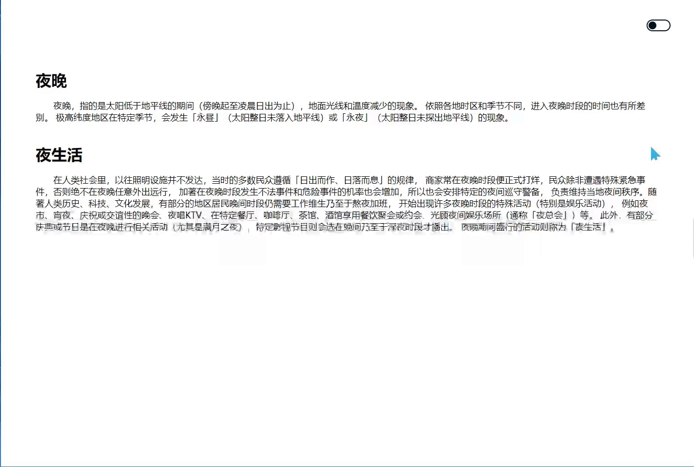

# 黑夜模式
==教程地址==：[原文地址（YouTube）](https://youtu.be/PPhCJewgI4Y)

==B站教程==：[原文转载（bilibili）](https://www.bilibili.com/video/av80590623/)

**两个视频的内容相同，第二个为转载**
## 演示


## 代码区

### html
```html
    <div class="toggle"></div>
    <div class="main">
        <h1>夜晚</h1>
        <p> 夜晚，指的是太阳低于地平线的期间（傍晚起至凌晨日出为止），地面光线和温度减少的现象。
            依照各地时区和季节不同，进入夜晚时段的时间也有所差别。
            极高纬度地区在特定季节，会发生「永昼」（太阳整日未落入地平线）或「永夜」（太阳整日未探出地平线）的现象。
        </p>
        <br><br>
        <h1>夜生活</h1>
        <p> 在人类社会里，以往照明设施并不发达，当时的多数民众遵循「日出而作、日落而息」的规律，
            商家常在夜晚时段便正式打烊，民众除非遭遇特殊紧急事件，否则绝不在夜晚任意外出远行，
            加著在夜晚时段发生不法事件和危险事件的机率也会增加，所以也会安排特定的夜间巡守警备，
            负责维持当地夜间秩序。随著人类历史、科技、文化发展，有部分的地区居民晚间时段仍需要工作维生乃至于熬夜加班，
            开始出现许多夜晚时段的特殊活动（特别是娱乐活动），
            例如夜市、宵夜、庆祝或交谊性的晚会、夜唱KTV、在特定餐厅、咖啡厅、茶馆、酒馆享用餐饮聚会或约会、光顾夜间娱乐场所（通称「夜总会」）等。
            此外，有部分庆典或节日是在夜晚进行相关活动（尤其是满月之夜），特定影视节目则会选在晚间乃至于深夜时段才播出。
            夜晚期间盛行的活动则称为「夜生活」。
        </p>
    </div>
```
### CSS
```css
body{
    margin: 0; /*外边距*/
    padding: 0;/*内边距*/
    font-family: sans-serif;/*字体样式*/
    transition: 1s; /*过渡时间*/
}
body.night{
    background: #00151f; /*背景颜色*/
}
.toggle{
    position: absolute; /*绝对定位*/
    top: 40px; /*距上*/
    right: 50px; /*距左*/
    background: #fff; /*背景*/
    border: 2px solid #00151f; /*边框*/
    width: 45px; /*宽*/
    height: 20px; /*高*/
    cursor: pointer; /*当光标处在位置时的样式，此处为链接样式*/
    border-radius: 20px; /*圆角*/
    transition: 0.5s; /*过渡时间*/
}
.toggle.active{ /*当点击到夜间按钮时*/
    background: #00151f;
    border: 2px solid #fff;
}
.toggle:before{ /*之后显示*/
    content: ""; /*文本*/
    position: absolute; /*绝对定位*/
    top: 2.3px;
    left: 2px;
    width: 16px;
    height: 16px;
    background: #00151f;
    border-radius: 50%;
    transition: 0.5s;
}
.toggle.active::before{ /*切换到夜间时的样式*/
    left: 25px;
    background: #fff;
}
.main{ /*主体内容*/
    margin: 10% auto;
    width: 90%;

}
.main h1{ 
    margin:  0 0 20px;
    padding: 0;
    color: #000;
    transition: 0.5s;
}
.main p{
    margin: 0;
    padding: 0;
    transition: 1.5s;
    color: #000;
    font-size: 18px;
    text-indent: 2em;
}
body.night .main h1,body.night .main p{ /*夜间模式的切换*/
    color: #fff;
}
```
### JS
```javascript
    /*jquery请自行下载*/
$(document).ready(function(){
    $('.toggle').click(function(){  //按钮点击事件
        $(".toggle").toggleClass("active"); //切换样式
        $("body").toggleClass("night"); //切换样式
    })
});
```
## 效果图请看原文地址或者B站转载
==教程地址==：[原文地址（YouTube）](https://youtu.be/PPhCJewgI4Y)

==B站教程==：[原文转载（bilibili）](https://www.bilibili.com/video/av80590623/)
