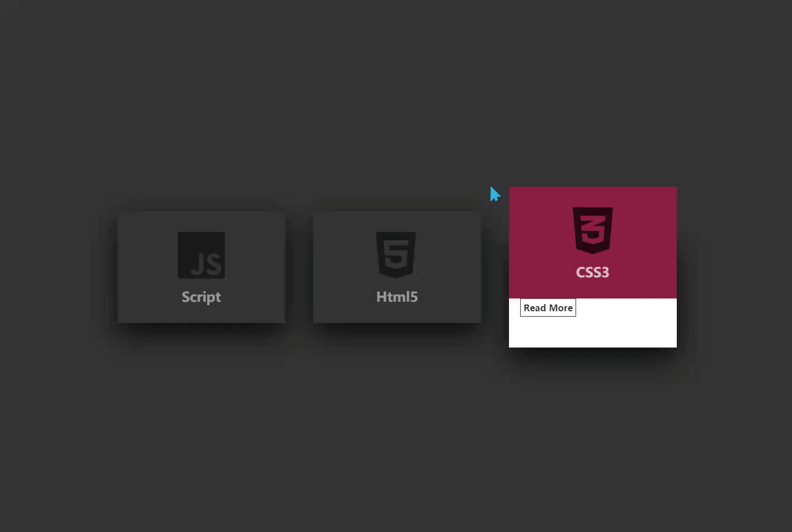

# 标题
==教程地址==：[原文地址（YouTube）](https://youtu.be/EZqhWu8GJ6U)

==B站教程==：[原文转载（bilibili）](https://www.bilibili.com/video/av80737284/)

**两个视频的内容相同，第二个为转载**

## 效果图
>

## 代码区

### html
```html
<div class="container">
    <div class="card"><!--第一个卡片-->
        <div class="face face1"> <!--显示页-->
            <div class="content"> <!--显示页内容-->
                <i class="fab fa-js fa-6x"></i>
                <h3>Script</h3>
            </div>
        </div>
        <div class="face face2"> <!--附页-->
            <div class="content">
                <p>JavaScript是一种具有函数优先的轻量级，解释型或即时编译型的编程语言。</p>
                <a href="#">Read More</a>
            </div>
        </div>
    </div>
    <div class="card"> <!--第二个卡片-->
        <div class="face face1">
            <div class="content">
                <i class="fab fa-html5 fa-6x"></i>
                <h3>Html5</h3>
            </div>
        </div>
        <div class="face face2">
            <div class="content">
                <p>HTML5是构建Web内容的一种语言描述方式。</p>
                <a href="#">Read More</a>
            </div>
        </div>
    </div>
    <div class="card"><!--第三个卡片-->
        <div class="face face1">
            <div class="content">
                <i class="fab fa-css3-alt fa-6x"></i>
                <h3>CSS3</h3>
            </div>
        </div>
        <div class="face face2">
            <div class="content">
                <p>CSS3是CSS（层叠样式表）技术的升级版本。</p>
                <a href="#">Read More</a>
            </div>
        </div>
    </div>
</div>
```
### CSS
```css
body{
    margin: 0; /*外边距*/
    padding: 0; /*内边距*/
    min-height: 100vh;  /*最小高度*/
    background: #333; /*背景颜色*/
    display: flex; /*盒模型*/
    justify-content: center; /*文档X轴布局*/
    align-items: center; /*文档Y轴布局*/
}
.container{
    width: 1000px; /*宽度*/
    position: relative; /*相对定位*/
    display: flex; /*盒模型*/
    justify-content: space-between; /*文档X轴内容与内容间空隙相等*/
}
.container .card{
    position: relative; /*相对定位*/
}
.container .card .face{ 
    width: 300px; 
    height: 200px; 
    transition: 0.5s; /*过渡时间*/
}
.container .card .face.face1{ 
    position: relative; 
    background: #333; 
    display: flex; 
    justify-content: center; 
    align-items: center; 
    z-index: 1; 
    transform: translateY(100px); /*2D转换，Y轴移动*/
} 
.container .card:hover .face.face1{ /*此处为card标签悬停时，内容1复位*/
    background: #ff0057; 
    transform: translateY(0); 
}
.container .card .face.face1 .content{
    opacity: 0.5; /*透明度*/
    transition: 0.5s; 
}
.container .card:hover .face.face1 .content{ /*此处为card标签悬停时，更改封面的透明度*/
    opacity: 1; /*透明度*/
}
.container .card .face.face1 .content h3{
    margin: 10px 0 0; 
    padding: 0; 
    color:#fff; 
    text-align: center; /*字体居中*/
    font-size: 1.5em; /*字体大小*/
}
.container .card .face.face2{
    position: relative; 
    background: #fff; 
    display: flex; 
    justify-content: center; 
    align-items: center; 
    padding: 20px; 
    box-sizing: border-box; /*设置盒子模型内布局，此处为元素的内边距盒边框不会影响最终大小*/
    box-shadow: 0 20px 50px rgba(0, 0, 0, 0.8); /*阴影*/
    transform: translateY(-100px); /*2D转换，Y轴移动*/
}
.container .card:hover .face.face2{ /*此处为card标签悬停时，内容2复位*/
    transform: translateY(0px); 
}
.container .card .face.face2 p{
    margin: 0; 
    padding: 0; 
}
.container .card .face.face2 a{
    margin:  15px 0 0; 
    display: inline-block; /*设置为行内块元素*/
    text-decoration: none; /*文字样式，此处为了删除下划线*/
    font-weight: 900; /*字体粗细*/
    color: #333; 
    padding: 5px; 
    border: 1px solid #333; 
}
.container .card .face.face2 a:hover{ /*此处为a标签悬停时*/
    background: #333; 
    color: #fff; 
}
```
### JS
```javascript
 //i标签可替换图片，内容请自行下载
```
==教程地址==：[原文地址（YouTube）](https://youtu.be/EZqhWu8GJ6U)

==B站教程==：[原文转载（bilibili）](https://www.bilibili.com/video/av80737284/)
