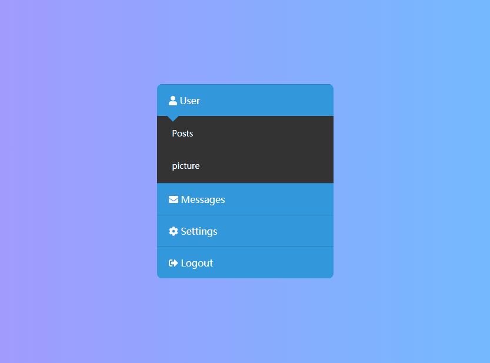

# CSS & HTML 手风琴菜单
==教程地址==：[原文地址（YouTube）](https://youtu.be/gnyYpX2nc1g)

==B站教程==：[原文转载（bilibili）](https://www.bilibili.com/video/av80818724/)

**两个视频的内容相同，第二个为转载**

## 效果图
>

## 代码区

### html
```html
<body>
    <div class="middle">
        <div class="menu">
            <li class="item" id="user">
                <a href="#user" class="btn"><i class="fa fa-user" aria-hidden="true"></i>
                    User</a>
                <div class="smenu">
                    <a href="#">Posts</a> <!--帖子-->
                    <a href="#">picture</a> <!--图片-->
                </div>
            </li>
            <li class="item" id="Messages">
                <a href="#Messages" class="btn"><i class="fa fa-envelope" aria-hidden="true"></i>
                    Messages</a> <!--留言内容-->
                <div class="smenu">
                    <a href="#">new</a> <!--新的-->
                    <a href="#">Sent</a> <!--已发送-->
                    <a href="#">Spam</a><!--垃圾箱-->
                </div>
            </li>
            <li class="item" id="Settings">
                <a href="#Settings" class="btn"><i class="fa fa-cog" aria-hidden="true"></i>
                    Settings</a> <!--设置-->
                <div class="smenu">
                    <a href="#">Password</a> <!--密码-->
                    <a href="#">Language</a> <!--语言-->
                </div>
            </li>
            <li class="item">
                <a href="#" class="btn"><i class="fa fa-sign-out-alt" aria-hidden="true"></i>
                    Logout</a> <!--退出-->
            </li>
        </div>
    </div>
```
### CSS
```css
*{
    margin: 0; /*外边距*/
    padding: 0; /*内边距*/
    font-family: sans-serif; /*字体设置*/
    list-style: none; /*清除默认样式*/
    text-decoration: none; /*文本修饰，(去除下划线)*/
}
body,html{
    min-width: 100%; /*最小宽度*/
    min-height: 100%; /*最大宽度*/
    background:linear-gradient(270deg,#74b9ff,#a29bfe); /*渐变(角度，颜色1，颜色2)*/
}
 /*.middle(中间)，menu(菜单)，item(项)，smenu(子菜单)*/
.middle{
    position: absolute; /*绝对定位*/
    top:50%; /*距上部*/
    left: 50%; /*距左部*/
    transform: translate(-50%,-50%); /*移动，此设置为把定位的元素中心作为定位点*/
}
.menu{
    width: 300px; /*宽度*/
    border-radius: 8px; /*圆角*/
    overflow: hidden; /*超出内容隐藏*/
}
.item{
    border-top: 1px solid #2980b9; /*上边框*/
    overflow: hidden;
}
.btn{
    display: block; /*块元素*/
    padding:  16px 20px; 
    background: #3498db; 
    color: #fff; /*字体颜色*/
    position: relative; /*相对定位*/
}
.btn::before{ /*之前添加*/
    content: ""; /*添加内容*/
    position: absolute; /*相对定位*/
    width: 14px; 
    height: 14px;
    background: #3498db; 
    left: 20px;
    bottom: -7px;
    transform: rotate(45deg); /*角度旋转*/
}
.btn i{
    margin-right: 10px; /*右外边距*/
}
.smenu{
    background: #333; 
    overflow: hidden; 
    transition:  0.5s; /*动画时间*/
    max-height: 0; /*最大高度*/
}
.smenu a{
    position: relative; /*相对布局*/
    display: block; /*块元素*/
    padding: 16px 26px; 
    color: #fff; 
    font-size: 14px; /*字体大小*/
    margin: 4px 0;
}
.smenu a::before{ /*之前添加，此处为子菜单a前面的蓝色线条*/
    content: ""; /*内容*/
    position: absolute; /*绝对布局*/
    width: 6px;
    height: 100%;
    background: #3498db;
    left:0;
    top:0;
    transition: 0.3s; /*过渡时间*/
    opacity: 0; /*透明度*/
}
.smenu a:hover::before{ /*悬停时*/
    opacity: 1; 
}
.item:target .smenu{ /*匹配:target属性里面的对应id的元素将其设置*/
    max-height: 10em; 
    /*详细内容见：https://developer.mozilla.org/zh-CN/docs/Web/CSS/:target*/
}
```
### JS
```javascript
 //图标请自行下载
```
==教程地址==：[原文地址（YouTube）](https://youtu.be/gnyYpX2nc1g)

==B站教程==：[原文转载（bilibili）](https://www.bilibili.com/video/av80818724/)
