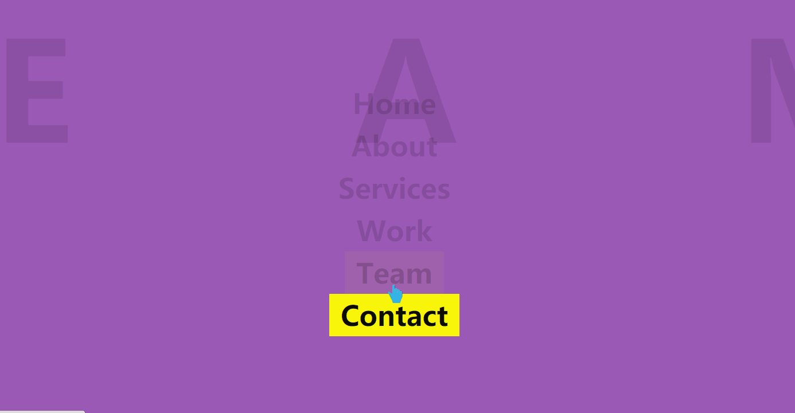

# 纯CSS制作动态背景随标题变换菜单
==教程地址==：[原文地址（YouTube）](https://youtu.be/hW0EVM12b5g)

==B站教程==：[原文转载（bilibili）](https://www.bilibili.com/video/av81126620/)

**两个视频的内容相同，第二个为转载**

## 效果图
>

## 代码区

### html
```html
<div class="navigation">
    <ul>
        <li><a href="#" data-text="Home">Home</a></li> <!--data-text为背景字体-->
        <li><a href="#" data-text="About">About</a></li>
        <li><a href="#" data-text="Services">Services</a></li>
        <li><a href="#" data-text="Work">Work</a></li>
        <li><a href="#" data-text="Team">Team</a></li>
        <li><a href="#" data-text="Contact">Contact</a></li>
    </ul>
</div>
```
### CSS
```css
*{
    margin: 0; /*外边距*/
    padding:0; /*内边距*/
    font-family:sans-serif; /**/
    box-sizing: border-box; /**/
}
.navigation{
    display:flex; /*盒模型*/
    justify-content:center; /*X轴对齐方式*/
    align-items:center; /*Y轴对齐方式*/
    min-height:100vh; /*最小高度*/
    overflow:hidden; /*超出内容*/
}
.navigation ul{
    position:relative; /*相对定位*/
}
.navigation ul li{
    text-align:center; /*字体居中*/
    list-style: none; /*清除默认样式*/
}
.navigation ul li a{
    color: #333; /*字体颜色*/
    text-decoration:none; /*字体样式，此处清除下划线*/
    font-size:3em; /*字体大小*/
    padding:5px 20px; /*内边距*/
    display:inline-flex; /*行内盒模型*/
    font-weight:700; /*字体粗度*/
    transition:0.5s; /*过渡时间*/
}
.navigation ul:hover li a {
    color:#0002;
}
.navigation ul:hover li:hover a{
    color:#000;
    background-color:#ff0;
}
.navigation ul:hover li a:before{
    height: 500vh;
    content:"";
    position:absolute; /*绝对定位*/
    top:0%;
    left:50%;
    display:flex;
    transform:translate(-50%,-50%); /*修改元素定位中心点*/
    justify-content:center;
    align-items:center;
    font-size:5em;
    color:rgba(0,0,0,0.1);
    z-index: -1; /*修改Z轴排序，类似于PS图层*/
    opacity:0; /*透明度*/
    font-weight:900;
    text-transform:uppercase; /*字体大写*/
    letter-spacing:500px; /*文本字符间距*/
    transition:letter-spacing 1s,top 0.5s; /*修改指定属性的过渡时间*/
}
.navigation ul li a:hover:before{
    content:attr(data-text); /*增加标签内容*/ /*详解：https://developer.mozilla.org/zh-CN/docs/Web/CSS/attr*/
    opacity:1; /*透明度*/
    top:50%;
    letter-spacing: 20px; /*字符间距*/
    width: 150vw;
    
}
.navigation ul li:nth-child(6n+1) a:before{ /*6个为一组，6-1*/
    background-color: #81ecec;
}
.navigation ul li:nth-child(6n+2) a:before{ /*6个为一组，6-2*/
    background-color: #2ecc71;
}
.navigation ul li:nth-child(6n+3) a:before{ /*6个为一组，6-3*/
    background-color: #e74c3c;
}
.navigation ul li:nth-child(6n+4) a:before{ /*6个为一组，6-4*/
    background-color: #f1c40f
}
.navigation ul li:nth-child(6n+5) a:before{ /*6个为一组，6-5*/
    background-color: #9b59b6;
}
.navigation ul li:nth-child(6n+6) a:before{ /*6个为一组，6-6*/
    background-color: #3498db;
}
```
### JS
```javascript

```
==教程地址==：[原文地址（YouTube）](https://youtu.be/hW0EVM12b5g)

==B站教程==：[原文转载（bilibili）](https://www.bilibili.com/video/av81126620/)
    