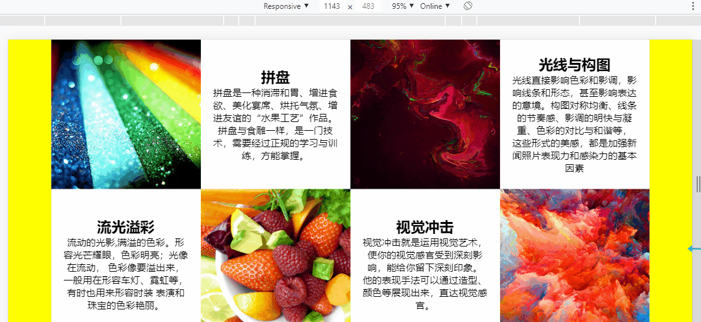
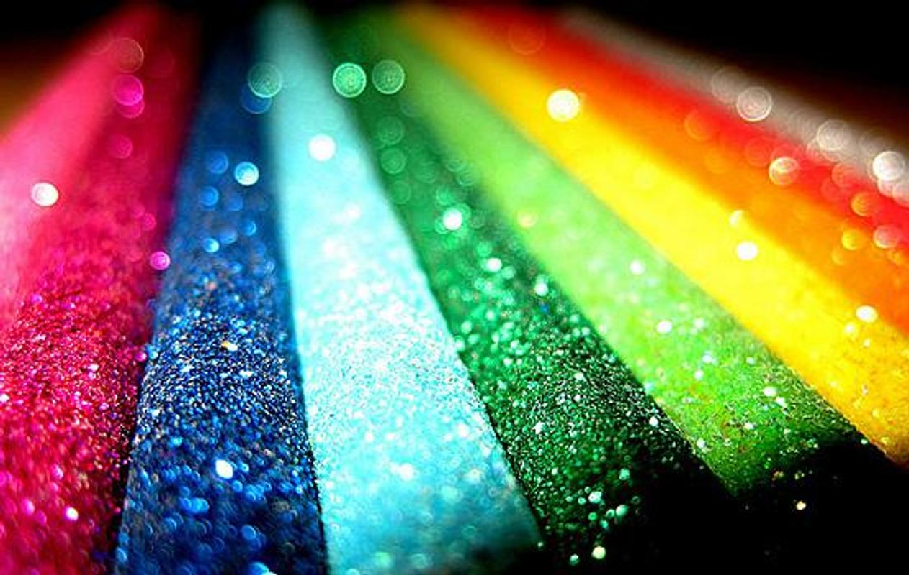
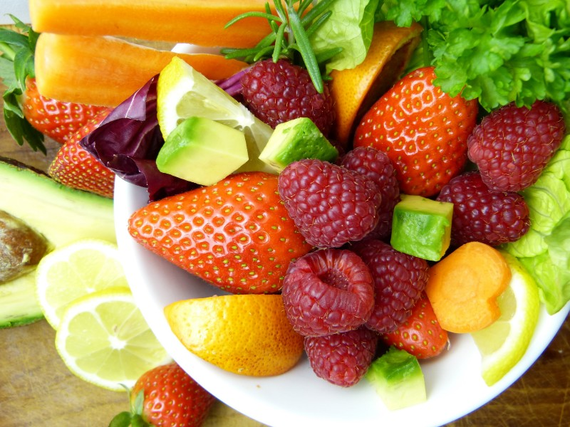
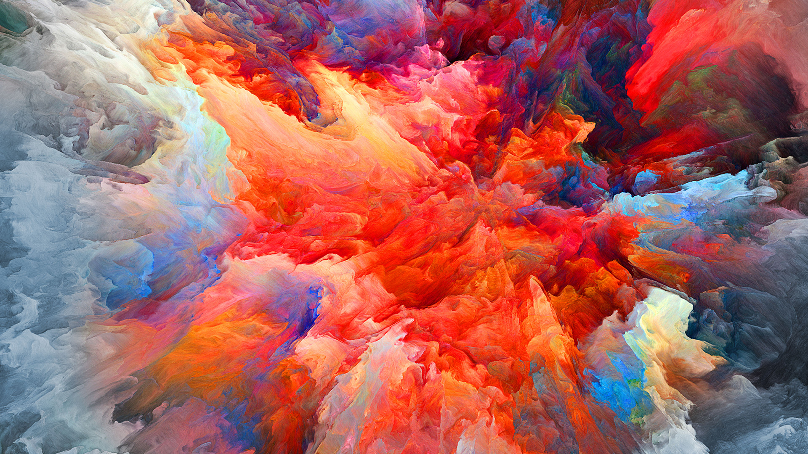

# CSS Flexbox的自适应框模型Web设计
==教程地址==：[原文地址（YouTube）](https://youtu.be/u5llIESEPqA)

==B站教程==：[原文转载（bilibili）](https://www.bilibili.com/video/av81662136)

**两个视频的内容相同，第二个为转载**

## 效果图
>

## 代码区

### html
```html
<div class="container">
    <div class="card">
        <div class="imgBx">
            
        </div>
        <div class="content">
            <div>
                <h2>流光溢彩</h2>
                <p>流动的光影,满溢的色彩。形容光芒耀眼，色彩明亮；光像在流动，
                    色彩像要溢出来，一般用在形容车灯、霓虹等，有时也用来形容时装
                    表演和珠宝的色彩艳丽。</p>
            </div>
        </div>
    </div>
    <div class="card">
        <div class="imgBx">
            
        </div>
        <div class="content">
            <div>
                <h2>拼盘</h2>
                <p>拼盘是一种消滞和胃、增进食欲、美化宴席、烘托气氛、增进友谊的“水果工艺”作品。
                        拼盘与食雕一样，是一门技术，需要经过正规的学习与训练，方能掌握。</p>
            </div>
        </div>
    </div>
    <div class="card">
        <div class="imgBx">
            
        </div>
        <div class="content">
            <div>
                <h2>视觉冲击</h2>
                <p>视觉冲击就是运用视觉艺术，使你的视觉感官受到深刻影响，能给你留下深刻印象。
                    他的表现手法可以通过造型、颜色等展现出来，直达视觉感官。</p>
            </div>
            </div>
    </div>
    <div class="card">
        <div class="imgBx">
            
        </div>
        <div class="content">
            <div>
                <h2>光线与构图</h2>
                <p>光线直接影响色彩和影调，影响线条和形态，甚至影响表达的意境。构图对称均衡、线条的节奏感、影调的明快与凝重、色彩的对比与和谐等，
                    这些形式的美感，都是加强新闻照片表现力和感染力的基本因素</p>
            </div>
        </div>
    </div>
</div>
```
### CSS
```css
*{
    margin: 0; /*外边距*/
    padding: 0; /*内边距*/
    box-sizing: border-box; /**/
    font-family: sans-serif; /*字体*/
}
body{
    display: flex; /*盒模型*/
    justify-content: center; /*主轴*/
    align-items: center; /*副轴*/
    min-height: 100vh; /*最小高度*/
    background: yellow; /*背景颜色*/
}
.container{
    position: relative; /*相对定位*/
    width: 1000px;
    display: grid; /*网格布局*/
    grid-template-columns: repeat(4,minmax(250px,1fr));  /*网格子元素的布局，重复（个数，大小）*/
    /*https://developer.mozilla.org/zh-CN/docs/Web/CSS/grid-template-columns*/
}
.container .card{
    position: relative;
    display: flex;
    flex-direction: column; /*盒模型以列方式布局*/
    background: #fff; 
}
.container .card:nth-child(2n+2){ /*2个为一组,其中第一个为一下格式*/
    flex-direction: column-reverse; /*列模式倒叙*/
}
.container .card .imgBx{
    position: relative;
    width: 250px;
    height: 250px;
    background: #000;
}
.container .card .imgBx img{
    width: 100%;
    height: 100%;
    position: absolute;
    top:0;
    left: 0;
    object-fit: cover; /*保持宽高比进行填充*/
    /*https://developer.mozilla.org/zh-CN/docs/Web/CSS/object-fit*/
}
.container .card .content{
    position: relative;
    width: 250px;
    height: 250px;
    display: flex;
    justify-content: center;
    align-items: center;
}
.container .card .content div{
    padding: 20px;
    text-align: center; /*文字居中*/
}
@media (max-width:1000px){ /*当宽度小于1000时更改*/
    .container{
        grid-template-columns: repeat(auto-fit,minmax(100%,1fr));
        margin: 50px;
    }
    .container .card{
        flex-direction: row; /**/
        margin: 10px 0;
    }
    .container .card:nth-child(even){
        flex-direction: row-reverse;
    }
    .container .card .imgBx,
    .container .card .content
    {
        width: 50%;
    }
}
@media (max-width:600px){ /*当宽度小于600时更改*/
    .container .card{
        flex-direction: column;
        margin: 10px 0;
    }
    .container .card:nth-child(even){
        flex-direction: column;
    }    
    .container .card .imgBx,
    .container .card .content
    {
        width: 100%;
    }
    .container .card .content{
        height: 100%;
    }
}
```
### JS
```javascript
 //无
```
==教程地址==：[原文地址（YouTube）](https://youtu.be/u5llIESEPqA)

==B站教程==：[原文转载（bilibili）](https://www.bilibili.com/video/av81662136)