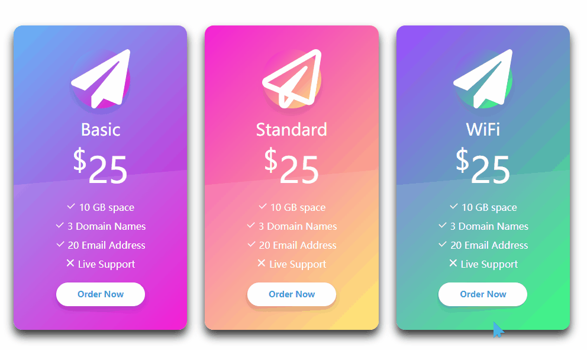

# 标题
==教程地址==：[原文地址（YouTube）](https://youtu.be/og2BwCm1m38)

==B站教程==：[原文转载（bilibili）](https://www.bilibili.com/video/av82004869/)

**两个视频的内容相同，第二个为转载**
## 效果图
>
## 代码区
> **以下代码为本人填写，转载请注明教程地址和本贴地址**
### html
```html
<!DOCTYPE html>
<html lang="en">
<head>
    <meta charset="UTF-8">
    <meta name="viewport" content="width=device-width, initial-scale=1.0">
    <meta http-equiv="X-UA-Compatible" content="ie=edge">
    <title>Document</title>
    <script src="js/all.js"></script>
    <link rel="stylesheet" href="css/all.css">
    <link rel="stylesheet" href="https://cdn.jsdelivr.net/npm/bootstrap@3.3.7/dist/css/bootstrap.min.css">
    <link rel="stylesheet" href="css/style.css">
</head>
<body>
    <section>
        <div class="container-fluid">
            <div class="container">
                <div class="row">
                    <div class="col-sm-4">
                        <div class="card text-center">
                            <div class="title">
                                <i class="fa fa-paper-plane"></i>
                                <h2>Basic</h2>
                            </div>
                            <div class="price">
                                <h4><sup>$</sup>25</h4>
                            </div>
                            <div class="option">
                                <ul>
                                    <li>
                                        <svg t="1578113732367" class="icon" viewBox="0 0 1024 1024" version="1.1" xmlns="http://www.w3.org/2000/svg" p-id="2529" width="16" height="16"><path d="M856.795 217.698L408.552 665.94 167.205 424.57 98.23 493.544l310.32 310.32L925.77 286.647z" p-id="2530" fill="currentColor"></path></svg>
                                        10 GB space
                                    </li>
                                    <li>
                                        <svg t="1578113732367" class="icon" viewBox="0 0 1024 1024" version="1.1" xmlns="http://www.w3.org/2000/svg" p-id="2529" width="16" height="16"><path d="M856.795 217.698L408.552 665.94 167.205 424.57 98.23 493.544l310.32 310.32L925.77 286.647z" p-id="2530" fill="currentColor"></path></svg>
                                        3 Domain Names
                                    </li>
                                    <li>
                                        <svg t="1578113732367" class="icon" viewBox="0 0 1024 1024" version="1.1" xmlns="http://www.w3.org/2000/svg" p-id="2529" width="16" height="16"><path d="M856.795 217.698L408.552 665.94 167.205 424.57 98.23 493.544l310.32 310.32L925.77 286.647z" p-id="2530" fill="currentColor"></path></svg>
                                        20 Email Address
                                    </li>
                                    <li>
                                        <svg t="1578113831507" class="icon" viewBox="0 0 1024 1024" version="1.1" xmlns="http://www.w3.org/2000/svg" p-id="2530" fill="currentColor" width="16" height="16"><path d="M598.050133 501.623467l265.693867-265.693867c26.385067-26.385067 26.453333-69.666133-0.2048-96.324267-26.8288-26.8288-69.802667-26.760533-96.3584-0.2048l-265.693867 265.693867-265.693867-265.693867c-26.555733-26.555733-69.495467-26.658133-96.3584 0.2048-26.658133 26.658133-26.589867 69.9392-0.2048 96.324267l265.693867 265.693867-265.693867 265.693867c-26.385067 26.385067-26.453333 69.666133 0.2048 96.3584 26.8288 26.8288 69.802667 26.760533 96.3584 0.2048l265.693867-265.693867 265.693867 265.693867c26.555733 26.555733 69.495467 26.658133 96.3584-0.2048 26.658133-26.658133 26.589867-69.9392 0.2048-96.3584L598.050133 501.623467 598.050133 501.623467z" p-id="3468"></path></svg>
                                        Live Support
                                    </li>
                                </ul>
                            </div>
                            <a href="#">Order Now</a>
                        </div>
                    </div>
                    <div class="col-sm-4">
                        <div class="card text-center">
                            <div class="title">
                                <i class="far fa-paper-plane"></i>
                                <h2>Standard</h2>
                            </div>
                            <div class="price">
                                <h4><sup>$</sup>25</h4>
                            </div>
                            <div class="option">
                                <ul>
                                    <li>
                                        <svg t="1578113732367" class="icon" viewBox="0 0 1024 1024" version="1.1" xmlns="http://www.w3.org/2000/svg" p-id="2529" width="16" height="16"><path d="M856.795 217.698L408.552 665.94 167.205 424.57 98.23 493.544l310.32 310.32L925.77 286.647z" p-id="2530" fill="currentColor"></path></svg>
                                        10 GB space
                                    </li>
                                    <li>
                                        <svg t="1578113732367" class="icon" viewBox="0 0 1024 1024" version="1.1" xmlns="http://www.w3.org/2000/svg" p-id="2529" width="16" height="16"><path d="M856.795 217.698L408.552 665.94 167.205 424.57 98.23 493.544l310.32 310.32L925.77 286.647z" p-id="2530" fill="currentColor"></path></svg>
                                        3 Domain Names
                                    </li>
                                    <li>
                                        <svg t="1578113732367" class="icon" viewBox="0 0 1024 1024" version="1.1" xmlns="http://www.w3.org/2000/svg" p-id="2529" width="16" height="16"><path d="M856.795 217.698L408.552 665.94 167.205 424.57 98.23 493.544l310.32 310.32L925.77 286.647z" p-id="2530" fill="currentColor"></path></svg>
                                        20 Email Address
                                    </li>
                                    <li>
                                        <svg t="1578113831507" class="icon" viewBox="0 0 1024 1024" version="1.1" xmlns="http://www.w3.org/2000/svg" p-id="2530" fill="currentColor" width="16" height="16"><path d="M598.050133 501.623467l265.693867-265.693867c26.385067-26.385067 26.453333-69.666133-0.2048-96.324267-26.8288-26.8288-69.802667-26.760533-96.3584-0.2048l-265.693867 265.693867-265.693867-265.693867c-26.555733-26.555733-69.495467-26.658133-96.3584 0.2048-26.658133 26.658133-26.589867 69.9392-0.2048 96.324267l265.693867 265.693867-265.693867 265.693867c-26.385067 26.385067-26.453333 69.666133 0.2048 96.3584 26.8288 26.8288 69.802667 26.760533 96.3584 0.2048l265.693867-265.693867 265.693867 265.693867c26.555733 26.555733 69.495467 26.658133 96.3584-0.2048 26.658133-26.658133 26.589867-69.9392 0.2048-96.3584L598.050133 501.623467 598.050133 501.623467z" p-id="3468"></path></svg>
                                        Live Support
                                    </li>
                                </ul>
                            </div>
                            <a href="#">Order Now</a>
                        </div>
                    </div>
                    <div class="col-sm-4">
                        <div class="card text-center">
                            <div class="title">
                                <i class="fa fa-paper-plane"></i>
                                <h2>WiFi</h2>
                            </div>
                            <div class="price">
                                <h4><sup>$</sup>25</h4>
                            </div>
                            <div class="option">
                                <ul>
                                    <li>
                                        <svg t="1578113732367" class="icon" viewBox="0 0 1024 1024" version="1.1" xmlns="http://www.w3.org/2000/svg" p-id="2529" width="16" height="16"><path d="M856.795 217.698L408.552 665.94 167.205 424.57 98.23 493.544l310.32 310.32L925.77 286.647z" p-id="2530" fill="currentColor"></path></svg>
                                        10 GB space
                                    </li>
                                    <li>
                                        <svg t="1578113732367" class="icon" viewBox="0 0 1024 1024" version="1.1" xmlns="http://www.w3.org/2000/svg" p-id="2529" width="16" height="16"><path d="M856.795 217.698L408.552 665.94 167.205 424.57 98.23 493.544l310.32 310.32L925.77 286.647z" p-id="2530" fill="currentColor"></path></svg>
                                        3 Domain Names
                                    </li>
                                    <li>
                                        <svg t="1578113732367" class="icon" viewBox="0 0 1024 1024" version="1.1" xmlns="http://www.w3.org/2000/svg" p-id="2529" width="16" height="16"><path d="M856.795 217.698L408.552 665.94 167.205 424.57 98.23 493.544l310.32 310.32L925.77 286.647z" p-id="2530" fill="currentColor"></path></svg>
                                        20 Email Address
                                    </li>
                                    <li>
                                        <svg t="1578113831507" class="icon" viewBox="0 0 1024 1024" version="1.1" xmlns="http://www.w3.org/2000/svg" p-id="2530" fill="currentColor" width="16" height="16"><path d="M598.050133 501.623467l265.693867-265.693867c26.385067-26.385067 26.453333-69.666133-0.2048-96.324267-26.8288-26.8288-69.802667-26.760533-96.3584-0.2048l-265.693867 265.693867-265.693867-265.693867c-26.555733-26.555733-69.495467-26.658133-96.3584 0.2048-26.658133 26.658133-26.589867 69.9392-0.2048 96.324267l265.693867 265.693867-265.693867 265.693867c-26.385067 26.385067-26.453333 69.666133 0.2048 96.3584 26.8288 26.8288 69.802667 26.760533 96.3584 0.2048l265.693867-265.693867 265.693867 265.693867c26.555733 26.555733 69.495467 26.658133 96.3584-0.2048 26.658133-26.658133 26.589867-69.9392 0.2048-96.3584L598.050133 501.623467 598.050133 501.623467z" p-id="3468"></path></svg>
                                        Live Support
                                    </li>
                                </ul>
                            </div>
                            <a href="#">Order Now</a>
                        </div>
                    </div>
                </div>
            </div>
        </div>
    </section>
</body>
</html>
```
### CSS
```css
body{
    margin: 0; /*外边距*/
    padding: 0; /*内边距*/
    font-family: sans-serif; /*字体*/
}
section{
    width: 100%; /*宽*/
    height: 100%; /*高*/
    box-sizing: border-box; /*大小规则*/
    padding: 140px 0; 
}
.card{
    position: relative; /*相对定位*/
    max-width: 300px; /*最宽*/
    height: auto;
    border-radius: 15px; /*边框圆角*/
    margin: 0 auto;
    padding: 40px 20px;
    box-shadow: 0 10px 15px;
    transition: 0.5s; /*过渡时间*/
    overflow: hidden; /*超出隐藏*/
}
.col-sm-4:nth-child(3n+1) .card, /*3个为一组，第一个*/
.col-sm-4:nth-child(3n+1) .card .title .fa-paper-plane{
    background: linear-gradient(-45deg,#f403d1,#64b5f6); /*渐变*/
}
.col-sm-4:nth-child(3n+2) .card,
.col-sm-4:nth-child(3n+2) .card .title .fa-paper-plane{
    background: linear-gradient(-45deg,#ffec61,#f321d7);
}
.col-sm-4:nth-child(3n+3) .card,

.col-sm-4:nth-child(3n+3) .card .title .fa-paper-plane{
    background: linear-gradient(-45deg,#24ff72,#9a4eff);
}
.card::before{ /*之前*/
    content: ""; /*内容*/
    position: absolute;
    bottom: 0; /*距下*/
    left: 0; /*据左*/
    width: 100%;
    height: 40%;
    background: rgba(255, 255, 255, 0.1);
    z-index: 1; /*z轴定位*/
    transform: skewY(-5deg) scale(1.5); /*扭曲 放大*/
}
.title .fa-paper-plane{
    font-size: 60px; /*字体大小*/
    line-height: 100px;
    width: 100px;
    height: 100px;
    text-align: center; /*字体居中*/
    border-radius: 50%;
    color: #fff;
    box-shadow: 0 10px 10px rgba(0, 0, 0, 0.1); /*阴影*/
}
.title h2{
    position: relative;
    margin: 20px 0 0;
    padding: 0;
    color: #fff;
    font-size: 28px;
    z-index: 2;
}
.price{
    position: relative;
    z-index: 2;
}
.price h4{
    margin: 0;
    padding: 20px 0;
    color: #fff;
    font-size: 60px;
}
.option{
    position: relative;
    z-index: 2;
}
.option ul{
    margin: 0;
    padding: 0;

}
.option ul li{
    margin: 0 0 10px;
    padding: 0;
    list-style: none;
    color: #fff;
    font-size: 16px;
}
.card a{
    position: relative;
    z-index: 2;
    background: #fff;
    font-weight: 600;
    color:#3498db;
    width: 150px;
    height: 40px;
    line-height: 40px;
    display: block;
    text-align: center;
    margin: 20px auto 0;
    border-radius: 40px;
    text-decoration: none; /*字体样式*/
    cursor: pointer; /*鼠标样式*/
    box-shadow: 0 5px 10px rgba(0, 0, 0, 0.2);
}
.card a:hover{
    text-decoration: none;
    background: #000;
    color: #fff;
}
.icon{
    color: #fff;
}
```
### JS
```javascript
 //无
```
**图标样式请自行下载**
==教程地址==：[原文地址（YouTube）](https://youtu.be/og2BwCm1m38)

==B站教程==：[原文转载（bilibili）](https://www.bilibili.com/video/av82004869/)