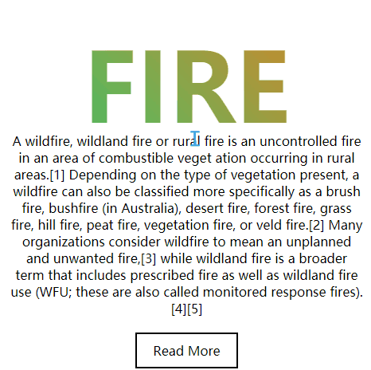

# 带背景Text
==教程地址==：[原文地址（YouTube）](https://youtu.be/8eAWHc34MT0)

==B站教程==：[原文转载（bilibili）](https://www.bilibili.com/video/av82221939/)

**两个视频的内容相同，第二个为转载**

## 效果图
>

## 代码区

### html
```html
    <section>
        <div class="content">
            <h2>Fire</h2>
            <p>content------</p>
                <a href="#">Read More</a>
        </div>
    </section>
```
### CSS
```css
*{
    margin: 0; /*外边距*/
    padding: 0; /*内边距*/
    box-sizing: border-box; /*大小判断*/
    outline: none; /*轮廓*/
    font-family: sans-serif; /*字体*/
}
section{
    position: relative; /*想到定位*/
    width: 100%; /*宽*/
    min-height: 100vh; /*最小高*/
    display: flex; /*弹性盒模型*/
    justify-content: center; /*主轴居中*/
    align-items: center; /*副轴*/
    padding: 50px 0;
}
section .content{
    text-align: center; /*字体居中*/
}
section .content h2{
    font-size: 24vw; /*字体大小*/
    text-transform: uppercase; /*大写*/
    font-weight: 900;
    line-height: 1em; /*行高*/
    -webkit-background-clip: text; /*背景根据字体裁剪*/
    color: transparent; /*字体透明*/
}
section:nth-child(n+1) .content h2{ /*n1设置*/
    background-image:linear-gradient(45deg,#2ecc71,#e67e22);
}
section .content p{
    max-width:800px;
    margin: 0 auto;
    padding: 0 20px;
}
section .content a{
    display: inline-block; /*行内盒模型*/
    padding: 10px 20px;
    border: 2px solid #000; /*边框*/
    text-decoration: none ; /*字体样式*/
    color:#000; /*字体颜色*/
    margin-top: 20px;
}
```
### JS
```javascript
 //none
```
==教程地址==：[原文地址（YouTube）](https://youtu.be/8eAWHc34MT0)

==B站教程==：[原文转载（bilibili）](https://www.bilibili.com/video/av82221939/)