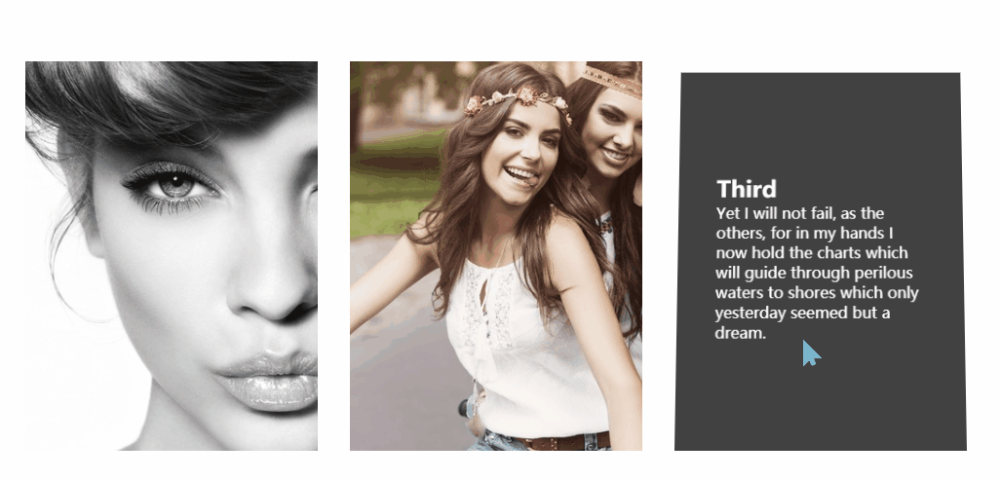

# 标题
==教程地址==：[原文地址（YouTube）](https://youtu.be/M7Dae-7nfow)

==B站教程==：[原文转载（bilibili）](https://www.bilibili.com/video/av82419367/)

**两个视频的内容相同，第二个为转载**

## 效果图
>

## 代码区

### html
```html
    <div class="container">
        <div class="box">
            <div class="imgBx"> <!--图片-->
                
            </div>
            <div class="contentBx"> <!--翻页之后的文本-->
                <div>
                    <h2>First</h2>
                    <p>Failure no longer will be my payment for struggle. 
                        Just as nature made no provision for my body to tolerate
                         pain neither has it made any provision for my life to 
                         suffer failure. Failure, like pain, is alien to my life. 
                         In the past I accepted it as I accepted pain. 
                         </p>
                </div>
            </div>
        </div>
    </div>
```
### CSS
```css
*{
    margin: 0; /*外边距*/
    padding: 0; /*内边距*/
    box-sizing: border-box; /*宽度大小规则*/
    font-family: sans-serif; /*字体*/
}
body{
    display: flex; /*弹性盒模型*/
    justify-content: center; /*主轴对齐方式*/
    align-items: center; /*副轴对齐方式*/
    min-height: 100vh; /*最小高度*/
}
.container{
    position: relative; /*相对位置*/
    width: 1000px; /*宽度*/
    display: flex;
    flex-wrap: wrap; /*允许换行*/
    justify-content: space-around; /*周围允许有空间*/
    transform-style: perserve-3d; /*子元素保留3D*/
}
.container .box{ /*内容盒子*/
    position: relative;
    width: 300px;
    height: 400px;
    margin: 20px 0px;
    perspective: 1000px;
    overflow: hidden; /*超出隐藏*/
    transform-style: perserve-3d;
}
.container .box .imgBx{ /*盒子内图片*/
    position: absolute;
    top: 0; /*距上部*/
    left: 0; /*距左部*/
    width: 100%;
    height: 100%;
    transform-origin: top; /*3D起始位置*/
    transform-style: preserve-3d; /*子元素保留3D*/
    transition: 0.5s; /**/
}
.container .box .imgBx img{
    position: absolute;
    top: 0;
    left: 0;
    width: 100%;
    height: 100%;
    object-fit: cover; /*图片大小为适应布局*/
    transition-delay: 0.2s;
}
.container .box:hover .imgBx{ /*图片悬停时*/
    transition-delay: 0s; /*过渡从何开始（等待秒数）*/
    transform: rotateX(-90deg); /*X轴旋转*/
    opacity: 0; /*透明度*/
}
.container .box .contentBx{
    position: absolute;
    top: 0;
    left: 0;
    width: 100%;
    height: 100%;
    background-color: #333; /*背景颜色*/
    display: flex;
    justify-content: center;
    align-items: center;
    padding: 40px;
    transform-origin: bottom;
    transform-style: preserve-3d;
    transition: 0.5s;
    transform: rotateX(90deg);
    opacity: 0;
    color: #fff; /*字体颜色*/
}
.container .box:hover .contentBx{
    transform: rotateX(0deg);
    opacity: 1;
    transition-delay: 0.2s;
}
```

==教程地址==：[原文地址（YouTube）](https://youtu.be/M7Dae-7nfow)

==B站教程==：[原文转载（bilibili）](https://www.bilibili.com/video/av82419367/)