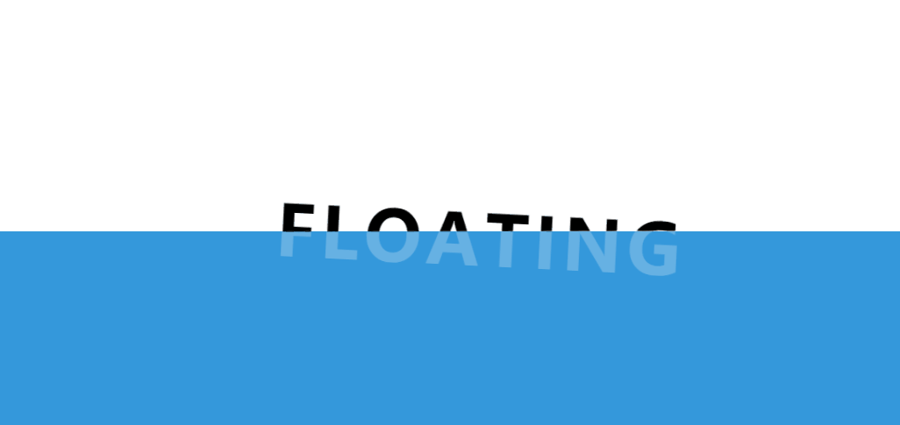

# 标题
==教程地址==：[原文地址（YouTube）](https://youtu.be/UTFatnsd0RI)

==B站教程==：[原文转载（bilibili）](https://www.bilibili.com/video/av82604480/)

**两个视频的内容相同，第二个为转载**

## 效果图
>

## 代码区

### html
```html
<div class="floating-text" data-text="Floating">
    Floating
</div>
```
### CSS
```css
*{
    margin: 0; /*外边距*/
    padding: 0; /*内边距*/
    font-family: sans-serif; /*字体*/
}
body{
    height: 100vh; /*高*/
    background:linear-gradient(0deg,#3498db 50%,#fff 0%); /*渐变*/
    display: flex; /*弹性布局*/
    justify-content: center; /*主轴排序*/
    align-items: center; /*交叉轴排序*/
}
.floating-text{
    text-transform: uppercase; /*大写*/
    font-size: 80px; /*字体大小*/
    font-weight: 900; /*字体宽度*/
    letter-spacing: 6px; /*字符间距*/
    color: #ffffff40; /*字体颜色*/
    transform: translateY(0); /*Y轴垂直移动*/
    animation:  f11 3s infinite linear; /*动画：名字 3秒完成 重复 线性时间*/
}

.floating-text::before{ /**/
    content: attr(data-text); /*添加文字（按照自定义的属性）*/
    position: absolute; /*绝对定位*/
    color: #000; /*颜色*/
    clip-path: polygon(0 0,100% 0,100% 50%,0 50%); /*多边形裁剪 x y,x1 y1,.....,xn yn*/
    animation:  f12 3s infinite linear;
}
@keyframes f11{ /*动画f11*/
    30%{
        transform: translateY(10%) rotate(4deg); /*y轴移动10%*/
    }
    70%{
        transform: translateY(10%) rotate(-4deg);
    }
}
@keyframes f12{
    30%{
        clip-path: polygon(0 0,100% 0,100% 24%,0 56%);
    }
    70%{
        clip-path: polygon(0 0,100% 0,100% 56%,0 24%);
    }
}
```
### JS
```javascript

```
==教程地址==：[原文地址（YouTube）](https://youtu.be/UTFatnsd0RI)

==B站教程==：[原文转载（bilibili）](https://www.bilibili.com/video/av82604480/)