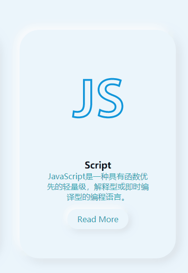

# 标题
==教程地址==：[原文地址（YouTube）](https://youtu.be/d071ZRyZlyM)

==B站教程==：[原文转载（bilibili）](https://www.bilibili.com/video/av82748133/)

**两个视频的内容相同，第二个为转载**

## 效果图
>

## 代码区

### html
```html
<div class="container">
    <div class="card">
        <div class="imgBx">
            <i class="fab fa-js fa-6x"></i>
        </div>
        <div class="content">
            <h3>Script</h3>
            <p>JavaScript是一种具有函数优先的轻量级，解释型或即时编译型的编程语言。</p>
            <a href="#"><span>Read More</span></a>
        </div>
    </div>
    <div class="card">
        <div class="imgBx">
            <i class="fab fa-js fa-6x"></i>
        </div>
        <div class="content">
            <h3>Script</h3>
            <p>JavaScript是一种具有函数优先的轻量级，解释型或即时编译型的编程语言。</p>
            <a href="#"><span>Read More</span></a>
        </div>
    </div>
    <div class="card">
        <div class="imgBx">
            <i class="fab fa-js fa-6x"></i>
        </div>
        <div class="content">
            <h3>Script</h3>
            <p>JavaScript是一种具有函数优先的轻量级，解释型或即时编译型的编程语言。</p>
            <a href="#"><span>Read More</span></a>
        </div>
    </div>
</div>
```
### CSS
```css
*{
    margin: 0; /*外边距*/
    padding: 0; /*内边距*/
    box-sizing: border-box; /*盒大小规定*/
    font-family: sans-serif; /*字体*/
}
body{
    display: flex; /*弹性盒模型*/
    justify-content: center; /*主轴居中*/
    min-height: 100vh; /*最小高度*/
    background-color: #ebf5fc; /*背景颜色*/
}
.container{
    position: relative; /*相对定位*/
    display: flex; 
    justify-content: space-around; 
    align-items: center; 
    flex-wrap: wrap; /*允许换行*/
    width: 1100px; 
}
.container .card{
    width: 320px;
    margin: 20px;
    padding: 40px 30px;
    border-radius: 40px; /*边框圆角*/
    background-color: #ebf5fc;
    box-shadow:-6px -6px 20px rgba(255, 255, 255,1), /*阴影*/
                6px 6px 20px rgba(0, 0, 0, .1);
}
.container .card:hover{ /*悬停时*/
    box-shadow: inset -6px -6px 20px rgba(255, 255, 255,.5), /*改为内部阴影*/
                inset 6px 6px 20px rgba(0, 0, 0, 0.05);
}
.container .card .imgBx{
    position: relative;
    text-align: center; /*文字居中*/
}
.container .card .imgBx>*{ 
    max-width: 120px; /*最小宽度*/
}
.container .card .content{
    position: relative;
    margin: 20px;
    text-align: center;
}
.container .card .content h2{
    color: #32a3b1; /*字体颜色*/
    font-weight: 700; /*字体粗细*/
    font-size: 1.4em; /*字体大小*/
    letter-spacing: 2px; /*字符间距*/
}
.container .card .content p{
    color: #32a3b1;
}
.container .card .content a{
    display: inline-block; /*行内块模型*/
    padding: 10px 20px;
    margin-top:15px;
    border-radius: 40px;
    color: #32a3b1;
    font-size: 16px;
    text-decoration: none; /*字体效果*/
    box-shadow:  -4px -4px 15px rgba(255, 255, 255,1),
        4px 4px 15px rgba(0, 0, 0, 0.1);
}
.container .card .content a:hover{
    box-shadow: inset -4px -4px 10px rgba(255, 255, 255,.5),
            inset 4px 4px 10px rgba(0, 0, 0, 0.1);
}
.container .card a:hover span{
    display: block; /**/
    transform: scale(0.98);
}
.container .card:hover .imgBx,
.container .card:hover .content{ /**/
    transform: scale(0.98); /**/
}
```
### JS
```javascript

```
==教程地址==：[原文地址（YouTube）](https://youtu.be/d071ZRyZlyM)

==B站教程==：[原文转载（bilibili）](https://www.bilibili.com/video/av82748133/)