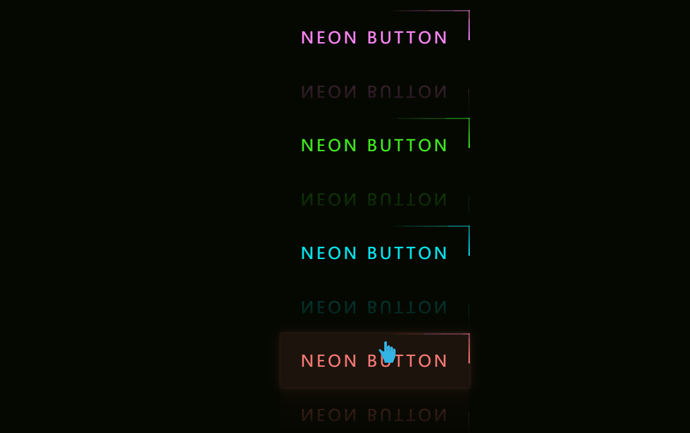

# 赛博朋克按钮样式
==教程地址==：[原文地址（YouTube）](https://youtu.be/3RRgVHd2TXQ)

==B站教程==：[原文转载（bilibili）](https://www.bilibili.com/video/av83276020/)

**两个视频的内容相同，第二个为转载**

## 效果图
>

## 代码区

### html
```html
<!-- 按钮 * 4 -->
<a href="#">
    <!-- 四个边框，进行边框渐变环绕 -->
    <span></span>
    <span></span>
    <span></span>
    <span></span>
    Neon Button
</a>
<a href="#">
    <span></span>
    <span></span>
    <span></span>
    <span></span>
    Neon Button
</a>
<a href="#">
    <span></span>
    <span></span>
    <span></span>
    <span></span>
    Neon Button
</a>
<a href="#">
    <span></span>
    <span></span>
    <span></span>
    <span></span>
    Neon Button
</a>
```
### CSS
```css

```
### JS
```javascript

```
==教程地址==：[原文地址（YouTube）](https://youtu.be/3RRgVHd2TXQ)

==B站教程==：[原文转载（bilibili）](https://www.bilibili.com/video/av83276020/)