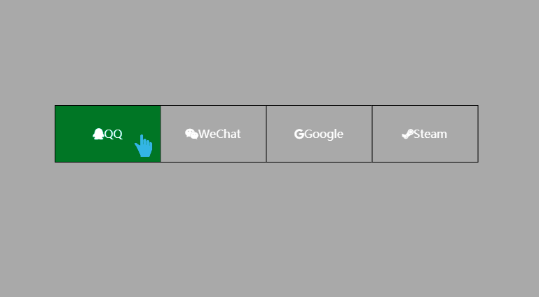

# 实现左进右出动态按钮
==教程地址==：[原文地址（YouTube）](https://youtu.be/2tqz3ViVht8)

==B站教程==：[原文转载（bilibili）](https://www.bilibili.com/video/av83344473/)

**两个视频的内容相同，第二个为转载**

## 效果图
>

## 代码区

### html
```html
<html lang="en">
<head>
    <meta charset="UTF-8">
    <meta name="viewport" content="width=device-width, initial-scale=1.0">
    <meta http-equiv="X-UA-Compatible" content="ie=edge">
    <title>Document</title>
    <!-- Latest compiled and minified CSS -->
    <link rel="stylesheet" href="https://stackpath.bootstrapcdn.com/font-awesome/4.7.0/css/font-awesome.min.css">
    <link rel="stylesheet" href="css/style.css">
</head>
<body>
    <ul><li><a href="#"><i class="fa fa-qq" aria-hidden="true"></i>QQ</a></li>
        <li><a href="#"><i class="fa fa-weixin" aria-hidden="true"></i>WeChat</a></li>
        <li><a href="#"><i class="fa fa-google" aria-hidden="true"></i>Google</a></li>
        <li><a href="#"><i class="fa fa-steam" aria-hidden="true"></i>Steam</a></li></ul>
</body>
</html>
```
### CSS
```css
body{
    margin: 0; /*外边距*/
    padding:0; /*内边距*/
    min-height: 100vh; /*最小高度*/
    background-color: darkgray; /*背景颜色*/
}
ul{
    position: absolute; /*绝对定位*/
    top:50%; /*据上部*/
    left:50%; /*距左侧*/
    transform:translate(-50%,-50%); /*2D转*/
    margin: 0;
    padding: 0;
    display: flex; /*弹性盒模型*/
}
ul li{
    list-style: none; /*列表样式*/
}
ul li a{
    position: relative; /*相对定位*/
    display: block; /*盒模型*/
    width: 150px;
    height: 80px;
    line-height: 80px; /*行高*/
    text-align: center; /*文字对齐*/
    font-size: 16px; /*字体大小*/
    color: #fff; /*字体颜色*/
    font-family: sans-serif; /*字体*/
    text-decoration: none; /*字体样式*/
    border: 1px solid #000; /*边框*/
    border-right: none; /*右边框设置为无*/
}
ul li:last-child a{ /*最后一个按钮设置为有有边框*/
    border-right: 1px solid #000;
}
ul li a::before{ /*之前增加*/
    content: ''; /*内容*/
    position: absolute;
    top:0;
    left: 0;
    width: 100%;
    height: 100%;
    background-color: red;
    overflow: hidden; /*超出内容*/
    z-index: -1; /*图层层叠*/
    transform: scaleX(0); /*放大*/
    transform-origin: right; /*动画从右侧开始*/
    transition: transform 0.5s ease-in-out; /*过渡时间  0.5s 播放时序*/
}
ul li a:hover::before{ /*悬停时添加*/
    transform:scaleX(1);
    transform-origin: left; /*从左侧开始动画*/
}
ul li:nth-child(1) a{ /*第一个a元素*/
    filter: hue-rotate(160deg); /*色调翻转*/
}
ul li:nth-child(2) a{
    filter: hue-rotate(0deg);
}
ul li:nth-child(3) a{
    filter: hue-rotate(240deg);
}
ul li:nth-child(4) a{
    filter: hue-rotate(300deg);
}
```
### JS
```javascript

```
==教程地址==：[原文地址（YouTube）](https://youtu.be/2tqz3ViVht8)

==B站教程==：[原文转载（bilibili）](https://www.bilibili.com/video/av83344473/)