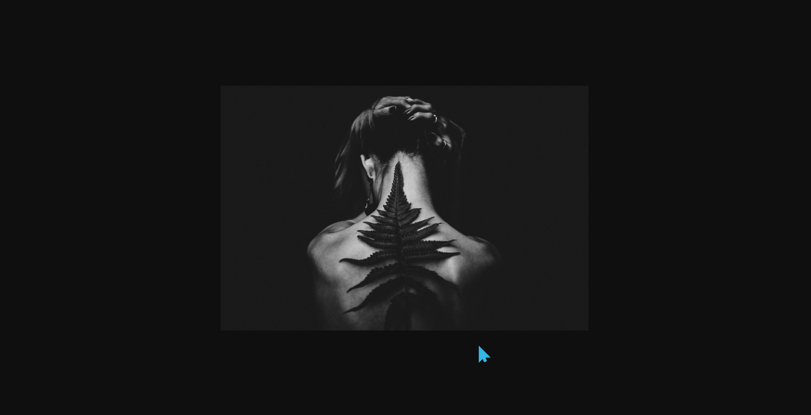

# 扫描仪效果
==教程地址==：[原文地址（YouTube）](https://youtu.be/mfF-_C0cNvE)

==B站教程==：[原文转载（bilibili）](https://www.bilibili.com/video/av83562385/)

**两个视频的内容相同，第二个为转载**

## 效果图
>

## 代码区

### html
```html
<div class="pic"></div>
```
### CSS
```css
body{
  margin: 0; /*外边距*/
  padding: 0; /*内边距*/
  height: 100vh; /*高度*/
  display: flex; /*弹性盒子*/
  align-items: center; /*交叉轴对齐方式*/
  justify-content: center; /*主轴对齐方式*/
  background-color: #0f0f0f; /*背景颜色*/
}

.pic{
  width: 600px; 
  height: 400px; 
  background: url(../img/bg.jpg) no-repeat; /*背景图片 不循环显示*/
  background-size: cover; /*背景大小为适应性布局*/
  cursor: pointer; /*鼠标样式为指针样式*/
  position: relative; /*相对定位*/
  overflow: hidden; /*超出隐藏*/
}
.pic:before{ /*之前添加，此处为扫描线*/
  content: ''; /*内容*/
  position: absolute; /*绝对定位*/
  width: 600px;
  height: 40px;
  background: url(../img/bg.jpg) no-repeat;
  background-size: cover;
  filter: sepia(100%); /*使元素颜色更接近棕褐色*/
  opacity: 0;
}
.pic:hover::before{ /*悬停时*/
  opacity: .7; /*透明度*/
  animation: glitch 1.5s infinite linear; /*动画 : 名称 时间 重复 线性执行*/
}
@keyframes glitch {
  0%{
    top: 0; /*距上部*/
    background-position: 12px 0; /*X轴移动 y轴移动*/
  }
  20%{
    /* top 和background-position的Y轴应该成倒数，这样才能使
      扫描时的图片显示为背景相应位置的图片
    */
    top: 80px; 
    background-position: -10px -80px;
  }
  40%{
    top: 160px;
    background-position: 6px -160px;
  }
  60%{
    top: 240px;
    background-position: -6px -240px;
  }
  80%{
    top: 320px;
    background-position: 10px -320px;
  }
  100%{
    top: 400px;
    background-position: -12px -400px;
  }
}
```
### JS
```javascript

```
==教程地址==：[原文地址（YouTube）](https://youtu.be/mfF-_C0cNvE)

==B站教程==：[原文转载（bilibili）](https://www.bilibili.com/video/av83562385/)