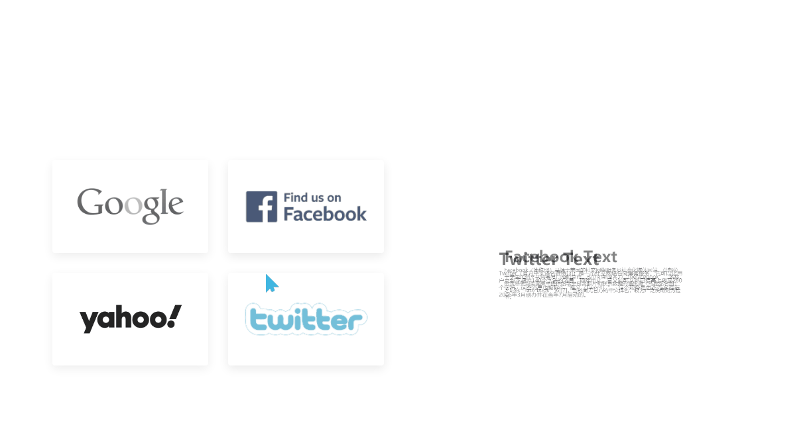

# 动态选项卡实现 CSS & js
==教程地址==：[原文地址（YouTube）](https://youtu.be/1e7dAyEDe3o)

==B站教程==：[原文转载（bilibili）](https://www.bilibili.com/video/av83855674)

**两个视频的内容相同，第二个为转载**

## 效果图
>

## 代码区
### html
```html
<div class="container">
  <div class="icon"> 
    <!-- 4个按钮 -->
    <div class="iconBx active" data-id='content1'>
      
    </div>
    <div class="iconBx" data-id='content2'>
      
    </div>
    <div class="iconBx" data-id='content3'>
      
    </div>
    <div class="iconBx" data-id='content4'>
      
    </div>
  </div>
  <!-- 按钮内容 -->
  <div class="content">
    <!-- 内容一div -->
    <div class="contentBx active" id='content1'>
        <div>
            <!-- 内容 -->
            <div class="text">
                <h2>Google Text</h2>
                <p>
                    1998年9月4日，Google以私营公司的形式创立，目的是设计并管理互联网搜索引擎“Google搜索”。2004年8月19日，Google公司在纳斯达克上市，后来被称为“三驾马车”的公司两位共同创始人与出任首席执行官的埃里克·施密特在此时承诺：共同在Google工作至少二十年，即至2024年止[15]。Google的宗旨是“整合全球信息，供大众使用，使人人受益”。
                </p>
            </div>
        </div>
    </div>
    <!-- 内容二div -->
    <div class="contentBx" id='content2'>
        <div>
            <div class="text">
                <h2>Facebook Text</h2>
                <p>
                Facebook（简称FB）是源于美国的社交网络服务及社会化媒体网站，总部位于美国加州圣马特奥县门洛帕克市。成立初期原名为“thefacebook”，名称的灵感来自美国高中提供给学生包含照片和联系数据的通讯录（或称花名册）之昵称“face book”[6][7]。当前尚无官方的中文译名，较为广泛使用则为脸书。
                </p>
            </div>
        </div>
    </div>
    <div class="contentBx" id='content3'>
        <div>
            <div class="text">
                <h2>Yahoo Text</h2>
                <p>
                雅虎（英语：Yahoo!）是美国Verizon Media的子公司，为互联网服务部门，品牌旗下知名服务有门户网站、邮箱、体育以及新闻等服务。当前总部位于加州的森尼韦尔市。
                </p>
            </div>
        </div>
    </div>
    <div class="contentBx" id='content4'>
        <div>
          <div class="text">
              <h2>Twitter Text</h2>
              <p>
                Twitter（官方中文译名推特[3]）是一个社交网络与微博客服务，它可以让用户更新不超过140个字符的消息，现除中文、日文和韩文外已提高上限至280个字符，这些消息也被称作“推文（Tweet）”。这个服务是由杰克·多西在2006年3月创办并在当年7月启动的。
              </p>
          </div>
      </div>
    </div>
  </div>
</div>
```
### CSS
```css
*{
  margin: 0; /*外边框*/
  padding: 0; /*内边框*/
  box-sizing: border-box; /*盒大小规则*/
  font-family: sans-serif; /*字体*/
}
body{
  display: flex; /*弹性盒模型*/
  justify-content: center; /*主轴对齐方式*/
  align-items: center; /*交叉轴对齐方式*/
  min-height: 100vh; /*最小高度*/
}
.container{
  position: relative; /*相对定位*/
  display: flex;
  flex-wrap: wrap; /*允许换行*/
  width: 1100px;
}
.container .icon{
  position: relative;
  width: 50%;
  text-align: center; /*文字对齐方式*/
  display: flex;
  justify-content: center;
  align-items: center;
  flex-wrap: wrap; 
}
.container .icon .iconBx{
  position: relative;
  width: calc(50% - 40px); /*计算*/
  margin: 0 30px 30px 0;
  padding: 0 25px;
  height: 140px;
  display: flex;
  justify-content: center;
  align-items: center;
  flex-wrap: wrap;
  border-radius: 4px; /*边框圆角*/
  transition: 0.5s; /*过渡动画*/
  box-shadow: 0 5px 15px rgba(0, 0, 0, 0.07); /*阴影*/
}
.container .icon .iconBx.active{
  box-shadow: 0 5px 15px rgba(0, 0, 0, .1);
}
.container .icon .iconBx img {
  max-height: 100%;
  background-size: cover;
  filter: grayscale(1); /*使颜色更偏向灰阶*/
  transition: 0.5s;
  transform: scale(1.2); /*放大*/
}
.container .icon .iconBx.active img {
  filter: grayscale(0);
  transform: scale(1.5);
}
.content{
  position: relative;
  width: 50%;
  overflow: hidden;
}
.content .contentBx{
  position: absolute;
  width: 100%;
  height: 100%;
  display: flex;
  justify-content: center;
  align-items: center;
  transition: 0.5s;
  transform: scale(0);
  opacity: 0; /*透明度*/
}
.content .contentBx.active{
  transform: scale(1);
  opacity: 1;
  transition: .5s;
}
.content .contentBx h2{
  font-size: 3em; /**/
}
```
### JS
```javascript
  const iconBx = document.querySelectorAll('.iconBx') // 按钮
        const contentBx = document.querySelectorAll('.contentBx') // 对应文字内容
        for (let i of iconBx) { // 循环遍历
            i.addEventListener('mouseover', function () { // 悬停事件
                for(let j of contentBx) {
                    j.className = 'contentBx' // 获取对应内容的class名
                }
                document.getElementById(this.dataset.id).className = 'contentBx active' 
                for(let j of iconBx) { // 按钮遍历
                    j.className = 'iconBx'
                }
                // 修改按钮class名以对应相应事件按钮
                this.className = 'iconBx active' 
            })
        }
```
==教程地址==：[原文地址（YouTube）](https://youtu.be/1e7dAyEDe3o)

==B站教程==：[原文转载（bilibili）](https://www.bilibili.com/video/av83855674)