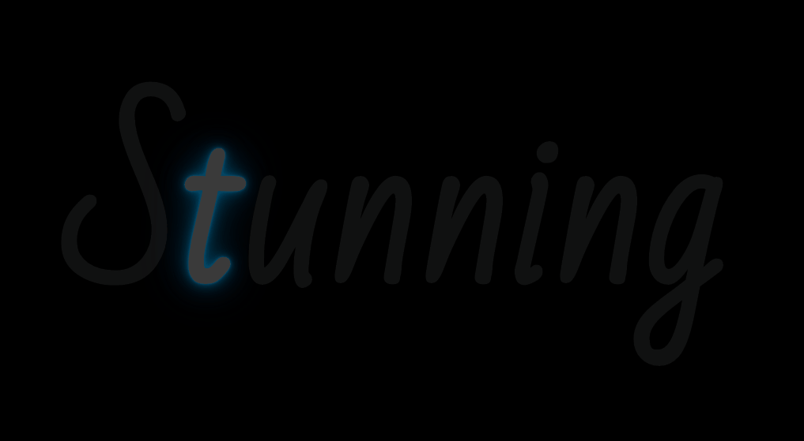

# 点闪文字
==教程地址==：[原文地址（YouTube）](https://youtu.be/1B3FgFXn274)

==B站教程==：[原文转载（bilibili）](https://www.bilibili.com/video/av84003161/)

**两个视频的内容相同，第二个为转载**

## 效果图
>

## 代码区

### html
```html
<h1 id='main'></h1>
```
### CSS
```css
@import url('https://fonts.googleapis.com/css?family=Bad+Script');

body{
  margin: 0; /*外边距*/
  padding: 0; /*内边距*/
  display: flex; /*弹性盒模型*/
  justify-content: center; /*主轴对齐方式*/
  align-items: center; /*交叉轴对齐方式*/
  height: 100vh; /*高度*/
  background-color: #000; /*背景颜色*/
  font-family: 'Bad Script', cursive; /*字体*/
}
h1{
  margin: 0;
  padding: 0;
  color: #111; /*字体颜色*/
  font-size: 16em; /*字体大小*/
}
h1 span {
  margin: 0;
  padding: 0;
  animation: animate 2s linear infinite; /*动画: name 2s 线性播放 循环*/
  user-select: none; /**/
}

@keyframes animate{ /*动画*/
  0%,100%{
    color: #fff;
    filter: blur(2px); /*过渡:模糊*/
    text-shadow:  /*字体阴影*/
    0 0 10px #00bcff,
    0 0 20px #00b3ff,
    0 0 40px #00b3ff,
    0 0 80px #00b3ff,
    0 0 120px #00b3ff,
    0 0 200px #00b3ff,
    0 0 300px #00b3ff,
    0 0 400px #00b3ff;
  }
  5%,95%{
    color: #111;
    filter: blur(0px);
    text-shadow: none;
  }
}
```
### JS
```javascript
    // 要显示的字符串
    const s = 'Stunning'
    // 获取父元素id
    const main = document.getElementById('main')
    // 裁剪父元素到数组
    const array = s.split('')
    // 计时器
    const ospanAnimationDelay = 0
    // 循环数组
    for (let i in array) {
        // 新建元素span
        const ospan = document.createElement('span');
        // 设置新建元素内容
        ospan.innerText = array[i];
        // 添加动画等待时间以形成循环闪烁效果
        ospan.style.animationDelay = ospanAnimationDelay + 0.25 * i + 's'
        // 添加子元素
        main.appendChild(ospan)
    }
```
==教程地址==：[原文地址（YouTube）](https://youtu.be/1B3FgFXn274)

==B站教程==：[原文转载（bilibili）](https://www.bilibili.com/video/av84003161/)