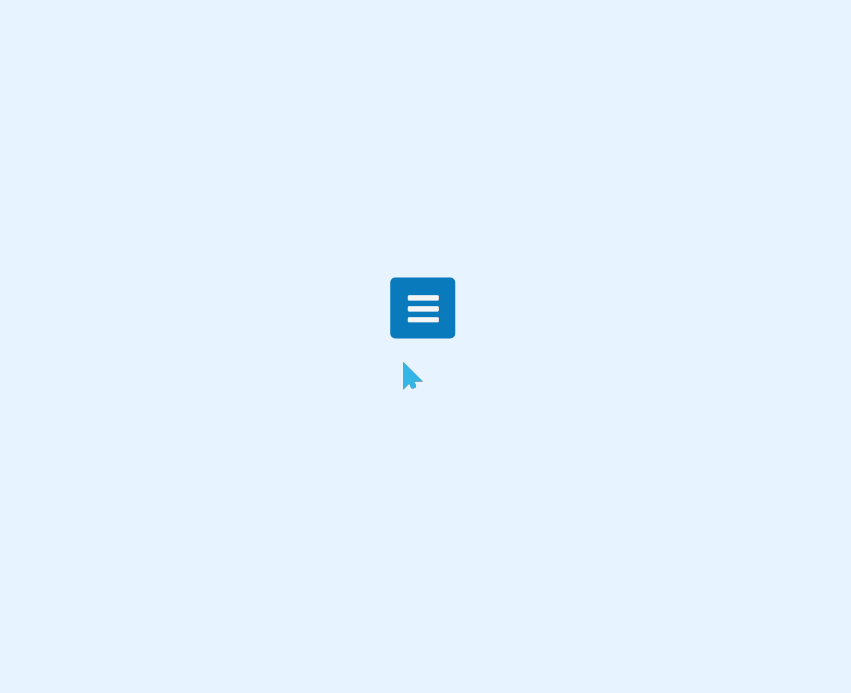

# 动画菜单栏使用
==教程地址==：[原文地址（YouTube）](https://youtu.be/aLwJcY1sLj8)

==B站教程==：[原文转载（bilibili）](https://www.bilibili.com/video/av85014901)

**两个视频的内容相同，第二个为转载**

## 效果图
>

## 代码区

### html
```html
<div class="menu-bar">
  <!-- 绑定id='button'事件，实现点击效果 -->
  <input type="checkbox" id="check">
    <label for="check">
      <div id="button">
        <!-- 按钮样式 -->
        <i class="fa fa-bars"></i>
      </div>
    </label>
    <!-- 子项菜单 -->
    <div class="menu-items">
      <ul>
        <li><a href="#">Home</a></li>
        <li><a href="#">About</a></li>
        <li><a href="#">Services</a></li>
        <li><a href="#">Contact</a></li>
        <li><a href="#">Feedback</a></li>
      </ul>
    </div>
</div>
```
### CSS
```css
*{
  margin: 0; /*外边距*/
  padding: 0; /*内边距*/
  box-sizing: border-box; /*盒子大小规则*/
}
body{
  background-color: #e7f3fe; /*背景颜色*/
  user-select: none; /*无法选中*/
}
.menu-bar,label{ /*菜单和按钮*/
  position: absolute; /*绝对定位*/
  top: 50%; /*距上部*/
  left: 50%;
  transform: translate(-50%, -50%); /*移动，X,Y轴*/
}
/*兄弟选择器，选择之后的同级指定元素*/
/*当处于选择状态时，进行操作*/
#check:checked ~ label { 
  left: 100%;
  transform: translate(-90%,-50%);
}
.menu-bar label{
  z-index: 1;
  transition: 0.35s ease-in; /*过渡时间，慢速-快*/
}
.menu-bar label #button{
  display: flex; /*盒模型*/
  height: 61px;
  width: 65px;
  background: #097abc;
  border-radius: 5px;
  cursor: pointer; /*鼠标状态*/
}
label #button i{
  margin: auto;
  font-size: 35px; /*字体大小*/
  color: #f5f5f5;
  transform: rotateZ(0turn); /*Z轴旋转*/
  transition: transform 0.2s linear;
}
#check:checked ~  label #button i{
  transform: rotateZ(0.5turn);
}
#check:checked ~  label #button i::before{
  content: '\f00d'; /*为图标库对应代码*/
}
.menu-bar .menu-items{ /*子菜单*/
  background-color: #f5f5f5;
  padding: 0 60px 0 0; /*外边距，用于分开按钮*/
  box-shadow: 0 0 5px #075fab; /*阴影*/
  border-top-left-radius: 5px; /*左上*/
  border-bottom-left-radius: 5px; /*左下*/
  transform: scaleX(0); /*X轴放大，此处为不显示*/
  transform-origin: center; /*动画开始位置*/
  transition: transform 0.35s ease-in;
}
.menu-items ul{
  list-style: none; /*取消默认样式*/
  display: flex;
  padding: 20px 5px; /*用于处理和按钮同宽*/
}
.menu-items ul li a{
  color: #0ab7f5;
  font-size: 17px;
  margin: 0 5px; /*外边距为了设置各子项不在一起*/
  padding: 10px 12px; /*为了阴影效果大小*/
  border-radius: 5px;
  text-transform: uppercase;
  font-family: sans-serif;
  text-decoration: none;
}
.menu-items ul li a:hover{ /*选中时，提供阴影*/
  box-shadow: 
    inset 0 0 5px #0ab7f5,
    inset 0 0 15px #85c3fa,
    inset 0 0 25px #b6dbfc;
}
#check:checked ~ .menu-items{ /*当单选按钮选中时，进行*/
  transform: scaleX(1); /*放大到正常显示*/
}

#check{
  display: none; /*设置为不可见*/
}
```
### JS
```javascript
  <script src="https://kit.fontawesome.com/a076d05399.js"></script>
```
==教程地址==：[原文地址（YouTube）](https://youtu.be/aLwJcY1sLj8)

==B站教程==：[原文转载（bilibili）](https://www.bilibili.com/video/av85014901)