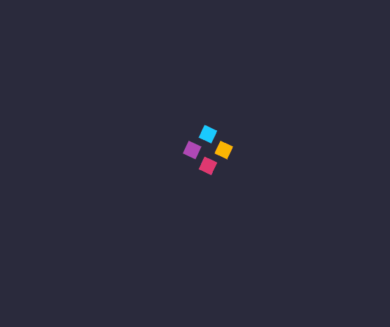

# loading方块动画
==教程地址==：[原文地址（YouTube）](https://youtu.be/-d3duNFG45k)

==B站教程==：[原文转载（bilibili）](https://www.bilibili.com/video/av85294859/)

**两个视频的内容相同，第二个为转载**

## 效果图
>

## 代码区

### html
```html
<div class="loading">
  <!-- 四个方块 -->
  <span></span>
  <span></span>
  <span></span>
  <span></span>
</div>
```
### CSS
```css
body{
  background-color: #2a2a3c; /*背景颜色*/
}
.loading{
  position: absolute; /*绝对定位*/
  top: 50%; /*距上部*/
  left: 50%; /*距左部*/
  height: 40px; /*高度*/
  width: 40px; /*宽度*/
  /*转变： X,Y轴移动, 旋转45度 开启GPU加速(详见Google)*/
  transform: translate(-50%, -50%) rotate(45deg) translate3d(0,0,0);
  animation: animate 1.2s ease-in-out infinite; /*动画: 名称 时间 播放线性 重复*/
}
@keyframes animate{ /*动画 animate*/
  0%, 10%, 100%{
    height: 40px;
    width: 40px;
  }
  /*根据修改宽、高，实现子元素span的移动*/
  65%{
    height: 70px;
    width: 70px;
  }
}
span{
  position: absolute;
  display: block; /*盒模型*/
  width: 20px;
  height: 20px;
  animation: rotate 1.2s linear both infinite; /*动画：名字 时间 结束后状态 重复*/
}
@keyframes rotate{
  0%, 30% {
    transform: rotate(0);
  } 
  /*根据修改角度实现元素的抖动效果*/
  65%{
    transform: rotate(-40deg);
  }
}
span:nth-child(1){ /*第一个span元素*/
  background: #1ac9ff;
  left: 0;
  top: 0;
}
span:nth-child(2){ 
  background: #fcb603;
  /*根据修改定位，让4各span元素不重叠*/
  right: 0;
  top: 0;
}
span:nth-child(3){
  background: #af49b6;
  left: 0;
  bottom: 0;
}
span:nth-child(4){
  background: #e03870;
  right: 0;
  bottom: 0;
}
```
### JS
```javascript

```
==教程地址==：[原文地址（YouTube）](https://youtu.be/-d3duNFG45k)

==B站教程==：[原文转载（bilibili）](https://www.bilibili.com/video/av85294859/)