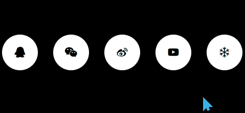

# 标题
==教程地址==：[原文地址（YouTube）](https://youtu.be/Dm7ZWMjzBzI)

==B站教程==：[原文转载（bilibili）](https://www.bilibili.com/video/av85607553/)

**两个视频的内容相同，第二个为转载**

## 效果图
>

## 代码区

### html
```html
<div class="wrapper">
  <ul>
    <li><i class="fa fa-qq fa-lg" aria-hidden="true"></i></li>
    <li><i class="fa fa-weixin fa-lg" aria-hidden="true"></i></li>
    <li><i class="fa fa-weibo fa-lg" aria-hidden="true"></i></li>
    <li><i class="fa fa-youtube-play fa-lg" aria-hidden="true"></i></li>
    <li><i class="fa fa-snowflake-o fa-lg" aria-hidden="true"></i></li>
  </ul>
</div>
```
### CSS
```css
*{
  margin: 0; /* 外边距 */
  padding: 0; /* 内边距 */
}
body{
  background: #000; /* 背景颜色 */
}
.wrapper{
  position: absolute; /* 绝对定位 */
  top: 50%; /* 距上部 */
  left: 50%; /* 距左部 */
  transform: translate(-50%, -50%); /* X,Y轴移动 */
}
ul{
  list-style: none; /* 清除默认样式 */
  width: 500px; /* 宽度 */
}
ul li{
  width: 70px;
  float: left; /* 左浮动 */
  position: relative; /* 相对定位 */
  cursor: pointer; /* 鼠标样式 */
  height: 70px; /* 高度 */
  margin: 0 15px;
  background: #fff;
  border-radius: 50%; /* 边框圆角 */
}
ul li .fa{
  position: absolute;
  color: #000;
  top: 50%;
  left: 50%;
  transform: translate(-50%, -50%); /* X,Y轴移动 */
}
ul li::before{ /* 之前添加 */
  content: ''; /* 内容 */
  position: absolute;
  top: -10px;
  left: -10px;
  width: 80px;
  height: 80px;
  background: transparent; /* 透明背景 */
  z-index: -1; /* z轴层叠 */
  border-radius: 50%;
  border: 5px solid#fff;
  filter: blur(6px); /* 模糊 */
  transform: scale(0);
  transition: all 0.5s ease; /* 过渡时间 */
}
ul li:hover::before{
  transform: scale(1); /* 放大到1倍 */
}
```
### JS
```javascript

```
==教程地址==：[原文地址（YouTube）](https://youtu.be/Dm7ZWMjzBzI)

==B站教程==：[原文转载（bilibili）](https://www.bilibili.com/video/av85607553/)