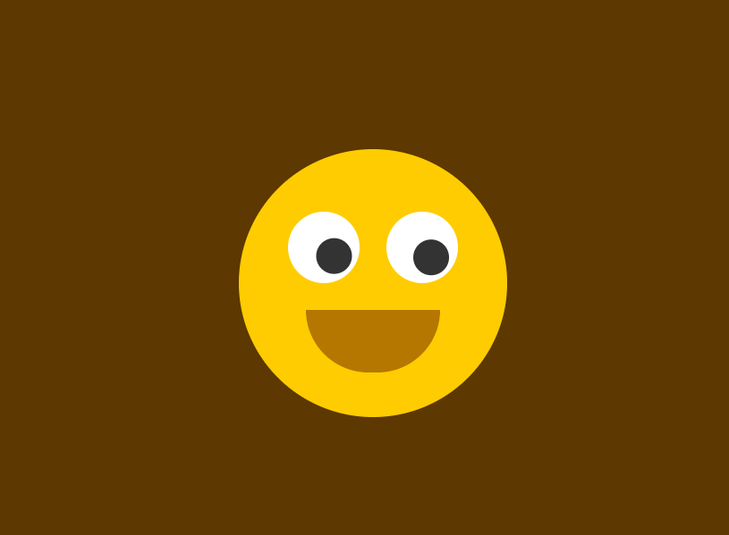

# 小黄人眼睛跟随鼠标移动
==教程地址==：[原文地址（YouTube）](https://youtu.be/WqgKe3dcXxg)

==B站教程==：[原文转载（bilibili）](https://www.bilibili.com/video/av85885408/)

**两个视频的内容相同，第二个为转载**

## 效果图
>

## 代码区

### html
```html
<div class="face"> <!-- 脸部 -->
	<div class="eyes"> <!--  眼睛 -->
		<div class="eye"></div>
		<div class="eye"></div>
	</div>
</div>
<script src="js/main.js"></script>
```
### CSS
```css
* {
  margin: 0; /* 外边距 */
  padding: 0; /* 内边距 */
  box-sizing: border-box; /* 盒子大小规则 */
}
body{
  display: flex; /* 弹性盒模型 */
  justify-content: center; /* 主轴对齐方式 */
  align-items: center; /* 交叉轴对齐方式 */
  min-height: 100vh; /* 最小高度：100视窗大小 */
  background: #5d3800; /* 背景颜色 */
}

/* 黄色圆脸 */ 
.face{
  position: relative; /* 相对定位 */
  width: 300px; /* 宽度 */
  height: 300px; /* 高度 */
  border-radius: 50%; /* 边框圆角 */
  background: #ffcd00;
  display: flex;
  justify-content: center;
  align-items: center;
}
/* 嘴巴 */
.face::before{
  content: ''; /* 内容 */
  position: absolute;
  top: 180px; /* 距上部 */
  width: 150px;
  height: 70px;
  background: #b57700;
  border-bottom-left-radius: 70px; /* 左下圆角 */
  border-bottom-right-radius: 70px;
  transition: .5s; /* 过渡时间 */
}
/* 悬停到face时嘴就行变化 */
.face:hover::before{
  content: '';
  top: 200px;
  width: 150px;
  height: 30px;
  /* 圆角归0为矩形 */
  border-radius: 0;
}
/* 眼睛框体 */
.eyes{
  position: relative;
  top: -40px;
  display: flex;
}
/* 2只眼睛 */
.eyes .eye{
  position: relative;
  width: 80px;
  height: 80px;
  display: block;
  background-color: #fff;
  margin: 0 15px;
  border-radius: 50%;
}
/* 眼珠 */
.eyes .eye::before{
  content: '';
  position: absolute;
  top: 50%;
  left: 25px;
  transform: translate(-50%, -50%); /* x,y轴移动 */
  width: 40px;
  height: 40px;
  background: #333;
  border-radius: 50%;
}
```
### JS
```javascript
// 给body添加鼠标移动事件 eyeball
document.querySelector('body').addEventListener('mousemove', eyeball);
// 事件函数
function eyeball() {
  // 根据css选择器 获取到元素 放入数组
  var eye = document.querySelectorAll('.eye');
  // 调用数组中的每个元素
  eye.forEach(function(eye) {
    // 元素相对于窗口左边的距离  左边框的宽度
    let x = (eye.getBoundingClientRect().left + (eye.clientLeft / 2));
    // 同上
    let y = (eye.getBoundingClientRect().top + (eye.clientTop / 2));
    // pageX 鼠标指针的位置，相对于文档左边缘
    let radian = Math.atan2(event.pageX - x, event.pageY -y);
    let rot = (radian * (180 / Math.PI) * -1) + 270;
    // 修改旋转角度
    eye.style.transform = 'rotate(' + rot + 'deg)';
  })
}
```
==教程地址==：[原文地址（YouTube）](https://youtu.be/WqgKe3dcXxg)

==B站教程==：[原文转载（bilibili）](https://www.bilibili.com/video/av85885408/)