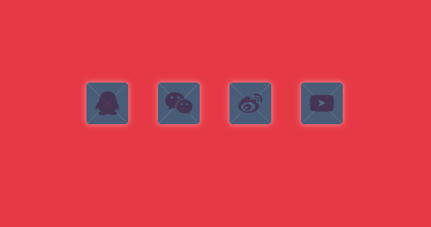

# 按钮：打开礼盒
==教程地址==：[原文地址（YouTube）](https://youtu.be/s4AULBAeVXQ)

==B站教程==：[原文转载（bilibili）](https://www.bilibili.com/video/av86240932)

**两个视频的内容相同，第二个为转载**

## 效果图
>

## 代码区

### html
```html
  <div class="wrapper">
		<ul>
      <!-- 请自行添加图标进行引入 fontawesome -->
			<li><i class="fa fa-qq fa-lg" aria-hidden="true"></i>
				<span class="cover1"></span> <!-- 上下盒框 -->
				<span class="cover2"></span> <!-- 左右盒框 -->
			</li>
			<li>
				<i class="fa fa-weixin fa-lg" aria-hidden="true"></i>
				<span class="cover1"></span>
				<span class="cover2"></span>
			</li>
			<li>
				<i class="fa fa-weibo fa-lg" aria-hidden="true"></i>
				<span class="cover1"></span>
				<span class="cover2"></span>
			</li>
			<li>
				<i class="fa fa-youtube-play fa-lg" aria-hidden="true"></i>
				<span class="cover1"></span>
				<span class="cover2"></span>
			</li>
		</ul>
	</div>
```
### CSS
```css
*{
  margin: 0;/* 外边距 */ 
  padding: 0;/* 内边距 */
}
body{
  background: #e63946;/* 背景颜色 */
}
.wrapper{
  position: absolute;/* 相对定位 */ 
  top: 50%;/* 距上部 */ 
  left: 50%;/* 距左部 */ 
  transform: translate(-50%, -50%);/* X,Y轴移动 */
}
ul{
  list-style: none;/* 清除默认样式 */
  width: 600px; /* 宽度 */
}
ul li{
  width: 70px;
  height: 70px;
  float: left;/* 左浮动 */
  margin: 0 25px;
  background-color: #fff;
  position: relative;
  cursor: pointer;/* 鼠标样式 */
  border-radius: 5px;/* 圆角 */
  transform-style: preserve-3d;/* 保留3D效果 */
  box-shadow: 0 0 10px rgba(255, 255, 255, 0.5);/* 阴影效果，X,Y,模糊,颜色 */
}
/* 图标 */
ul li .fa{
  position: absolute;
  color: #e63946;
  top: 50%;
  left: 50%;
  transform: translate(-50%, -50%);
  font-size: 40px;/* 字体大小 */ 
}
/* 下边 */
.cover1::before{
  content: '';
  position: absolute;
  top: 0;
  left: 0;
  /* 通过3边角透明实现3角形状 */ 
  border-left: 35px solid transparent;
  border-right: 35px solid transparent;
  border-bottom: 35px solid #1d3557;
  border-top: 35px solid transparent;
  border-radius: 5px;
  opacity: 0.8;/* 透明度 */ 
  transform-origin: bottom;/* 转变开始位置 */ 
  transition: all 0.8s ease;/* 过渡时间 速率曲线 */ 
}
/* 上边 */
.cover1::after{
  content: '';
  position: absolute;
  top: 0;
  left: 0;
  border-left: 35px solid transparent;
  border-right: 35px solid transparent;
  border-top: 35px solid #1d3557;
  border-bottom: 35px solid transparent;
  border-radius: 5px;
  opacity: 0.8;
  transform-origin: top;
  transition: all 0.8s ease;
}
/* 左边 */
.cover2::before{
  content: '';
  position: absolute;
  top: 0;
  left: 0;
  border-left: 35px solid #1d3557;
  border-right: 35px solid transparent;
  border-bottom: 35px solid transparent;
  border-top: 35px solid transparent;
  border-radius: 5px;
  opacity: 0.8;
  transform-origin: left;
  transition: all 0.8s ease;
}
/* 右边 */
.cover2::after{
  content: '';
  position: absolute;
  top: 0;
  left: 0;
  border-right: 35px solid #1d3557;
  border-left: 35px solid transparent;
  border-bottom: 35px solid transparent;
  border-top: 35px solid transparent;
  border-radius: 5px;
  opacity: 0.8;
  transform-origin: right;
  transition: all 0.8s ease;
}
ul li:hover .cover1::before{/* 通过修改元素对应的旋转来进行打开效果 */ 
  transform: rotateX(-180deg);
}
ul li:hover .cover1::after{
  transform: rotateX(180deg);
}
ul li:hover .cover2::before{
  transform: rotateY(-180deg);
}
ul li:hover .cover2::after{
  transform: rotateY(180deg);
}
```
### JS
```javascript

```
==教程地址==：[原文地址（YouTube）](https://youtu.be/s4AULBAeVXQ)

==B站教程==：[原文转载（bilibili）](https://www.bilibili.com/video/av86240932)