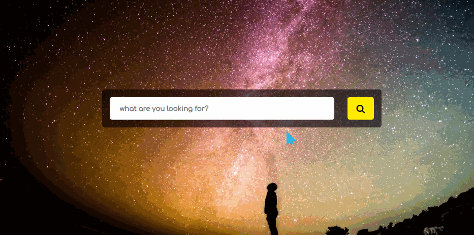

# 星空背景搜索框
==教程地址==：[原文地址（YouTube）](https://youtu.be/FVH-tXVRErg)

==B站教程==：[原文转载（bilibili）](https://www.bilibili.com/video/av86425818/)

**两个视频的内容相同，第二个为转载**

## 效果图
>

## 代码区

### html
```html
<!-- 图标请自行引入 -->
  <div class="wrapper">
		<input type="text" class="input" placeholder='what are you looking for?'>
		<div class="searchbtn">
			<i class="fa fa-search"></i>
		</div>
	</div>
```
### CSS
```css
@import url('https://fonts.googleapis.com/css?family=Comfortaa&display=swap');
*{
  margin: 0; /* 外边距 */
  padding: 0; /* 内边距 */
  outline: none; /* 选择时无选框 */
  box-sizing: border-box; /* 盒大小规则 */
  font-family: 'Comfortaa', cursive; /* 字体 */
}

body{
  background: url('../img/bg.jpg'); /* 背景 */
  background-size: cover; /* 背景大小方式：裁切保持比例 */
  width: 100%; /* 宽度 */
  height: 100vh; /* 高度 */
}
.wrapper{
  position: absolute; /* 绝对定位 */
  top: 50%; /* 距上部 */
  left: 50%; /* 距左部 */
  transform: translate(-50%, -50%); /* X,Y移动 */
  background: rgba(0, 0, 0, 0.6); /* 背景 */
  max-width: 550px; /* 最大宽度 */
  width: 100%;
  padding: 15px;
  border-radius: 5px; /* 边框圆角 */
  display: flex; /* 弹性盒布局 */
  justify-content: space-between; /* 主轴对齐方式 */
}

.wrapper .input{
  width: 85%;
  padding: 15px 20px;
  border: none;
  border-radius: 5px;
  font-weight: bold; /* 字体粗度 */
}

.searchbtn{
  background: #ffec00;
  width: 10%;
  border-radius: 5px;
  position: relative;
  cursor: pointer;
}

.searchbtn .fa{
  position: absolute;
  top: 50%;
  left: 50%;
  transform: translate(-50%, -50%);
  font-size: 18px;
}
```
### JS
```javascript

```
==教程地址==：[原文地址（YouTube）](https://youtu.be/FVH-tXVRErg)

==B站教程==：[原文转载（bilibili）](https://www.bilibili.com/video/av86425818/)