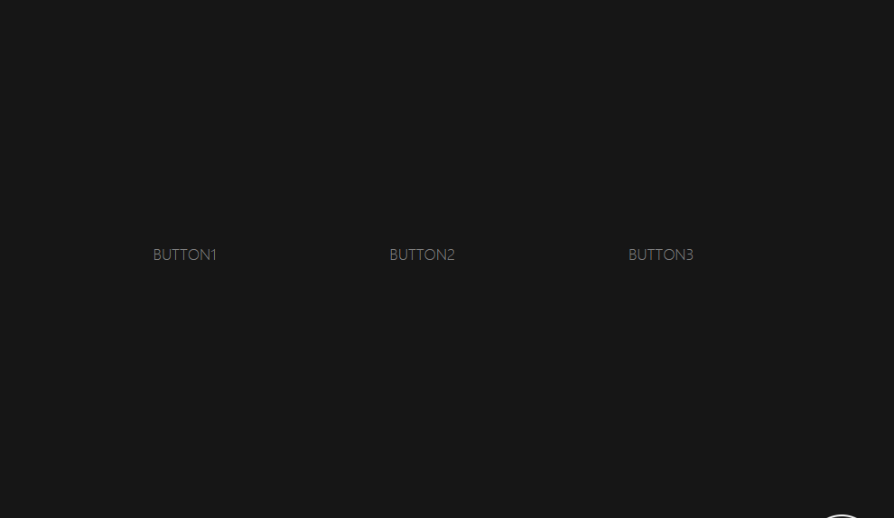

# 标题
==教程地址==：[原文地址（YouTube）](https://youtu.be/v37JcsRddBs)

==B站教程==：[原文转载（bilibili）](https://www.bilibili.com/video/av86635925/)

**两个视频的内容相同，第二个为转载**

## 效果图
>

## 代码区

### html
```html
  <a href="#" class="button">Button1</a>
	<a href="#" class="button">Button2</a>
	<a href="#" class="button">Button3</a>
```
### CSS
```css
html, body {
  margin: 0; /* 外边距 */
  padding: 0; /* 内边距 */
  width: 100%; /* 宽度 */
  height: 100%; /* 高度 */
  background: #161616; /* 背景颜色 */
  overflow: hidden; /* 溢出隐藏 */
}
body {
  display: flex; /* 弹性盒模型 */
  justify-content: center; /* 主轴对齐 */
  align-items: center; /* 交叉轴对齐 */
  font-family: sans-serif; /* 字体，非衬线 */
}
/* 光标(圆点)，边框 */
.cursor, .follow {
  position: absolute; /* 绝对定位 */
  pointer-events: none; /* 事件穿透 */
  width: 0.4em;
  height: 0.4em;
  transform: translate(-50%, -50%) translate3d(0, 0, 0); /* X,Y移动，开启加速 */
}
.cursor {
  background: red;
  border-radius: 100%; /* 让原点为圆型 */
}
.follow {
  padding: 2rem;
  border: 0.1em solid white;
  transition: all 0.2s ease-out;
  border-radius: 100%;
}
/* 当悬停到a标签时，增加的样式 */
.follow.on-focus {
  transform: translate(-0.55rem, -0.55rem) translate3d(0, 0, 0);
  border: 0.1rem solid white;
  border-radius: 0%;
  padding: 0.46rem;
}
.button {
  display: flex;
  justify-content: center;
  align-items: center;
  padding: 1rem 2rem;
  margin: 4rem;
  cursor: pointer; /* 鼠标悬停时样式 */
  text-transform: uppercase; /* 字体大写 */
  font-weight: lighter; /* 比父元素更细 */
  color: gray;
  text-decoration: none; /* 清除下划线 */
}

.button:hover{ /* 悬停时更改颜色 */
  color: #fff;
}
```
### JS
```javascript
	// 光标消失
	document.body.style.cursor = 'none';
	// 新建元素div
	var cursor = document.createElement('div');
	// 给元素增加class
	cursor.classList.add('cursor');
	// 给body添加子元素
	document.body.appendChild(cursor);

	var follow = document.createElement('div');
	follow.classList.add('follow');
	document.body.appendChild(follow);

	// 新建函数 用于删除
	function move(obj, event) {
		obj.style = '';
		obj.style.top = event.clientY + 'px';
		obj.style.left = event.clientX + 'px';
	}

	if(cursor) {
		// 增加鼠标在元素上的移动事件
		window.addEventListener('mousemove', function(event) {
			var e = event;
			var t= e.target;
			var f = follow;
			var c = cursor;
			// 判断元素标签名为a时进行
			if(t.tagName == 'A') {
				// 清除红点
				c.style.backgroundColor = 'transparent';
				// 给follow设置为当前获取到的元素t的属性
				f.style.top = t.offsetTop + 'px';
				f.style.left = t.offsetLeft + 'px';
				f.style.width = t.clientWidth + 'px';
				f.style.height = t.clientHeight + 'px';
				// 进行class添加
				f.classList.add('on-focus');
			} else {
				// 执行函数-清除
				move(c, e);
				move(f, e);
				// 删除class
				f.classList.remove('on-focus');
			};
		});
	}
```
==教程地址==：[原文地址（YouTube）](https://youtu.be/v37JcsRddBs)

==B站教程==：[原文转载（bilibili）](https://www.bilibili.com/video/av86635925/)