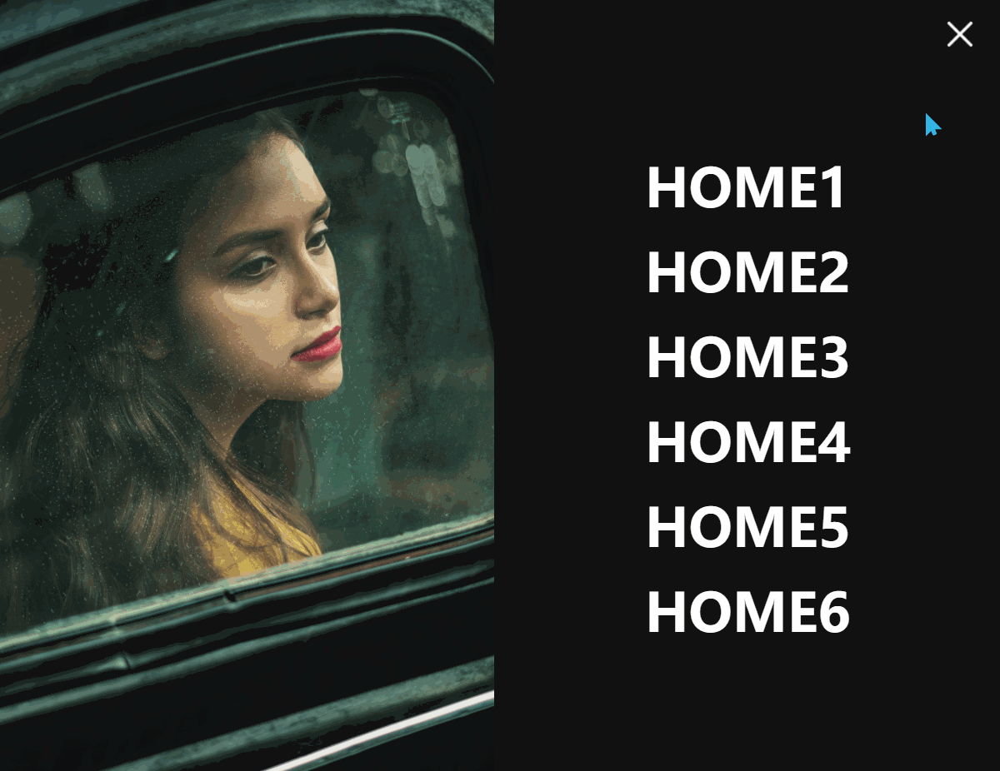
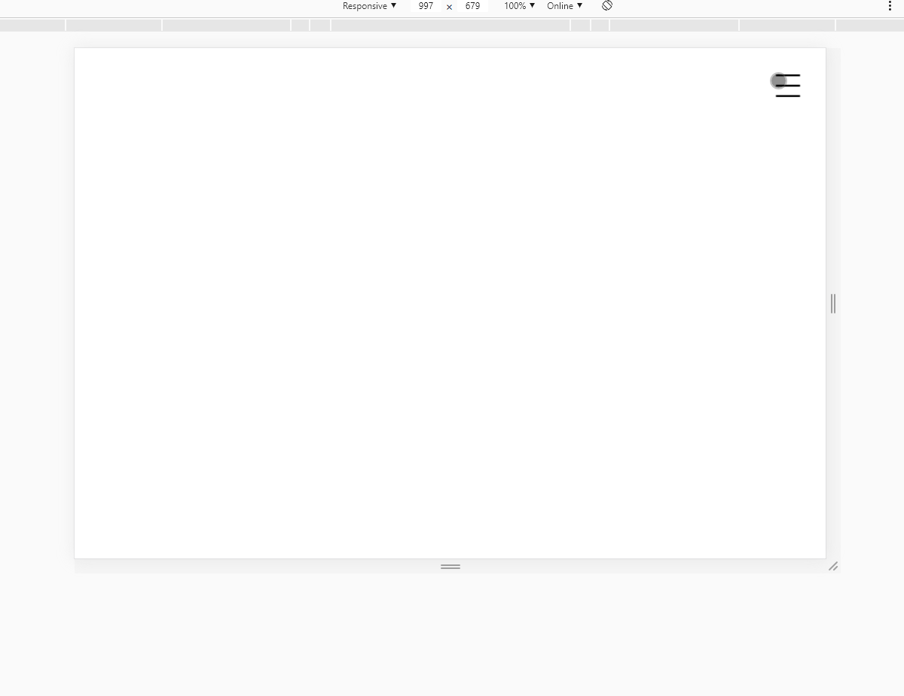

# 标题
==教程地址==：[原文地址（YouTube）](https://youtu.be/hrM0ltf8xi4)

==B站教程==：[原文转载（bilibili）](https://www.bilibili.com/video/av86829970/)

**两个视频的内容相同，第二个为转载**

## 效果图
>
>
## 代码区

### html
```html
<div class="fullpageMenu" id='nav'>
  <div class="banner">
    
  </div>
  <div class="nav">
    <ul>
      <li><a href="#" data-text="Home1">Home1</a></li>
      <li><a href="#" data-text="Home2">Home2</a></li>
      <li><a href="#" data-text="Home3">Home3</a></li>
      <li><a href="#" data-text="Home4">Home4</a></li>
      <li><a href="#" data-text="Home5">Home5</a></li>
      <li><a href="#" data-text="Home6">Home6</a></li>
    </ul>
  </div>
</div>
<span class="menuicon" id='toggle' onclick="menuToggle()"></span>
```
### CSS
```css
* {
  margin: 0; /* 外边距 */
  padding: 0; /* 内边距 */
  box-sizing: border-box; /* 盒子大小规则 */
  font-family: 'Teko', sans-serif; /* 字体 */
}

body {
  min-height: 100vh; /* 最小高度 */
}

/* 完整页面的菜单 */

.fullpageMenu {
  position: fixed; /* 固定定位 */
  top: -100%; /* 距上部 */
  width: 100%; /* 宽 */
  height: 100%; /* 高 */
  display: flex; /* 弹性盒模型 */
  justify-content: center; /* 主轴对齐方式 */
  align-items: center; /* 交叉轴对齐方式 */
  background: #111; /* 背景颜色 */
  transition: 0.5s; /* 过渡动画 */
}

/* 通过修改top定位实现下拉显示 */
.fullpageMenu.active {
  top: 0;
}

/* 右侧图片 */

.fullpageMenu .banner {
  position: relative;
  min-width: 600px;
  height: 100%;
}

.fullpageMenu .banner img {
  position: absolute;
  top: 0;
  left: 0;
  width: 100%;
  height: 100%;
  object-fit: cover; /* 保持图片比例进行覆盖 */
  overflow-y: auto; /* Y轴溢出自定义，当设置了cover时无用处 */
}

/* 菜单 */

.fullpageMenu .nav {
  display: flex;
  justify-content: center;
  align-items: center;
  width: 100%;
  height: 100%;
  overflow-y: auto;
}

.fullpageMenu .nav ul {
  position: relative;
}

.fullpageMenu .nav ul li {
  position: relative;
  list-style: none; /* 清理默认样式 */
  padding: 0 20px;
  margin: 5px 0;
  overflow: hidden; /* 溢出隐藏 */
  display: table; /* 表格模型 */
}

/* 红色背景 */
.fullpageMenu .nav ul li::before {
  content: '';
  position: absolute;
  top: 0;
  left: 0;
  width: 100%;
  height: 100%;
  background: #ff0047;
  transition: transform 0.5s ease-in-out; /* 过渡时间，0.5s 执行速率 */
  transform: scaleY(0); /* Y轴放大 */
  transform-origin: bottom;
}

.fullpageMenu .nav ul li:hover::before{
  transition: transform 0.5s ease-in-out;
  transform: scaleY(1);
  transform-origin: top;
}

.fullpageMenu .nav ul li a {
  position: relative;
  color: #fff;
  text-decoration: none; /* 字体附加样式 */
  font-size: 4em; /* 字体大小 */
  font-weight: 700; /* 字体维度 */
  padding-top: 12px;
  display: inline-block;
  text-transform: uppercase; /* 大写 */
  transition: 0.5s ease-in-out;
}

.fullpageMenu .nav ul li:hover a {
  transform: translateY(-100%); /* Y轴移动，以显示before */
  color: #fff;
}

.fullpageMenu .nav ul li a::before {
  content: attr(data-text); /* 内容 */
  position: absolute;
  bottom: -100%;
  left: 0;
  color: #fff;
}

/* 菜单设置 */
/* 未展开 */
.menuicon {
  position: fixed;
  top: 20px;
  right: 20px;
  width: 60px;
  height: 60px;
  background: transparent url(../img/menu.png);
  background-size: 40px; /* 背景大小 */
  cursor: pointer; /* 鼠标悬停样式 */
  background-repeat: no-repeat; /* 不重复覆盖 */
  background-position: 10px;
  transition:  0.5s;
}
/* 展开 */
.menuicon.active {
  /* 通过修改url实现 */
  background: transparent url(../img/exit.png);
  background-size: 40px;
  background-repeat: no-repeat;
  background-position: 10px;
}

/* 自适应布局，隐藏图片 */

@media (max-width: 991px) {
  .banner {
    display: none;
  }
}
```
### JS
```javascript
		function menuToggle() {
			// 根据ID获取元素
			var nav = document.getElementById('nav');
			var toggle = document.getElementById('toggle');
			// 切换active的类
			nav.classList.toggle('active');
			toggle.classList.toggle('active')
		}
```
==教程地址==：[原文地址（YouTube）](https://youtu.be/hrM0ltf8xi4)

==B站教程==：[原文转载（bilibili）](https://www.bilibili.com/video/av86829970/)