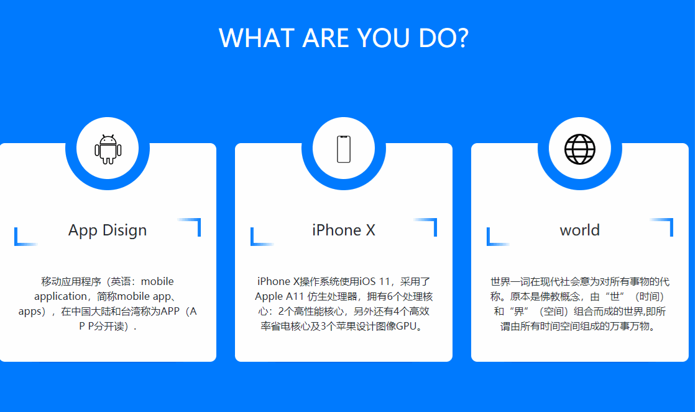

# 标题
==教程地址==：[原文地址（YouTube）](https://youtu.be/Llln7-xYRHA)

==B站教程==：[原文转载（bilibili）](https://www.bilibili.com/video/av87051255)

**两个视频的内容相同，第二个为转载**

## 效果图
>

## 代码区

### html
```html
<div class="container">
		<div class="row">
			<div class="col-md-4">
				<div class="main">
					<div class="service">
						<div class="service-logo">
							
						</div>
						<h4>App Disign</h4>
						<p>移动应用程序（英语：mobile application，简称mobile app、apps），在中国大陆和台湾称为APP（A P P分开读）.</p>
					</div>
					<div class="shadowOne"></div>
					<div class="shadowTwo"></div>
				</div>
			</div>
			<div class="col-md-4">
				<div class="main">
					<div class="service">
						<div class="service-logo">
							
						</div>
						<h4>iPhone X</h4>
						<p>iPhone X操作系统使用iOS 11，采用了Apple A11 仿生处理器，拥有6个处理核心：2个高性能核心，另外还有4个高效率省电核心及3个苹果设计图像GPU。</p>
					</div>
					<div class="shadowOne"></div>
					<div class="shadowTwo"></div>
				</div>
			</div>
			<div class="col-md-4">
				<div class="main">
					<div class="service">
						<div class="service-logo">
							
						</div>
						<h4>world</h4>
						<p>世界一词在现代社会意为对所有事物的代称。原本是佛教概念，由“世”（时间）和“界”（空间）组合而成的世界,即所谓由所有时间空间组成的万事万物。</p>
					</div>
					<div class="shadowOne"></div>
					<div class="shadowTwo"></div>
				</div>
			</div>
		</div>
	</div>
```
### CSS
```css
* {
  margin: 0; /* 外边距 */
  padding: 0; /* 内边距 */
  font-family: sans-serif; /* 字体 */
}
body {
  background-color: #007bff !important; /* 背景颜色，权重级别 */
}
h1 {
  text-align: center; /* 字体居中 */
  margin: 50px auto 120px !important;
  color: #fff; /* 字体颜色 */
}
.main {
  width: 100%; /* 宽度 */
  min-height: 380px; /* 最小高度 */
  text-align: center; /* 字体居中 */
  position: relative; /* 相对定位 */
  cursor: pointer; /* 鼠标样式 */
}
.service {
  width: 100%;
  background: #fff;
  padding: 30px;
  border-radius: 10px; /* 边框圆角 */
  position: absolute; /* 绝对定位 */
  bottom: 0; /* 距底部 */
  z-index: 1; /* 层叠顺序 */
  box-shadow: 0 0 20px -15px #030380; /* 盒子阴影 */
  transition: transform 0.8s; /* 过渡时间 */
}
.service-logo {
  box-sizing: border-box;
  width: 136px;
  line-height: 100px; /* 行高 */
  border-radius: 50%;
  margin: -90px auto 0;
  background-color: #fff;
  border: 18px solid #007bff;
  transition: 1s;
}
.service-logo img {
  width: 50%;
  vertical-align: middle; /* 垂直对齐方式 */
  margin: auto;
}
.service h4 {
  height: 35px;
  widows: 70%;
  background: #fff;
  margin: 50px auto;
  position: relative;

}

.service h4::after { /* 之后添加 */
  content: ''; /* 内容 */
  width: 40px;
  height: 30px;
  background: linear-gradient(to right, #fff, #007bff); /* 渐变背景 */
  position: absolute;
  right: -5px;
  top: -5px;
  z-index: -1;
}

.service h4::before { /* 之前添加 */
  content: '';
  width: 40px;
  height: 30px;
  background: linear-gradient(to right, #007bff, #fff);
  position: absolute;
  left: -5px;
  bottom: -5px;
  z-index: -1;
}

.shadowOne {
  background: #fff;
  position: absolute;
  border-radius: 10px;
  top: 40%;
  bottom: 0;
  right: 10%;
  left: 10%;
  z-index: -1;
  box-shadow: 0 0 20px -15px #030380;
  transition: transform 0.8s;
}
.shadowTwo {
  background: #fff;
  position: absolute;
  border-radius: 10px;
  top: 40%;
  bottom: 0;
  right: 18%;
  left: 18%; 
  z-index: -2;
}
.main:hover .service {
  transform: translateY(-50px); /* Y轴移动 */
}
.main:hover .shadowOne {
  transform: translateY(-25px);
}
.main:hover  .service-logo{
  transform: rotateZ(-360deg);
}
```
### JS
```javascript

```
==教程地址==：[原文地址（YouTube）](https://youtu.be/Llln7-xYRHA)

==B站教程==：[原文转载（bilibili）](https://www.bilibili.com/video/av87051255)