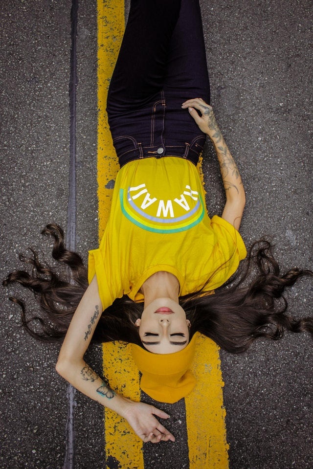

# 标题
==教程地址==：[原文地址（YouTube）](https://youtu.be/s1hRFCPut_I)

==B站教程==：[原文转载（bilibili）](https://www.bilibili.com/video/av87470816/)

**两个视频的内容相同，第二个为转载**

## 效果图
>

## 代码区

### html
```html
<div class="wrapper">
  <div class="img-container">
    
    <!-- 移动的背景(用于背景色) -->
    <div class="slider"></div>
    <!-- 文字 -->
    <div class="caption">
      <h1>Rianna Jennifer</h1>
      <span>American Model</span>
    </div>
    <!-- 选项 -->
    <div class="share">
      <ul>
        <li><i class="fa fa-facebook" aria-hidden="true"></i></li>
        <li><i class="fa fa-twitter" aria-hidden="true"></i></li>
        <li><i class="fa fa-google-plus" aria-hidden="true"></i></li>
      </ul>
    </div>
  </div>
</div>
```
### CSS
```css
*{
  margin: 0; /* 外边距 */
  padding: 0; /* 内边距 */
}

body{
	background: #e17055; /* 背景颜色 */
	font-family: arial; /* 字体 */
}

.wrapper{
	position: absolute; /* 绝对定位 */
	top: 50%; /* 距上部 */
	left: 50%;
	transform: translate(-50%,-50%); /* X,Y轴移动，相对于自身 */
}
/* 背景图片布局 */
.img-container{
	width: 330px; /* 宽度 */
	height: 330px; /* 高度 */
	position: relative; /* 相对定位 */
	border-radius: 50%; /* 边框圆角 */
	cursor: pointer; /* 鼠标样式 */
	overflow: hidden; /* 超出隐藏 */
}
/* 图片设置 */
.img-container img{
	width: 100%; /* 宽 */
  height: 100%; /* 高 */
  object-fit: cover; /* 进行裁剪，使图片保持宽高比 */
	border-radius: 50%;
}

/* 悬停时背景 */
.slider{
	position: absolute;
	top: -250px;
	left: 250px;
	background: #e17055;
	width: 100%;
	height: 100%;
	border-radius: 50%;
	opacity: 0.8; /* 透明度 */
	transition: all 1s ease; /* 过渡时间 */
}
/* 悬停展开的文字 */
.caption{
	position: absolute;
	top: -60px;
	left: 40px;
	text-align: center;
	color: #fff;
}

.caption h1{
	font-size: 30px;
	font-weight: 900;
}

.caption span{
	font-size: 15px;
}
/* 悬停展开的 选项 */
.share{
	position: absolute;
	bottom: 400px;
	left:40px;
}

.share ul{
	list-style: none; /* 清除默认样式 */
	width: 260px;
}

.share ul li{
	width: 50px;
	padding: 20px 10px;
	border-radius: 50%;
	float: left;
	text-align: center;
	border: 3px solid #fff;
	margin: 0 5px;
	transition: all 1s ease;
}

.share .fa{
	color: #fff;
	font-size: 24px;
	transition: all 1s ease;
}

.share ul li:hover{
	background: #fff;
	transition: all 1s ease;
}

.share ul li:hover .fa{
	color: #2A2642;
	opacity: 0.8;
	transition: all 1s ease;
}


.img-container:hover .slider{
	top: 0;
	left: 0;
	transition: all 1s ease;
}

.img-container:hover .caption{
	animation: caption 1s ease 1s forwards; /* 开启动画 */
}

.img-container:hover .share{
	animation: share 1s ease 2s forwards; /* 第二个时间为等待时间 */
}

@keyframes caption{
	0%{
		top: 0px;
		opacity: 0;
	}
	50%{
		top: 30px;
		opacity: 0;
	}

	100%{
		top: 80px;
		opacity: 1;
	}
}

@keyframes share{
	0%{
		bottom: 150px;
		opacity: 0;
	}

	100%{
		bottom: 80px;
		opacity: 1;
	}
}
```
### JS
```javascript

```
==教程地址==：[原文地址（YouTube）](https://youtu.be/s1hRFCPut_I)

==B站教程==：[原文转载（bilibili）](https://www.bilibili.com/video/av87470816/)