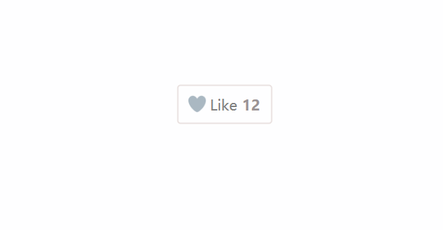

# 点赞爱心按钮
==教程地址==：[原文地址（YouTube）](https://youtu.be/B8nOgu4nvD8)

==B站教程==：[原文转载（bilibili）](https://www.bilibili.com/video/av87917143/)

**两个视频的内容相同，第二个为转载**

## 效果图
>

## 代码区

### html
```html
	<!-- 外边框 -->
  <div class="heart-btn">
		<!-- 内容 -->
		<div class="content">
			<!-- 爱心 -->
			<span class="heart"></span>
			<!-- 文字Liek -->
			<span class="like">Like</span>
			<!-- 数字 -->
			<span class="numb"></span>
		</div>
	</div>
```
### CSS
```css
@import url('https://fonts.googleapis.com/css?family=Montserrat:600&display=swap');
/* 按钮主体 */
.heart-btn {
  position: absolute; /* 绝对定位 */
  top: 50%; /* 距上部 */
  left: 50%; /* 距左部 */
  transform: translate(-50%, -50%); /* X,Y移动 */
}
/* 内容 */
.content {
  border: 2px solid #eae2e1; /* 边框 */
  padding: 13px 16px; /* 内边距 */
  border-radius: 5px; /* 边框圆角 */
  display: flex; /* 弹性盒模型 */
  cursor: pointer; /* 鼠标样式 */
}
.content.heart-active { /* 切换后样式 */
  border-color: #f9b9c4; /* 修改边框颜色 */
  background: #fbd0d8; /*  修改背景颜色*/
}
/* 内容爱心 */
.content .heart {
  height: 90px;/* 高度 */
  width: 90px;/* 宽度 */
  background: url(../img/img.png) no-repeat; /* 背景图片，不重复 */
  background-position: left; /* 背景定位 */
  background-size: 2900%; /* 背景大小，因为有29个所以为2900 */
  position: absolute;
  top: 50%;
  left: 21%;
  transform: translate(-50%, -50%);
}
.heart.heart-active { /* 切换后样式 */
  animation: animate  .8s steps(28) 1; /* 动画(名称, 事件, 逐帧播放, 一次) */
  background-position: right; /* 保留定位在右侧 */
}
/* 执行动画 */
@keyframes animate{
  /* 通过图片位置移动实现点赞效果 */
  0% {
    background-position: left;
  }
  100% {
    background-position: right;
  }
}
/* 文字 */
.like {
  margin-left: 30px; /* 外边距 */
  font-size: 21px; /* 字体大小 */
  font-family: sans-serif;
  color: grey; /* 字体颜色 */
}
.like.heart-active {
  color: black;
}
/* 点赞数(模拟) */
.numb::before {
  content: '12'; /* 内容 */
  font-size: 21px;
  font-weight: 600; /* 维度 */
  font-family: sans-serif;
  color: #9c9496;
  margin-left: 7px;
}
.numb.heart-active::before {
  content: '13';
  color: black;
  transition: 0.8s;
}
```
### JS
```javascript
// jquery网址：src="http://libs.baidu.com/jquery/2.0.0/jquery.js"

// 页面加载完成后执行
$(document).ready(function() {
  // 根据类名添加点击事件
  $('.content').click(function() {
    // 根据类切换类名
    $(this).toggleClass('heart-active')
    $('.like').toggleClass('heart-active')
    $('.heart').toggleClass('heart-active')
    $('.numb').toggleClass('heart-active')
  })
})
```
==教程地址==：[原文地址（YouTube）](https://youtu.be/B8nOgu4nvD8)

==B站教程==：[原文转载（bilibili）](https://www.bilibili.com/video/av87917143/)