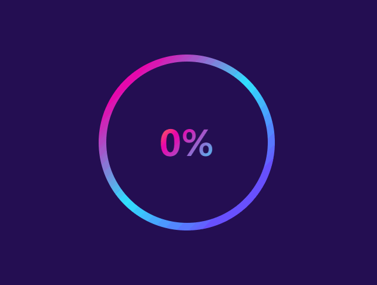

# RBG渐变圆形读条
==教程地址==：[原文地址（YouTube）](https://youtu.be/5JzEltt50LE)

==B站教程==：[原文转载（bilibili）](https://www.bilibili.com/video/av88134691)

**两个视频的内容相同，第二个为转载**

## 效果图
>

## 代码区

### html
```html
<div class="outer">	</div>
<div class="inner">
  <span>0%</span>
</div>
```
### CSS
```css
html, body {
  display: flex; /* 弹性盒模型 */
  align-items: center; /* 交叉轴对齐方式 */
  justify-content: center; /* 主轴对齐方式 */
  height: 100vh; /* 高度 */
  font-family: sans-serif; /* 字体 */
  background: #240f52; /* 背景颜色 */
  overflow: hidden; /* 超出隐藏 */
}

.outer {
  height: 300px; /* 高度 */
  width: 300px; /* 宽度 */
  background: linear-gradient(135deg,#FEED07 0%,#FE6A50 5%,#ED00AA 15%,#2FE3FE 50%,#8900FF 100%); /* 背景-渐变 */
  border-radius: 50%; /* 边框圆角 */
}

.inner {
  position: absolute; /* 绝对定位 */
  width: 275px;
  height: 275px;
  text-align: center; /* 字体居中 */
  line-height: 275px; /* 行高 */
  background: #240f52;
  border-radius: 50%;
  cursor: default; /* 光标默认样式 */
}

.inner span {
  font-size: 60px; /* 字体大小 */
  font-weight: 800; /* 字体维度 */
  background: linear-gradient(135deg,#FEED07 0%,#FE6A50 5%,#ED00AA 15%,#2FE3FE 50%,#8900FF 100%);
  color: transparent; /* 透明 */
  -webkit-background-clip: text; /* 背景按照文字裁剪 */
  background-size: 300%; /* 背景大小 */
  user-select: none; /* 用户无法选中 */
}
/* 默认添加的旋转0-100% */
.outer.active-loader {
  animation: rotate 2s ease infinite; /* 动画名称，动画时间，播放速率，重复播放 */
}

@keyframes rotate {
  to {
    transform: rotate(360deg); /* 通过修改旋转实现 */
  }
}
/* 100之后的一次动画 */
.outer.active-loader-2 {
  animation: rotate2 3s ease;
}

@keyframes rotate2 {
  to {
    transform: rotate(360deg);
  }
}
```
### JS
```javascript
// 获取3个元素
let outer = document.querySelector('.outer')
let inner = document.querySelector('.inner')
let percent = document.querySelector('span')
let count = 0;
// 添加点击事件
inner.addEventListener('click', function() {
  // 添加调用的周期间隔(func, time)
  let loading = setInterval(animate, 200);
  function animate() {
    if(count == 100) {
      // 清除(停止)周期间隔
      clearInterval()
      // 删除、添加类
      outer.classList.remove('active-loader')
      outer.classList.add('active-loader-2')
    }else {
      count = count + 1;
      // 文字更改显示
      percent.textContent = count + '%'
      outer.classList.add('active-loader')
    }
  }
})
```
==教程地址==：[原文地址（YouTube）](https://youtu.be/5JzEltt50LE)

==B站教程==：[原文转载（bilibili）](https://www.bilibili.com/video/av88134691)