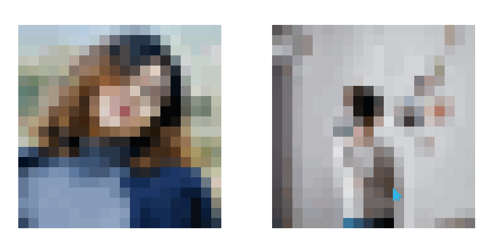
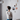

# 马赛克属性图片-(图片加载算法属性)

==教程地址==：[原文地址（YouTube）](https://youtu.be/UIanoqWffH0)

==B站教程==：[原文转载（bilibili）](https://www.bilibili.com/video/av88134808)

**两个视频的内容相同，第二个为转载**

## 效果图
>

## 代码区

### html
```html
<div class="container">
  <div class="pixel">
     <!-- 清晰 -->
     <!-- 模糊 -->
  </div>
  <div class="pixel">
    
    
  </div>
</div>
```
### CSS
```css
body {
  display: flex; /* 弹性盒模型 */
  justify-content: center; /* 主轴对齐方式 */
  align-items: center; /* 交叉轴对齐方式 */
  min-height: 100vh; /* 最小高度 */
}

.container {
  position: relative; /* 相对定位 */
  width: 900px; /* 宽度 */
  display: flex;
  justify-content: space-between;
  align-items: center;
}

/* 图片box */
.container .pixel {
  position: relative;
  width: 400px;
  height: 400px;
  background-color: #000;
}

.container .pixel img {
  position: absolute;
  top: 0;
  left: 0;
  width: 100%;
  height: 100%;
  image-rendering: pixelated; /* 图像的拉伸算法,详见下网址 */
  /* https://developer.mozilla.org/zh-CN/docs/Web/CSS/image-rendering */
}

/* 最后一个子元素(模糊图片) */
.container .pixel img:last-child {
  transition: 2s; /*过渡时间*/
}

.container .pixel:hover img:last-child {
  opacity: 0; /*通过修改透明度来显示清晰图*/
}
```
### JS
```javascript

```
==教程地址==：[原文地址（YouTube）](https://youtu.be/UIanoqWffH0
)

==B站教程==：[原文转载（bilibili）](https://www.bilibili.com/video/av88134808)