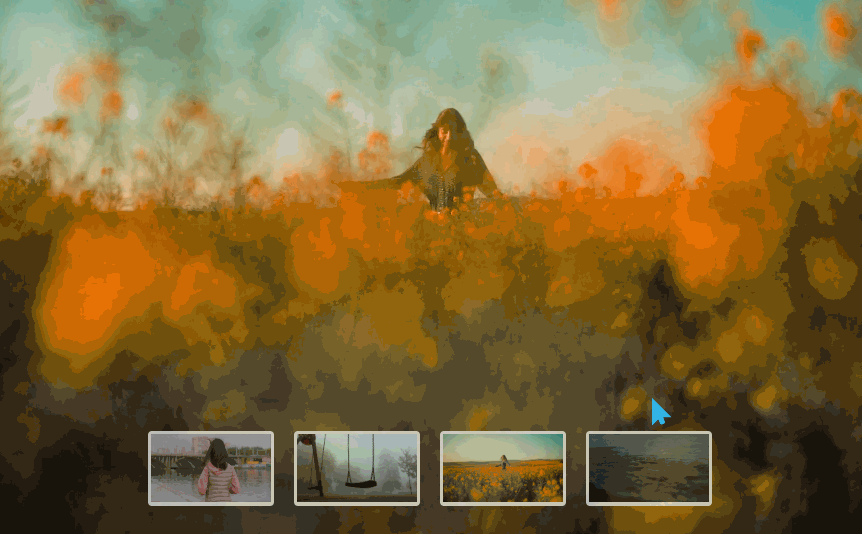
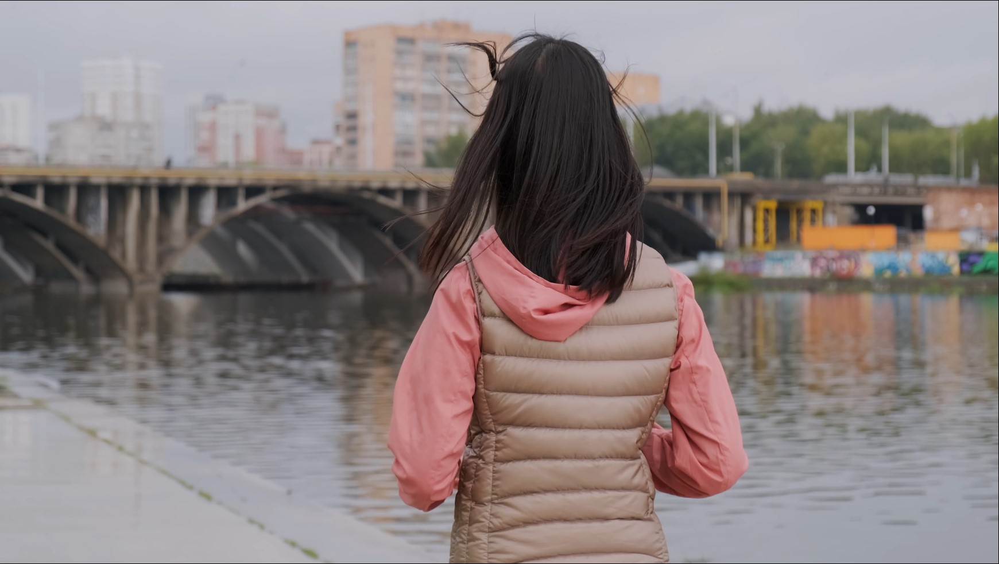
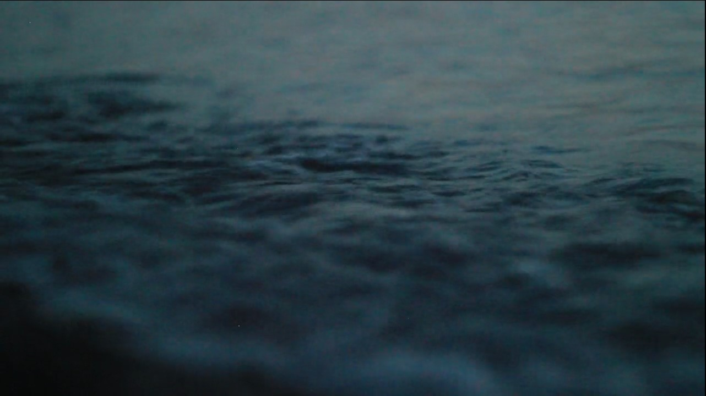

# 背景视频切换
==教程地址==：[原文地址（YouTube）](https://youtu.be/7gEJTwsH6kw)

==B站教程==：[原文转载（bilibili）](https://www.bilibili.com/video/av88363899)

**两个视频的内容相同，第二个为转载**

## 效果图
>

## 代码区

### html
```html
<section>
  <video id='slider' autoplay muted loop src="img/video/video1.mp4"></video>
  <ul class="navigation">
    <li onclick="videoUrl(1)"></li>
    <li onclick="videoUrl(2)"></li>
    <li onclick="videoUrl(3)"></li>
    <li onclick="videoUrl(4)"></li>
  </ul>
</section>
```
### CSS
```css
* {
  margin: 0; /* 外边距 */
  padding: 0; /* 内边距 */
  box-sizing: border-box; /* 盒子大小规则 */
}
section {
  position: relative; /* 相对定位 */
  width: 100%; /* 宽 */
  height: 100vh; /* 高 */
}
section video {
  position: absolute; /* 绝对定位 */
  top: 0; /* 距上部 */
  left: 0; /* 距左部 */
  width: 100%;
  height: 100%;
  object-fit: cover; /* 可替换元素如何适应，此处为裁剪到合适的大小 */
}

section  .navigation {
  position: absolute;
  bottom: 40px;
  left: 50%;
  transform: translate(-50%); /* X移动 */
  display: flex; /* 弹性盒模型 */
  z-index: 100; /* Z轴层叠顺序 */
  justify-content: center; /* 主轴对齐方式 */
  align-items: center; /* 交叉轴对齐方式 */
}

section .navigation li {
  list-style: none; /* 清除默认样式 */
  cursor: pointer;
  margin: 0 10px;
  border-radius: 4px;
  background: #fff; /* 背景颜色 */
  padding: 3px 3px 0;
  opacity: 0.7; /* 透明度 */
  transition: 1s; /* 过渡时间 */
}
section .navigation li:hover { /* 悬停时 */
  opacity: 1; /* 通过修改透明度实现显示 */
}

section .navigation li img{
  width: 120px;
  transition: 0.5s;
}

section .navigation li img:hover {
  width: 200px; /* 修改宽度实现放大 */
}
```
### JS
```javascript
function videoUrl (vvv) {
  // 切换地址路径
  document.getElementById('slider').src = 'img/video/video' + vvv + '.mp4';
}
```
==教程地址==：[原文地址（YouTube）](https://youtu.be/7gEJTwsH6kw)

==B站教程==：[原文转载（bilibili）](https://www.bilibili.com/video/av88363899)