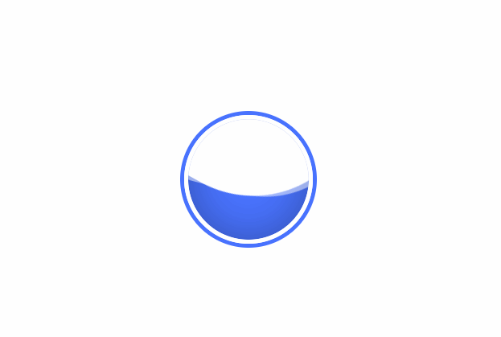

# 标题
==教程地址==：[原文地址（YouTube）](https://youtu.be/dQw9v7bWbPE)

==B站教程==：[原文转载（bilibili）](https://www.bilibili.com/video/av88364953/)

**两个视频的内容相同，第二个为转载**

## 效果图
>

## 代码区

### html
```html
<div class="circle">
  <div class="wave"></div>
</div>
```
### CSS
```css
body {
  margin: 0; /* 外边距 */
  padding: 0; /* 内边距 */
}
.circle {
  position: absolute; /* 绝对定位 */
  top: 50%; /* 距上部 */
  left: 50%; /* 距左部 */
  transform: translate(-50%, -50%); /* 移动X,Y */
  width: 150px; /* 宽 */
  height: 150px; /* 高 */
  border: 5px solid #fff; /* 边框 */
  box-shadow:  0 0 0 5px #4973ff; /* 盒子阴影： x,y,模糊,边框尺寸 */
  border-radius: 50%; /* 边框圆角 */
  overflow: hidden; /* 溢出隐藏 */
}

/* 水 */
.wave {
  position: relative;
  width: 100%;
  height: 100%;
  background: #4973ff;
  border-radius: 50%;
  box-shadow: inset 0 0 50px rgba(0, 0, 0, .3); /*n内阴影 */
}

/* 形成双面的水波 */
.wave::before,
.wave::after {
  content: ''; /* 内容 */
  position: absolute;
  width: 200%;
  height: 200%;
  top: 0;
  left: 50%;
}

.wave::before {
  border-radius: 45%;
  background: rgba(255, 255, 255, 1);
  animation: animate 5s linear infinite; /* 动画 */
}

.wave::after {
  border-radius: 40%;
  background: rgba(255, 255, 255, 0.5);
  animation: animate 10s linear infinite;
}

@keyframes animate {
  /* 通过修改y轴距离可以实现满加载 */
  0% {
    transform: translate(-50%, -70%) rotate(0deg);
  }
    100% {
    transform: translate(-50%, -70%) rotate(360deg);
  }
}
```
### JS
```javascript

```
==教程地址==：[原文地址（YouTube）](https://youtu.be/dQw9v7bWbPE)

==B站教程==：[原文转载（bilibili）](https://www.bilibili.com/video/av88364953/)