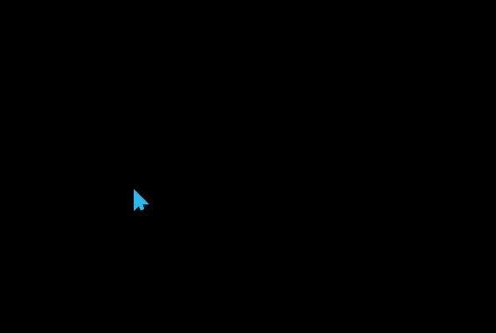

#  使用js实现跟随鼠标移动的心形上浮效果
==教程地址==：[原文地址（YouTube）](https://youtu.be/I0R0T7p5oR8)

==B站教程==：[原文转载（bilibili）](https://www.bilibili.com/video/av89100003/)

**两个视频的内容相同，第二个为转载**

## 效果图
>

## 代码区

### html
```html
<!-- 模板即可 -->
```
### CSS
```css
* {
  margin: 0; /* 外边距 */
  padding: 0; /* 内边距 */
}

body {
  overflow: hidden; /* 超出隐藏，防止出现滚动条 */
  background: #000; /* 背景颜色 */
  height: 100vh; /* 高度 */
}

span {
  position: absolute; /* 绝对定位 */
  background: url(../img/heart.png); /* 背景图片 */
  pointer-events: none; /* 事件不遮挡 */
  transform: translate(-50%, -50%); /* x,y移动 */
  background-size: cover; /* 背景大小，裁切 */
  animation: animate 2s linear infinite; /* 动画：名称，时间，速率，重复 */
}

@keyframes animate {
  100% {
    /*
    * 通过修改透明度，和色调转换实现颜色更改
    * 利用移动实现上浮
    **/
    transform: translate(-50%, -110vh);
    opacity: 0;
    filter: hue-rotate(720deg);
  } 
}
```
### JS
```javascript
		// 添加一个事件触发函数(事件做了更改，改为点击事件)
		document.addEventListener('click', function(e) {
			// 获取元素
			var body = document.querySelector('body')
			var heart = document.createElement('span')
			// 获取x,y位置
			var x = e.offsetX
			var y = e.offsetY
			// 给元素属性left,top赋值
			heart.style.left = x + 'px'
			heart.style.top = y + 'px'
			// 生成随机数
			var size = Math.random() * 100
			// 赋值
			heart.style.width = 20 + size + 'px'
			heart.style.height = 20 + size + 'px'
			// body内添加元素
			body.appendChild(heart)
			// 根据动画事件，进行摧毁
			setTimeout(function() {
				heart.remove()
			}, 2000)
		})
```
==教程地址==：[原文地址（YouTube）](https://youtu.be/I0R0T7p5oR8)

==B站教程==：[原文转载（bilibili）](https://www.bilibili.com/video/av89100003/)