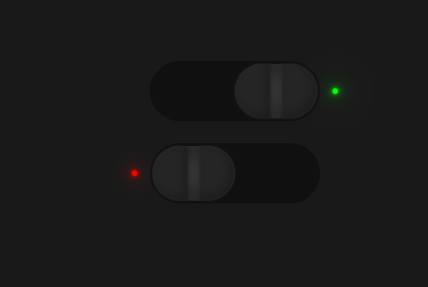

# CSS制作开关

==教程地址==：[原文地址（YouTube）](https://youtu.be/bq1SpzD8X2s)

==B站教程==：[原文转载（bilibili）](https://www.bilibili.com/video/av89570432)

**两个视频的内容相同，第二个为转载**

## 效果图
>

## 代码区

### html
```html
<label>
  <input type="checkbox" name="" id="one">
  <span class="check"></span>
  <span class="btn"></span>
</label>
<label>
  <input type="checkbox" name="" id="two">
  <span class="check"></span>
  <span class="btn"></span>
</label>
```
### CSS
```css
* {
  margin: 0; /* 外边距 */
  padding: 0; /* 内边距 */
  box-sizing: border-box; /* 盒子大小规则 */
}
body {
  display: flex; /* 弹性盒模型 */
  justify-content: center; /* 主轴对齐方式 */
  align-items: center; /* 交叉轴对齐方式 */
  min-height: 100vh; /* 最小高度 */
  flex-direction: column; /* 排列方向 */
  overflow: hidden; /* 超出隐藏 */
  background-color: #191919; /* 背景颜色 */
}
/*  */
label {
  position: relative; /* 相对定位 */
  width: 240px;
  height: 80px;
  cursor: pointer; /* 鼠标样式 */
  margin: 20px 0;
}

label input {
  opacity: 0; /* 透明度 */
}
label .check {
  position: absolute; /* 绝对定位 */
  top: 0;
  left: 0;
  cursor: pointer;
  width: 100%;
  height: 100%;
  background: #101010;
  border-radius: 40px; /* 边框圆角 */
  box-shadow: 0 0 0 4px #101010; /* 盒子阴影 */
}
 /* 红点实现 */
label .check::before { /* 之前添加 */
  content: ''; /* 内容 */
  position: absolute;
  top: calc(50% - 4px); /* 计算 */
  left: -30px;
  width: 8px;
  height: 8px;
  border-radius: 50%;
  background: #f00;
  transition: 0.5s; /* 等待时间 */
  box-shadow: 
  0 0 5px #f00,
  0 0 10px #f00,
  0 0 20px #f00,
  0 0 40px #f00,
  0 0 80px #f00;
}
 /* 切换隐藏 */
label input:checked ~ .check::before {
  background: none;
  box-shadow:none;
}

 /* 小绿点实现 */
label .check::after {
  content: '';
  position: absolute;
  top: calc(50% - 4px);
  right: -30px;
  width: 8px;
  height: 8px;
  border-radius: 50%;
  background: none;
  transition: 0.5s;
}

label input:checked ~ .check::after {
  background: #0f0;
  box-shadow: 
  0 0 5px #0f0,
  0 0 10px #0f0,
  0 0 20px #0f0,
  0 0 40px #0f0,
  0 0 80px #0f0;
}
 /* 按钮实现 */
label .btn {
  position: absolute;
  top: 0;
  left: 0;
  width: 120px;
  height: 80px;
  border-radius: 40px;
  background-color: #333;
  transition: 0.5s;
  box-shadow: inset 0 -20px 15px #292929, inset 0 20px 15px #292929;
}
label .btn::before {
  content: '';
  position: absolute;
  top: 0;
  left: 0;
  width: 52px;
  height: 80px;
  background: #252525;
  border-top-left-radius: 80px;
  border-bottom-left-radius: 80px;
  box-shadow: inset -5px -5px 15px rgba(0, 0, 0, 0.3);
  filter: blur(2px); /* 模糊 */
}
label .btn::after {
  content: '';
  position: absolute;
  top: 0;
  right: 0;
  width: 52px;
  height: 80px;
  background: #252525;
  border-top-right-radius: 80px;
  border-bottom-right-radius: 80px;
  box-shadow: inset -5px -5px 15px rgba(0, 0, 0, 0.3);
  filter: blur(2px);
}

label input:checked ~ .btn {
  left: 50%;
}
```
### JS
```javascript

```
==教程地址==：[原文地址（YouTube）](https://youtu.be/bq1SpzD8X2s)

==B站教程==：[原文转载（bilibili）](https://www.bilibili.com/video/av89570432)