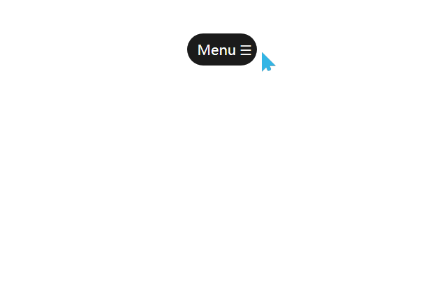

# 展开菜单栏
==教程地址==：[原文地址（YouTube）](https://youtu.be/57GkyGMnmsw)

==B站教程==：[原文转载（bilibili）](https://www.bilibili.com/video/av90037360)

**两个视频的内容相同，第二个为转载**

## 效果图
>

## 代码区

### html
```html
<div class="menu-container">
  <!-- 菜单栏 -->
  <div class="button"><p>Menu</p> 
    <span class="fas"></span> <!-- 按钮 -->
  </div>
  <!-- 子项 -->
  <ul>
    <li><a href="#">Home</a></li>
    <li><a href="#">About</a></li>
    <li><a href="#">Blogs</a></li>
    <li><a href="#">Contact</a></li>
    <li><a href="#">Feedback</a></li>
  </ul>
</div>
```
### CSS
```css
@charset "utf-8";
* {
  margin: 0; /* 外边距 */
  padding: 0; /* 内边距 */
  box-sizing: border-box; /* 盒子大小规则 */
  font-family: sans-serif ; /* 字体 */
}
.menu-container {
  position: absolute; /* 绝对定位 */
  top: 20%; /* 距上部 */
  left: 50%; /* 距左部 */
  transform: translate(-50%, -50%); /* x,y移动 */
  width: 300px; /* 宽度 */
  display: flex; /* 弹性盒模型 */
  align-items: center; /* 交叉轴对齐方式 */
  justify-content: center; /* 主轴对齐方式 */
}
.button {
  position: relative; /* 相对定位 */
  background: #1b1b1b; /* 背景颜色 */
  color: white;
  font-size: 20px; /* 字体大小 */
  padding: 8px 15px;
  width: 100px;
  line-height: 30px; /* 行高 */
  display: flex;
  align-items: center;
  justify-content: space-between;
  border-radius: 25px; /* 边框圆角 */
  cursor: pointer; /* 鼠标悬停样式 */
  transition: width 0.4s; /* 过渡时间 */
}
/* 点击后样式 */
.button.expand {
  width: 100%;
}
.fas::before {
  content: '\2630'; /* 特殊字符编码 */
  padding: 0 0 0 5px;
}

.fas.expand::before {
  content: '\2612';
}

/* 子菜单样式 */
ul {
  list-style: none; /* 清除默认样式 */
  position: absolute;
  top: 65px;
  display: none;
  background: #161616;
  width: 100%;
  text-align: center; /* 文字居中 */
  border-radius: 5px;
  box-shadow: 0 3px 6px rgba(0, 0, 0, 0.3); /* 阴影 */
}

ul::before { /* 指向关闭按钮的箭头 */
  position: absolute;
  content: '';
  width: 20px;
  height: 20px;
  background: #1b1b1b;
  top: -10px;
  right: 15px;
  transform: rotate(45deg); /* 旋转 */
  z-index: -1; /* 层叠 */
}

ul li {
  line-height: 35px;
  padding: 8px 20px;
  cursor: pointer;
  border: 1px solid transparent;
  border-bottom: 1px solid rgba(255, 255, 255, .1);
}
ul li:last-child {
  border-bottom: none;
}

ul li:hover {
  box-shadow: inset 0 0 5px #33ffff,
              inset 0 0 5px #65ffff;
}
ul li:hover:first-child { /* 第一项 */
  border-radius: 5px 5px 0 0;
}

ul li:hover:last-child {
  border-radius: 0px 0px 5px 5px;
}
ul li a {
  color: white;
  text-decoration: none;
}
ul li:hover a {
  color: cyan;
}
```
### JS
```javascript
// 文档加载准备
$(document).ready(function () {
  // 添加点击事件
  $('.button').click(function () {
    // 判断是否拥有指定class
    if($(this).hasClass('expand')) {
      // 下拉事件
      $("ul").stop().slideUp(function () {
        $('.button').removeClass('expand');
        $('.fas').removeClass('expand');
      });
    }else{
      // 添加样式
      $(this).addClass('expand');
      setTimeout(function() {
        $('.fas').addClass('expand');
        $("ul").stop().slideDown();
      }, 200)
    }
  })
})
```
==教程地址==：[原文地址（YouTube）](https://youtu.be/57GkyGMnmsw)

==B站教程==：[原文转载（bilibili）](https://www.bilibili.com/video/av90037360)