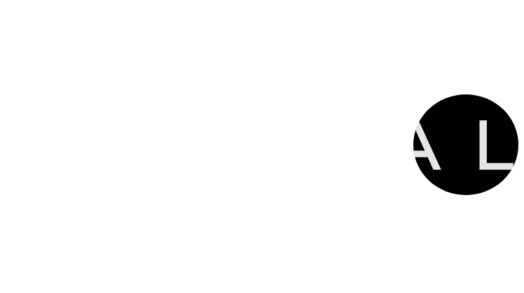

# 滚动显示阴影文字
==教程地址==：[原文地址（codepen）](https://codepen.io/aneeket/pen/qBdaWdQ)

==B站教程==：[原文转载（bilibili）](https://www.bilibili.com/video/av90290875/)

**两个视频的内容相同，第二个为转载**

## 效果图
>

## 代码区

### html
```html
  <div class="reveal">
		<span>Reveal</span>
	</div>
```
### CSS
```css
@import url("https://fonts.googleapis.com/css?family=Montserrat&display=swap");

@import url("https://stackpath.bootstrapcdn.com/bootstrap/4.4.1/css/bootstrap.min.css");

* {
	font-family: "Montserrat", sans-serif !important;
}

body {
	min-height: 100vh; /* 最小高度 */
	display: flex; /* 弹性盒模型 */
	align-items: center; /* 交叉轴对齐 */
	justify-content: center; /* 主轴对齐方式 */
	flex-direction: column; /* 排列方向 */
}

.reveal {
  position: relative; /* 相对定位 */
  font-size: 6em; /* 字符大小 */
  font-weight: bold; /* 字体维度 */
  text-transform: uppercase; /* 大写 */
  background: #fff; /* 背景颜色 */
  letter-spacing: 0.5em; /* 字符间距 */
}

span {
  color: #e5e5e5; /* 颜色 */
  mix-blend-mode: lighten; /* 颜色如何混合 */
}
/* 阴影 */
.reveal:before {
  content: ''; /* 内容 */
  position: absolute; /* 绝对定位 */
  top: 0;
  left: 0;
  width: 150px;
  height: 100%;
  border-radius: 50%; /* 边框圆角 */
  background: #000;
  animation: reveal 6s linear infinite; /* 动画：名称，时间，速率，重复 */
}

@keyframes reveal {
  /* 利用left移动实现动画效果 */
  0% {
    left: -50px;
  }
  50% {
    left: calc(100% - 150px);
  }
  100% {
    left: -50px;
  }
}

```
### JS
```javascript

```
==教程地址==：[原文地址（codepen）](https://codepen.io/aneeket/pen/qBdaWdQ)

==B站教程==：[原文转载（bilibili）](https://www.bilibili.com/video/av90290875/)