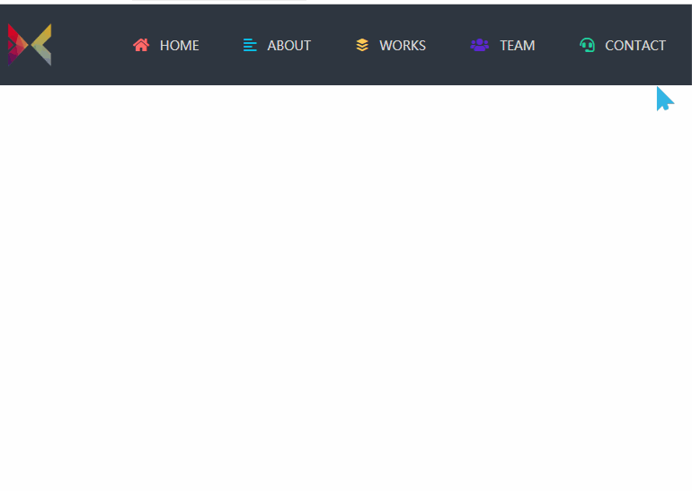

# 响应式菜单
==教程地址==：[原文地址（YouTube）](https://youtu.be/NXJ1wLsllwg)

==B站教程==：[原文转载（bilibili）](https://www.bilibili.com/video/av92437865)

**两个视频的内容相同，第二个为转载**

## 效果图
>

## 代码区

### html
```html
<header>
<div class="inner-width">
  <a href="#" class="logo"></a>
  <i class="menu-toggle-btn fas fa-bars"></i>
  <nav class="navigation-menu">
    <a href="#"><i class="fas fa-home home"></i> Home</a>
    <a href="#"><i class="fas fa-align-left about"></i> About</a>
    <a href="#"><i class="fab fa-buffer works"></i> Works</a>
    <a href="#"><i class="fas fa-users team"></i> Team</a>
    <a href="#"><i class="fas fa-headset contact"></i> Contact</a>
  </nav>
</div>
</header>
```
### CSS
```css
*{
  margin: 0; /* 外边距 */
  padding: 0; /* 内边距 */
  text-decoration: none; /* 文字装饰 */
  font-family: "Open Sans",sans-serif; /* 字体样式 */
}

header{
  height: 90px; /* 高度 */
  background: #2f3640; /* 背景颜色 */
}

.inner-width{
  max-width: 1000px; /* 最大高度 */
  padding: 0 10px;
  margin: auto;
}

.logo{
  float: left; /* 左浮动 */
  padding: 20px 0;
}

.logo img{
  height: 50px;
}

.navigation-menu{
  float: right;
  display: flex; /* 弹性盒模型 */
  align-items: center; /* 交叉轴对齐方式 */
  min-height: 90px;
}

.navigation-menu a{
  margin-left: 10px;
  color: #ddd; /* 颜色 */
  text-transform: uppercase; /* 大写 */
  font-size: 14px; /* 字号 */
  padding: 12px 20px;
  border-radius: 4px; /* 圆角 */
  transition: .3s linear; /* 过渡时间 */
}

.navigation-menu a:hover{
  background: #fff;
  color: #2f3640;
  transform: scale(1.1); /* 放大 */
}

.navigation-menu i{
  margin-right: 8px;
  font-size: 16px;
}

.menu-toggle-btn{
  float: right;
  height: 90px;
  line-height: 90px !important; /* 行高，权重等级 */
  color: #fff;
  font-size: 26px;
  display: none !important; /*  */
  cursor: pointer;
}

/*切换样式后*/
@media screen and (max-width:700px) {
  .menu-toggle-btn{
    display: block !important;
  }

  .navigation-menu{
    position: fixed; /* 根据浏览器定位 */
    width: 100%;
    max-width: 400px;
    background: #172b4d;
    top: 90px;
    right: 0;
    display: none;
    padding: 20px 40px;
    box-sizing: border-box;
  }

  .navigation-menu::before{
    content: "";
    border-left: 10px solid transparent; /* 透明 */
    border-right: 10px solid transparent;
    border-bottom: 10px solid #172b4d;
    position: absolute;
    top: -10px;
    right: 10px;
  }

  .navigation-menu a{
    display: block; /* 切换为盒模型 */
    margin: 10px 0;
  }

  .navigation-menu.active{
    display: block;
  }
}
.home{
  color: #ff6b6b;
}

.about{
  color: #0abde3;
}

.works{
  color: #feca57;
}

.team{
  color: #5f27cd;
}

.contact{
  color: #1dd1a1;
}
```
### JS
```javascript
// 图标和js网址
// https://cdnjs.cloudflare.com/ajax/libs/jquery/3.4.1/jquery.min.js"
// https://cdnjs.cloudflare.com/ajax/libs/font-awesome/5.12.1/css/all.min.css"

// 点击时切换样式
  $(".menu-toggle-btn").click(function(){
    $(this).toggleClass("fa-times");
    $(".navigation-menu").toggleClass("active");
  });
```
==教程地址==：[原文地址（YouTube）](https://youtu.be/NXJ1wLsllwg)

==B站教程==：[原文转载（bilibili）](https://www.bilibili.com/video/av92437865)