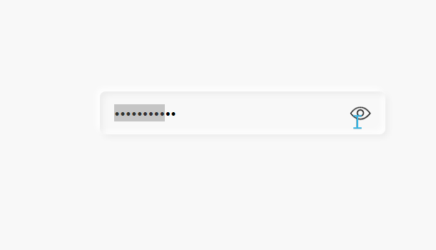

# 点击切换显示隐藏输入框
==教程地址==：[原文地址（YouTube）](https://youtu.be/UflhknjGNAA)

==B站教程==：[原文转载（bilibili）](https://www.bilibili.com/video/av92952904)

**两个视频的内容相同，第二个为转载**

## 效果图
>

## 代码区

### html
```html
<div class="inputBox">
  <input type="password" name='' placeholder="Enter password" id='password'>
  <div id="toggle" onclick="showHide()"></div>
</div>
```
### CSS
```css
* {
  margin: 0; /* 外边距 */
  padding: 0; /* 内边距 */
  font-family: sans-serif; /* 字体样式 */
}

body {
  display: flex; /* 弹性盒模型 */
  justify-content: center; /* 主轴对齐方式 */
  align-items: center; /* 交叉轴对齐方式 */
  min-height: 100vh; /* 最小高度 */
  background: #f8f8f8; /* 背景 */
}
.inputBox {
  position: relative; /* 相对定位 */
  width: 400px;
  height: 60px;
}

.inputBox input {
  position: absolute;
  top: 0;left: 0;
  width: 100%;
  height: 100%;
  border: none; /* 无边框 */
  background: transparent; /* 透明背景 */
  padding: 0 20px;
  font-size: 18px; /* 字体大小 */
  box-sizing: border-box; /* 盒子大小规则 */
  outline: none; /* 无轮廓 */
  border-radius: 8px; /* 边框圆角 */
  box-shadow:  /* 阴影 */
  -4px -4px 10px rgba(255, 255, 255, 1),
  inset 4px 4px 10px rgba(0, 0, 0, 0.05),
  inset -4px -4px 10px rgba(255, 255, 255, 1),
  4px 4px 10px rgba(0, 0, 0, 0.05);
}
 /* 提示文字 */
.inputBox input::placeholder {
  color: #ccc;
}
 /* 按钮 */
#toggle {
  position: absolute;
  top: 50%;
  right: 20px;
  transform: translateY(-50%);
  width: 30px;
  height: 30px;
  background: url(../img/bg1.png);
  background-size: cover; /* 背景图片大小模式 */
  cursor: pointer; /* 鼠标样式 */
}

#toggle.hide {
  background: url(../img/bg2.png);
  background-size: cover;
}
```
### JS
```javascript
// 获取元素
const password = document.getElementById('password');
const toggle = document.getElementById('toggle');
function showHide() {
  // 根据属性判断元素进行修改
  if(password.type === "password") {
    // 修改属性
    password.setAttribute('type', "text");
    // 添加样式类
    toggle.classList.add('hide');
  }else {
    password.setAttribute('type', "password");
    toggle.classList.remove('hide');
  }
}
```
==教程地址==：[原文地址（YouTube）](https://youtu.be/UflhknjGNAA)

==B站教程==：[原文转载（bilibili）](https://www.bilibili.com/video/av92952904)