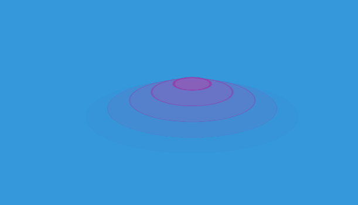

# 波纹效果
==教程地址==：[原文地址（YouTube）](https://www.bilibili.com/video/av93457368)

==B站教程==：[原文转载（bilibili）](https://www.bilibili.com/video/av93457368)

**两个视频的内容相同，第二个为转载**

## 效果图
>

## 代码区

### html
```html
<div class="container">
  <span class="ripple r1"></span>
  <span class="ripple r2"></span>
  <span class="ripple r3"></span>
  <span class="ripple r4"></span>
  <span class="ripple r5"></span>
  <span class="ripple r6"></span>
</div>
```
### CSS
```css
body{
  margin: 0; /* 外边距 */
  padding: 0; /* 内边距 */
  background: #3498db; /* 背景颜色 */
}
.container{
  position: absolute; /* 绝对定位 */
  top: 50%; /* 距上部 */
  left: 50%; /* 距左部 */
  transform: translate(-50%,-50%) rotateX(70deg); /* 移动，X轴旋转 */
}
.ripple{
  position: fixed; /* 视窗定位 */
  top: 0;
  transform: translateX(-50%);

  width: 20px;
  height: 20px;
  border-radius: 50%;
  animation: ripple 4s linear infinite; /* 动画：名称 时间 速率 重复 */
}
.r2{
  /* 延迟时间实现 */
  animation-delay: 0.8s;
}
.r3{
  animation-delay: 1.6s;
}
.r4{
  animation-delay: 2.4s;
}
.r5{
  animation-delay: 3.2s;
}
.r6{
  animation-delay: 4s;
}

@keyframes ripple {
  from{
    border: 4px solid #8e44ad;
    background: #9b59b670;
  }
  to{
    border: 0px solid #8e44ad;
    background: #9b59b670;
    width: 400px;
    height: 400px;
    top: 20px;
    opacity: 0; /* 透明度 */
  }
}

```
### JS
```javascript

```
==教程地址==：[原文地址（YouTube）](https://www.bilibili.com/video/av93457368)

==B站教程==：[原文转载（bilibili）](https://www.bilibili.com/video/av93457368)