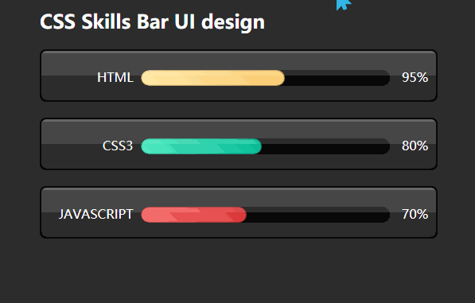

# 技能栏UI悬停设计
==教程地址==：[原文地址（YouTube）](https://www.bilibili.com/video/av93716432/)

==B站教程==：[原文转载（bilibili）](https://youtu.be/bvUMzFMiIbk)

**两个视频的内容相同，第二个为转载**

## 效果图
>

## 代码区

### html
```html
  <div class="container">
		<h2>CSS Skills Bar UI design</h2>
		<div class="skills">
			<span class="Name">Html</span>
			<div class="percent">
				<div class="progress" style="width: 95%;"></div>
			</div>
			<span class='Value' >95%</span>
    </div>
    <!-- skills自行复制 -->
	</div>
```
### CSS
```css

```
### JS
```javascript

```
==教程地址==：[原文地址（YouTube）](https://youtu.be/bvUMzFMiIbk)

==B站教程==：[原文转载（bilibili）](https://www.bilibili.com/video/av93716432/)