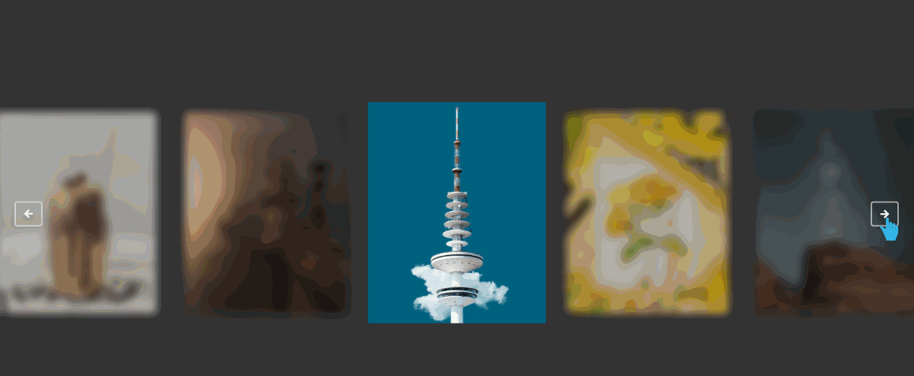

# Glide插件的图片轮播图
==教程地址==：[原文地址（YouTube）](https://youtu.be/iiLCKyFd_5c)

==B站教程==：[原文转载（bilibili）](https://www.bilibili.com/video/av94213224)

**两个视频的内容相同，第二个为转载**

## 效果图
>

## 代码区

### html
```html
<!-- 头文件注意引入次序 -->
<div class="images glide">
  <div class="glide__track" data-glide-el="track">
    <ul class="glide__slides">
      <!-- 请自行添加li图片 -->
      <li class="glide__slide">
        
      </li>
    </ul>
  </div>
  <!-- 按钮 -->
  <div class="glide__arrows" data-glide-el="controls">
    <button class="glide__arrow glide__arrow--left" data-glide-dir="<"><i class="fas fa-arrow-left"></i></button>
    <button class="glide__arrow glide__arrow--right" data-glide-dir=">"><i class="fas fa-arrow-right"></i></button>
  </div>
</div>
```
### CSS
```css
body{
  margin: 0;
  padding: 0;
  display: flex; /* 弹性盒模型 */
  align-items: center; /* 交叉轴对齐方式 */
  justify-content: center; /* 主轴对齐方式 */
  min-height: 100vh;
  background: #333;
}
.glide__slide img{
  width: 100%;
}
.glide__slide{
  filter: blur(6px); /* 模糊 */
  opacity: .7;
  transition: .3s linear;
}
.glide__slide--active{
  opacity: 1; /* 透明度 */
  filter: none; /* 无过渡 */
  transform: scale(1.1); /* 放大 */
}
.glide__slides{
  overflow: visible; /*内容不会被修剪，会出现在元素框外。 */
}
```
### JS
```javascript
new Glide(".images",{
  type: 'carousel',
  perView: 5,
  focusAt: 'center',
  gap: 40,
  breakpoints: {
    1200:{
      perView: 3
    },
    800:{
      perView: 2
    }
  }
}).mount();
```
==教程地址==：[原文地址（YouTube）](https://youtu.be/iiLCKyFd_5c)

==B站教程==：[原文转载（bilibili）](https://www.bilibili.com/video/av94213224)