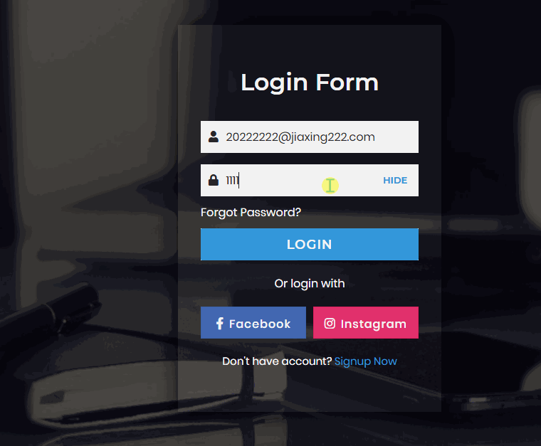

# 登陆界面设计
==教程地址==：[原文地址（YouTube）](https://youtu.be/qDNsgRZw_a4)

==B站教程==：[原文转载（bilibili）](https://www.bilibili.com/video/av95002360/)

**两个视频的内容相同，第二个为转载**

## 效果图
>

## 代码区

### html
```html
<div class="bg-img">
  <div class="content">
    <header>Login Form</header>
    <!-- 表单 -->
    <form action="#">
      <div class="field">
        <span class="fa fa-user"></span>
        <input type="text" required placeholder="Email or Phone">
      </div>
      <div class="field space">
        <span class="fa fa-lock"></span>
        <input type="password" class="pass-key" required placeholder="Password">
        <span class="show">SHOW</span>
      </div>
      <!-- 以下为按钮 -->
      <div class="pass">
        <a href="#">Forgot Password?</a>
      </div>
      <div class="field">
        <input type="submit" value="LOGIN">
      </div>
    </form>
    <!-- 更多方式登陆 -->
    <div class="login">Or login with</div>
    <div class="links">
      <div class="facebook">
        <i class="fab fa-facebook-f"><span>Facebook</span></i>
      </div>
      <div class="instagram">
        <i class="fab fa-instagram"><span>Instagram</span></i>
      </div>
    </div>
    <div class="signup">Don't have account?
      <a href="#">Signup Now</a>
    </div>
  </div>
</div>
```
### CSS
```css
@import url('https://fonts.googleapis.com/css?family=Montserrat:400,500,600,700|Poppins:400,500&display=swap');
*{
  margin: 0;
  padding: 0;
  box-sizing: border-box; /* 盒子大小规则 */
  user-select: none; /* 无法选中 */
}
.bg-img{
  background: url('../img/bg.jpg');
  height: 100vh;
  background-size: cover; /* 背景裁剪 */
  background-position: center; /* 背景居中 */
}
.bg-img:after{ /* 图标 */
  position: absolute; /* 绝对定位 */
  content: '';
  top: 0;
  left: 0;
  height: 100%;
  width: 100%;
  background: rgba(0,0,0,0.7);
}
.content{
  position: absolute;
  top: 50%;
  left: 50%;
  z-index: 999;
  text-align: center; /* 水平居中 */
  padding: 60px 32px;
  width: 370px;
  transform: translate(-50%,-50%); /* 移动x,y */
  background: rgba(255,255,255,0.04);
  box-shadow: -1px 4px 28px 0px rgba(0,0,0,0.75); /* 阴影 */
}
.content header{
  color: white;
  font-size: 33px; /* 字体大小 */
  font-weight: 600; /* 字体粗度 */
  margin: 0 0 35px 0;
  font-family: 'Montserrat',sans-serif;
}
.field{
  position: relative;
  height: 45px;
  width: 100%;
  display: flex;
  background: rgba(255,255,255,0.94);
}
.field span{
  color: #222;
  width: 40px;
  line-height: 45px;
}
.field input{
  height: 100%;
  width: 100%;
  background: transparent; /* 背景透明 */
  border: none;
  outline: none; /* 无轮廓 */
  color: #222;
  font-size: 16px;
  font-family: 'Poppins',sans-serif;
}
.space{
  margin-top: 16px;
}
.show{
  position: absolute;
  right: 13px;
  font-size: 13px;
  font-weight: 700;
  color: #222;
  display: none;
  cursor: pointer;
  font-family: 'Montserrat',sans-serif;
}
.pass-key:valid ~ .show{
  display: block;
}
.pass{
  text-align: left;
  margin: 10px 0;
}
.pass a{
  color: white;
  text-decoration: none;
  font-family: 'Poppins',sans-serif;
}
.pass:hover a{
  text-decoration: underline; /* 强调，增加下划线 */
}
 /* 登陆按钮 */
.field input[type="submit"]{
  background: #3498db;
  border: 1px solid #2691d9;
  color: white;
  font-size: 18px;
  letter-spacing: 1px;
  font-weight: 600;
  cursor: pointer;
  font-family: 'Montserrat',sans-serif;
}

.field input[type="submit"]:hover{
  background: #2691d9;
}
 /* 更多方式登陆 */

.login{
  color: white;
  margin: 20px 0;
  font-family: 'Poppins',sans-serif;
}
.links{
  display: flex;
  cursor: pointer; /* 鼠标样式 */
  color: white;
  margin: 0 0 20px 0;
}
.facebook,.instagram{
  width: 100%;
  height: 45px;
  line-height: 45px; /* 行高 */
  margin-left: 10px;
}
.facebook{
  margin-left: 0;
  background: #4267B2;
  border: 1px solid #3e61a8;
}
.instagram{
  background: #E1306C;
  border: 1px solid #df2060;
}
.facebook:hover{
  background: #3e61a8;
}
.instagram:hover{
  background: #df2060;
}
.links i{
  font-size: 17px;
}
i span{
  margin-left: 8px;
  font-weight: 500;
  letter-spacing: 1px;
  font-size: 16px;
  font-family: 'Poppins',sans-serif;
}
 /* 注册相关 */
.signup{
  font-size: 15px;
  color: white;
  font-family: 'Poppins',sans-serif;
}
.signup a{
  color: #3498db;
  text-decoration: none;
}


.signup a:hover{
  text-decoration: underline; /* 强调，增加下划线 */
}

```
### JS
```javascript
const pass_field = document.querySelector('.pass-key');
const showBtn = document.querySelector('.show');
// 切换显示与隐藏
showBtn.addEventListener('click', function(){
  if (pass_field.type === "password") {
      /* 切换颜色、字体、显示样式 */
    pass_field.type = "text";
    showBtn.textContent = "HIDE";
    showBtn.style.color = "#3498db";
  } else {
    pass_field.type = "password";
    showBtn.textContent = "SHOW";
    showBtn.style.color = "#222";
  }
});
```
==教程地址==：[原文地址（YouTube）](https://youtu.be/qDNsgRZw_a4)

==B站教程==：[原文转载（bilibili）](https://www.bilibili.com/video/av95002360/)