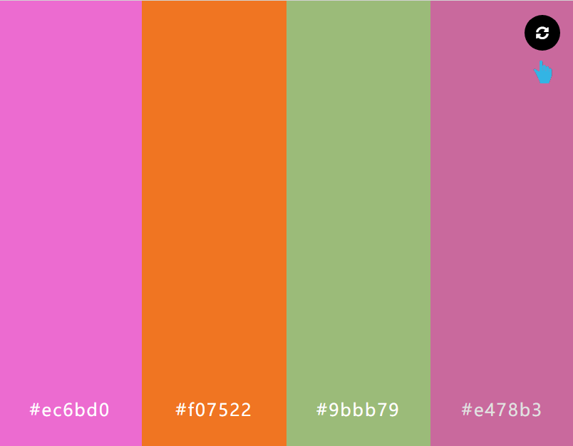

# 使用jQuery制作颜色效果选择器
==教程地址==：[原文地址（YouTube）](https://youtu.be/0579erpnkLs)

==B站教程==：[原文转载（bilibili）](https://www.bilibili.com/video/av96548408)

**两个视频的内容相同，第二个为转载**

## 效果图
>

## 代码区

### html
```html
<div class="colors-container">
  <div class="color">
    <div class="color-hex">#000000</div>
  </div>
  <div class="color">
    <div class="color-hex">#000000</div>
  </div>
  <div class="color">
    <div class="color-hex">#000000</div>
  </div>
  <div class="color">
    <div class="color-hex">#000000</div>
  </div>

  <button class="refresh"><i class="fas fa-sync-alt"></i></button>
  <div class="copied">The color copied to clipboard.</div>
</div>
```
### CSS
```css
*{
  margin: 0;
  padding: 0;
  box-sizing: border-box;
  font-family: "Open Sans",sans-serif;
}

.colors-container{
  width: 100%;
  min-height: 100vh;
  display: flex;
  flex-wrap: wrap;
}

.color{
  flex: 25%;
  min-height: 220px;
  transition: .4s linear;
  cursor: pointer;
  position: relative;
}

.color:hover{
  filter: brightness(80%);
}

.color-hex{
  position: absolute;
  bottom: 10%;
  width: 100%;
  text-align: center;
  color: #fff;
  font-size: 24px;
  letter-spacing: 2px;
}
.refresh{
  position: fixed;
  top: 20px;
  right: 20px;
  width: 50px;
  height: 50px;
  border: none;
  border-radius: 50%;
  font-size: 18px;
  color: #fff;
  background-color: #000;
  outline: none;
  cursor: pointer;
  transition: .4s linear;
}

.refresh:hover{
  transform: rotate(180deg);
}

.copied{
  position: fixed;
  bottom: 20px;
  left: 50%;
  transform: translateX(-50%);
  color: #fff;
  background-color: #000;
  padding: 15px 40px;
  min-width: 340px;
  text-align: center;
  display: none;
}

@media screen and (max-width: 800px){
  .color{
    flex: 100%;
  }
}
```
### JS
```javascript
      //set random colors
      $('.refresh').click(function(){
        $('.color').each(function(){
          var rColor = '#' + Math.random().toString(16).substr(2,6);
          $(this).css('background-color',rColor);
          $(this).children(".color-hex").text(rColor);
        });
      }).trigger('click');

      //copy to clipboard
      $('.color').click(function(){
        var input = $("<input>");
        var color = $(this).children(".color-hex").text();    
        $('body').append(input);
        input.val(color).select();
        document.execCommand('copy');
        input.remove();
        $('.copied').fadeIn().delay(2000).fadeOut();
      });
```
==教程地址==：[原文地址（YouTube）](https://youtu.be/0579erpnkLs)

==B站教程==：[原文转载（bilibili）](https://www.bilibili.com/video/av96548408)