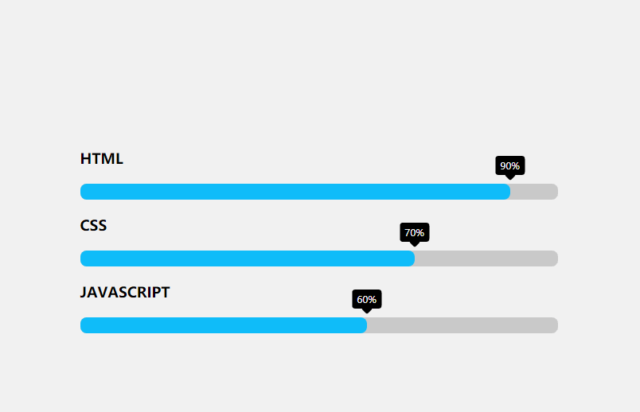

# jQuery制作扁平化动态技能栏
==教程地址==：[原文地址（YouTube）](https://youtu.be/xHuWmgV4O9Y)

==B站教程==：[原文转载（bilibili）](https://www.bilibili.com/video/av96549385)

**两个视频的内容相同，第二个为转载**

## 效果图
>

## 代码区

### html
```html
<div class="skills">
  <div class="skill">
    <div class="skill-name">HTML</div>
    <div class="skill-bar">
      <div class="skill-per" per="90"></div>
    </div>
  </div>

  <div class="skill">
    <div class="skill-name">CSS</div>
    <div class="skill-bar">
      <div class="skill-per" per="70"></div>
    </div>
  </div>

  <div class="skill">
    <div class="skill-name">Javascript</div>
    <div class="skill-bar">
      <div class="skill-per" per="60"></div>
    </div>
  </div>
</div>
```
### CSS
```css
body{
  margin: 0;
  padding: 0;
  font-family: 'Open Sans',sans-serif;
  min-height: 100vh;
  display: flex;
  align-items: center;
  justify-content: center;
  background: #f1f1f1;
}

.skills{
  width: 100%;
  max-width: 600px;
  padding: 0 20px;
}

.skill-name{
  font-size: 18px;
  font-weight: 700;
  text-transform: uppercase;
  margin: 20px 0;
}

.skill-bar{
  height: 20px;
  background: #cacaca;
  border-radius: 8px;
}

.skill-per{
  height: 20px;
  background-color: #0fbcf9;
  border-radius: 8px;
  width: 0;
  transition: 1s linear;
  position: relative;
}

.skill-per::before{
  content: attr(per);
  position: absolute;
  padding: 4px 6px;
  background-color: #000;
  color: #fff;
  font-size: 12px;
  border-radius: 4px;
  top: -35px;
  right: 0;
  transform: translateX(50%);
}

.skill-per::after{
  content: '';
  position: absolute;
  width: 10px;
  height: 10px;
  background-color: #000;
  top: -16px;
  right: 0;
  transform: translateX(50%) rotate(45deg);
  border-radius: 2px;
}
```
### JS
```javascript
$('.skill-per').each(function(){
  var $this = $(this);
  var per = $this.attr('per');
  $this.css("width",per+'%');
  $({animatedValue: 0}).animate({animatedValue: per},{
    duration: 1000,
    step: function(){
      $this.attr('per', Math.floor(this.animatedValue) + '%');
    },
    complete: function(){
      $this.attr('per', Math.floor(this.animatedValue) + '%');
    }
  });
});
```
==教程地址==：[原文地址（YouTube）](https://youtu.be/xHuWmgV4O9Y)

==B站教程==：[原文转载（bilibili）](https://www.bilibili.com/video/av96549385)