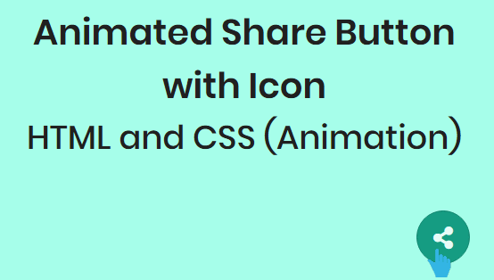

#  带有社交图标的动画共享按钮
==教程地址==：[原文地址（YouTube）](https://youtu.be/bm11uUrCrw8)

==B站教程==：[原文转载（bilibili）](https://www.bilibili.com/video/av98594260)

**两个视频的内容相同，第二个为转载**

## 效果图
>

## 代码区

### html
```html
<div class="content">
  <div class="text">Animated Share Button with Icon</div>
  <p>HTML and CSS (Animation)</p>
  <input type="checkbox" id="click">
  <label for="click" class="share-btn">
    <span class="fas fa-share-alt"></span>
    <a href="#"><span class="fab fa-twitter"></span></a>
    <a href="#"><span class="fab fa-instagram"></span></a>
    <a href="#"><span class="fab fa-youtube"></span></a>
  </label>
</div>
```
### CSS
```css
@import url('https://fonts.googleapis.com/css?family=Poppins:400,500,600,700&display=swap');
*{
  margin: 0;
  padding: 0;
  user-select: none;
  box-sizing: border-box;
  font-family: 'Poppins', sans-serif;
}
body{
  display: flex;
  align-items: center;
  justify-content: center;
  min-height: 100vh;
  background: #a7ffeb;
  text-align: center;
}
.content{
  color: #202020;
}
.text{
  font-size: 40px;
  font-weight: 600;
}
p{
  font-size: 37px;
  font-weight: 500;
}
.share-btn{
  position: absolute;
  bottom: 30px;
  right: 30px;
  z-index: 1;
}
.share-btn span{
  height: 60px;
  width: 60px;
  background: #16a085;
  line-height: 60px;
  font-size: 25px;
  color: #e9fcf8;
  border-radius: 50%;
  cursor: pointer;
  border: 1px solid #159d82;
}
.share-btn:hover span{
  background: #159d82;
  border-color: #12876f;
}
.share-btn a span{
  position: absolute;
  right: 10px;
  bottom: 10px;
  height: 30px;
  width: 30px;
  line-height: 30px;
  font-size: 18px;
  border: 1px solid transparent;
  background: #16a085;
  z-index: -1;
  opacity: 0;
  pointer-events: none;
  transition: 0.6s;
}
#click:checked ~ .share-btn a span{
  height: 50px;
  width: 50px;
  line-height: 50px;
  font-size: 23px;
  z-index: 1;
  opacity: 1;
  pointer-events: auto;
}
#click:checked ~ .share-btn a:nth-child(2) span{
  bottom: 0px;
  right: 80px;
  background: #1da1f2;
  border-color: #0e9af1;
}
#click:checked ~ .share-btn a:nth-child(3) span{
  bottom: 65px;
  right: 65px;
  background: #e1306c;
  border-color: #df2060;
}
.share-btn a:nth-child(3) span{
  transition-delay: 0.2s;
}
#click:checked ~ .share-btn a:nth-child(4) span{
  bottom: 80px;
  right: 0px;
  background: #ff0000;
  border-color: #e60000;
}
.share-btn a:nth-child(4) span{
  transition-delay: 0.4s;
}
#click{
  display: none;
}

```
### JS
```javascript

```
==教程地址==：[原文地址（YouTube）](https://youtu.be/bm11uUrCrw8)

==B站教程==：[原文转载（bilibili）](https://www.bilibili.com/video/av98594260)