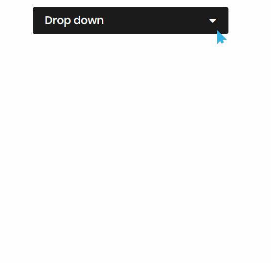

# CSS3制作带有子菜单的下拉菜单
==教程地址==：[原文地址（YouTube）](https://youtu.be/EQStBJU5AZM)

==B站教程==：[原文转载（bilibili）](https://www.bilibili.com/video/av98595055)

**两个视频的内容相同，第二个为转载**

## 效果图
>

## 代码区

### html
```html
<nav>
  <label for="btn" class="button">Drop down
    <span class="fas fa-caret-down"></span>
  </label>
  <input type="checkbox" id="btn">
  <ul class="menu">
    <li><a href="#">Home</a></li>
    <li>
      <label for="btn-2" class="first">Features
        <span class="fas fa-caret-down"></span>
      </label>
      <input type="checkbox" id="btn-2">
      <ul>
        <li><a href="#">Pages</a></li>
      </ul>
    </li>
    <li>
      <label for="btn-3" class="second">Services
        <span class="fas fa-caret-down"></span>
      </label>
      <input type="checkbox" id="btn-3">
      <ul>
        <li><a href="#">Web Design</a></li>
        <li><a href="#">App Design</a></li>
      </ul>
    </li>
    <li><a href="#">Contact</a></li>
    <li><a href="#">Feedback</a></li>
  </ul>
</nav>
```
### CSS
```css
@import url('https://fonts.googleapis.com/css?family=Poppins:400,500,600,700&display=swap');
*{
  margin: 0;
  padding: 0;
  box-sizing: border-box;
  user-select: none;
  font-family: 'Poppins', sans-serif;
}
nav{
  position: absolute;
  top: 20%;
  left: 50%;
  transform: translate(-50%, -50%);
  background: #1b1b1b;
  width: 400px;
  line-height: 40px;
  padding: 8px 25px;
  border-radius: 5px;
}
nav label{
  color: white;
  font-size: 22px;
  font-weight: 500;
  display: block;
  cursor: pointer;
}
.button span{
  float: right;
  line-height: 40px;
  transition: 0.5s;
}
.button span.rotate{
  transform: rotate(-180deg);
}
nav ul{
  position: absolute;
  background: #1b1b1b;
  list-style: none;
  top: 75px;
  left: 0;
  width: 100%;
  border-radius: 5px;
  display: none;
}
[id^=btn]:checked + ul{
  display: block;
}
nav .menu:before{
  position: absolute;
  content: '';
  height: 20px;
  width: 20px;
  background: #1b1b1b;
  right: 20px;
  top: -10px;
  transform: rotate(45deg);
  z-index: -1;
}
nav ul li{
  line-height: 40px;
  padding: 8px 20px;
  cursor: pointer;
  border-bottom: 1px solid rgba(0,0,0,0.2);
}
nav ul li label{
  font-size: 18px;
}
nav ul li a{
  color: white;
  text-decoration: none;
  font-size: 18px;
  display: block;
}
nav ul li a:hover,
nav ul li label:hover{
  color: cyan;
}
nav ul ul{
  position: static;
}
nav ul ul li{
  line-height: 30px;
  padding-left: 30px;
  border-bottom: none;
}
nav ul ul li a{
  color: #e6e6e6;
  font-size: 17px;
}
nav ul li span{
  font-size: 20px;
  float: right;
  margin-top: 10px;
  padding: 0 10px;
  transition: 0.5s;
}
nav ul li span.rotate{
  transform: rotate(-180deg);
}
input{
  display: none;
}

```
### JS
```javascript
// This code used to rotate drop icon(-180deg).
$('nav .button').click(function(){
  $('nav .button span').toggleClass("rotate");
});
  $('nav ul li .first').click(function(){
    $('nav ul li .first span').toggleClass("rotate");
  });
  $('nav ul li .second').click(function(){
    $('nav ul li .second span').toggleClass("rotate");
  });
```
==教程地址==：[原文地址（YouTube）](https://youtu.be/EQStBJU5AZM)

==B站教程==：[原文转载（bilibili）](https://www.bilibili.com/video/av98595055)