[点击访问](https://space.bilibili.com/12686142)
#### 介绍
资源来自互联网，并进行整理，用于自己学习

用于存放某些资源。


## HTML通用部分
```HTML
<!DOCTYPE html>
<html lang="en">
<head>
    <meta charset="UTF-8">
    <meta name="viewport" content="width=device-width, initial-scale=1.0">
    <meta http-equiv="X-UA-Compatible" content="ie=edge">
    <title>title</title>
    <link rel="stylesheet" href="css/style.css">
</head>
<body>
  <!-- 内容添加位置 -->
</body>
```

### 常用引入部分

```html
    <link rel="stylesheet" href="https://cdnjs.cloudflare.com/ajax/libs/font-awesome/5.11.2/css/all.css"> <!--图标网-->

```


## 各文件浏览


### 2019_12_24_纯CSS圆形进度栏

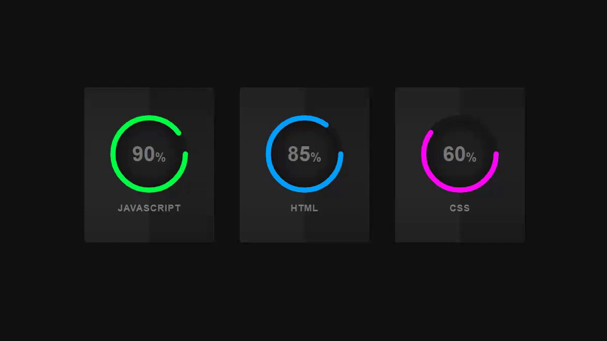

### 2019_12_25_夜间模式


### 2019_12_26_悬停展开卡


### 2019_12_27_手风琴菜单css+html

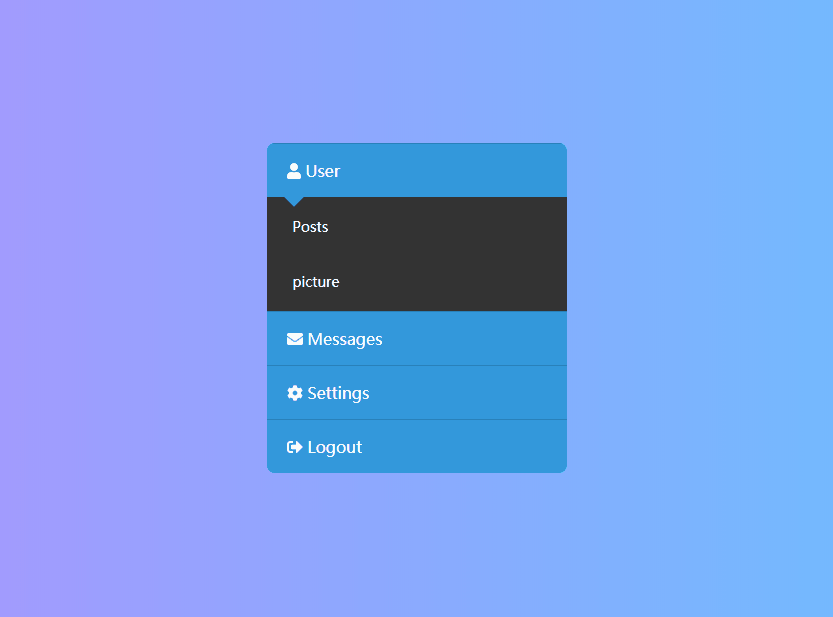

### 2019_12_28_移动边框式按钮


### 2019_12_29_动态背景随标题变换菜单

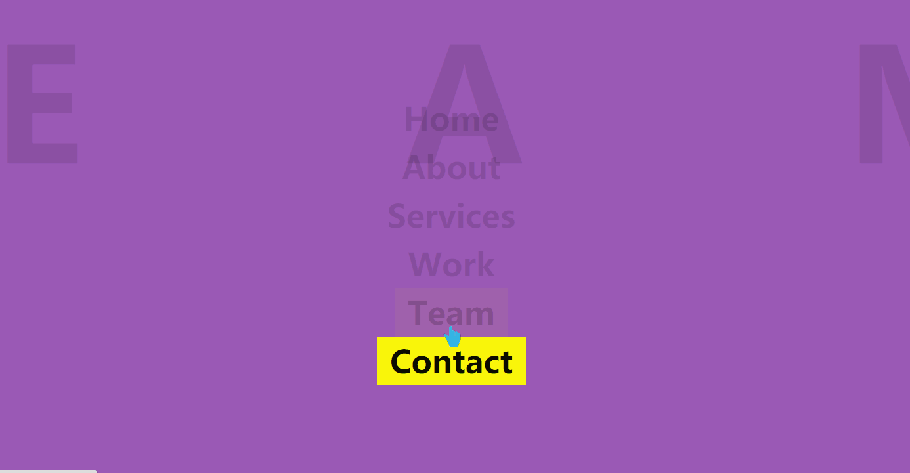

### 2019_12_31_ CSS倾斜边框,创意悬停效果


### 2019_12_31_悬停3D转换--1


### 2020_01_01_css自适应框模型


### 2020_01_03_简约日历


### 2020_01_04_渐变使用商品目录


### 2020_01_05_CSS穿透背景

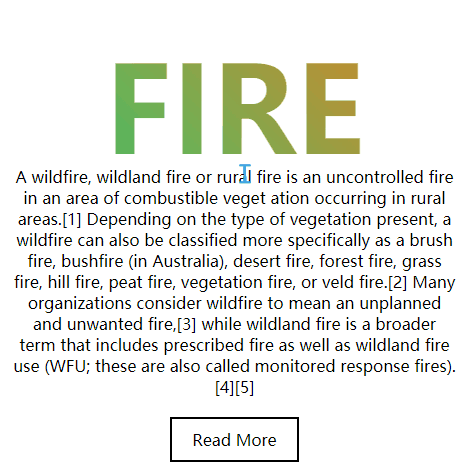

### 2020_01_06_动态个人信息


### 2020_01_07_图像翻转浏览窗口

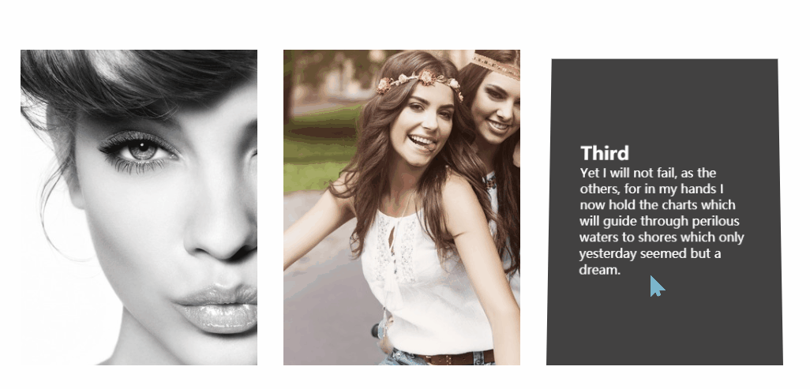

### 2020_01_08_潜泳的字体


### 2020_01_09_跳舞的线


### 2020_01_10_景深效果CSS


### 2020_01_12_旋转的纸风车


### 2020_01_13_赛博朋克按钮样式


### 2020_01_14_左近右出导航栏


### 2020_01_15_淡入淡出边框按钮


### 2020_01_16_实现扫描仪效果


### 2020_01_17_悬停显示详细信息分页


### 2020_01_18_点闪文字


### 2020_01_19_纯CSS实现枫叶下落


### 2020_01_20_翻页图书


### 2020_01_21_悬停时渐变发光按钮


### 2020_01_22_滚轮矫正图片背景


### 2020_01_23_跟随鼠标移动的背景


### 2020_01_24_制作滚动边框阅读窗口-CSS


### 2020_01_25_动态菜单栏


### 2020_01_26_svg实现


### 2020_01_27_loading方块动画


### 2020_01_28_镜面效果动态主页


### 2020_01_29_荧光按钮


### 2020_01_30_分层悬停叠加效果


### 2020_01_31_跟随鼠标移动的小人


### 2020_02_01_光环加载器


### 2020_02_02_打开礼盒按钮


### 2020_02_03_星空背景搜索框

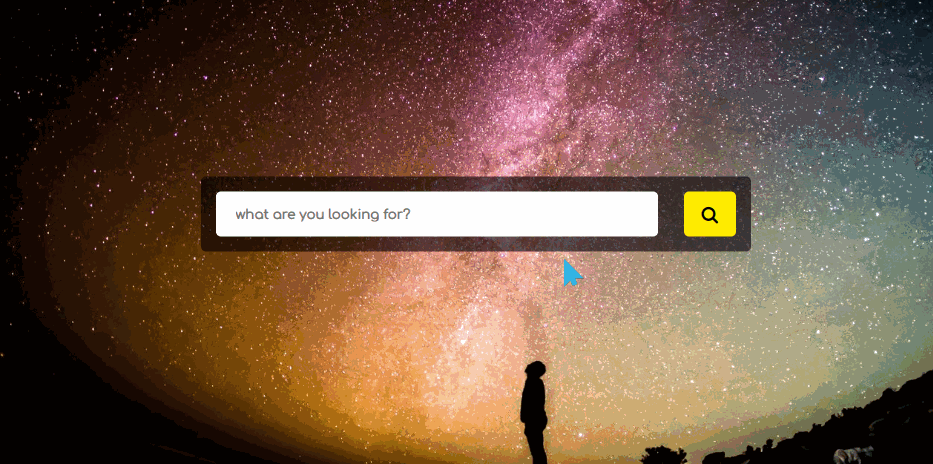

### 2020_02_04_ 鼠标附着式按钮边框


### 2020_02_05_自适应滑动特效菜单-滚动选项-01


### 2020_02_06_悬停多展开的主页

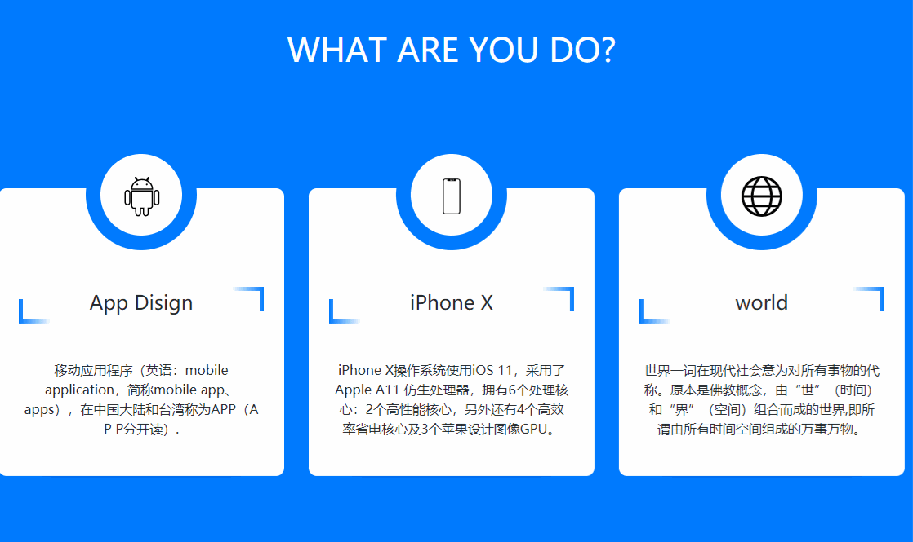

### 2020_02_07_社交按钮复选框

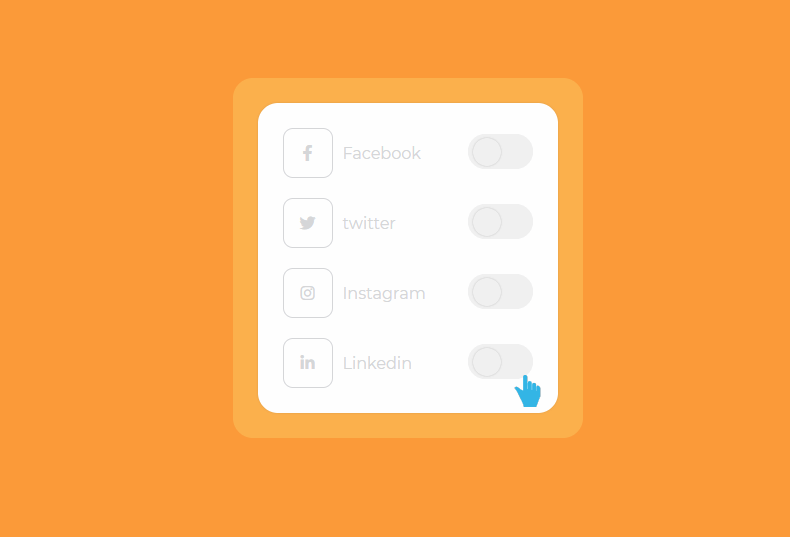

### 2020_02_08_渐出效果的个人主页


### 2020_02_09_纯CSS制作笑脸评分系统


### 2020_02_10_边框加载霓虹灯按钮


### 2020_02_10_点赞爱心按钮

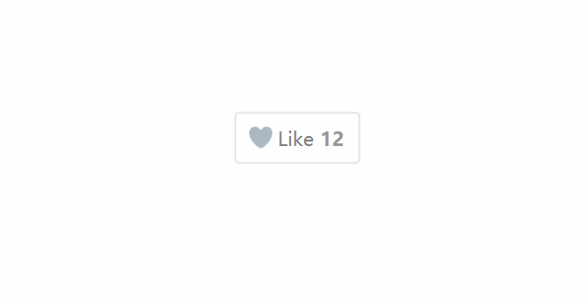

### label登录实现


### 2020_02_11_渐变RGB读条


### 2020_02_12_马赛克图片-利用图片加载算法


### 2020_02_12_视频背景切换

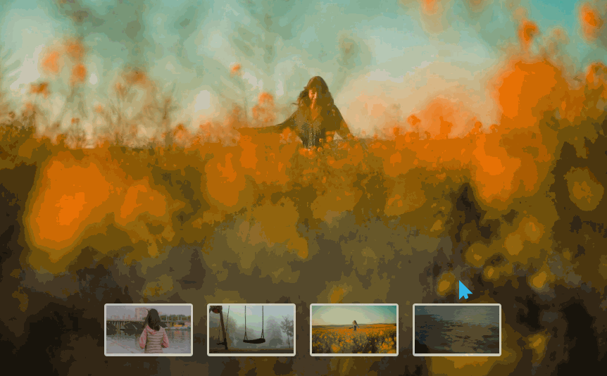

### 2020_02_12_蛇形加载动画


### 2020_02_13_黄色高亮加载动画


### 2020_02_13_水球加载动画


### 2020_02_15_心形鼠标滑动效果


### 2020_02_16_闪烁等待效果


### 2020_02_17_css制作开关

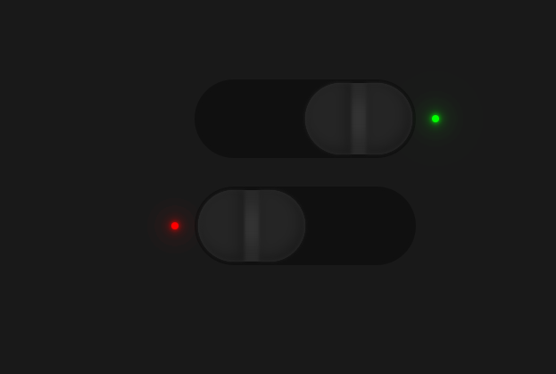

### 2020_02_18_输入式朝阳文字


### 2020_02_19_菜单栏


### 2020_02_20_滚动显示阴影文字


### 2020_02_23_jq动态表单数据


### 2020_02_24_等待效果


### 2020_02_25_悬停效果按钮


### 2020_02_26_图片文字制作视差效果


### 2020_02_27_滚动渐变导航栏


### 2020_02_28_响应式菜单

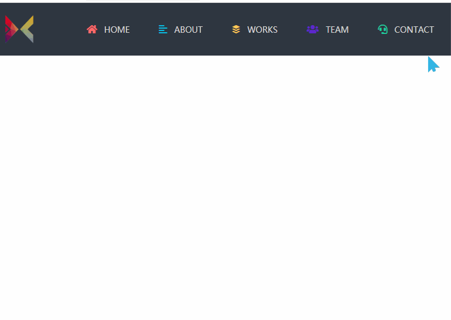

### 2020_02_29_分布图层悬停效果


### 2020_03_01_显示隐藏密码框

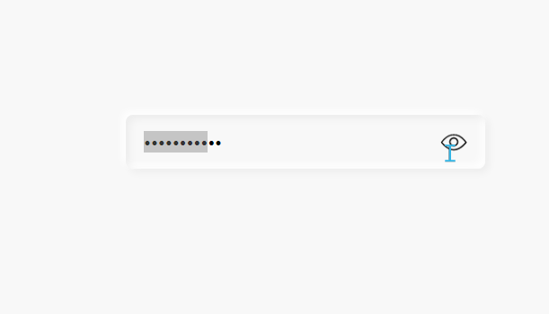

### 2020_03_03_水波特效

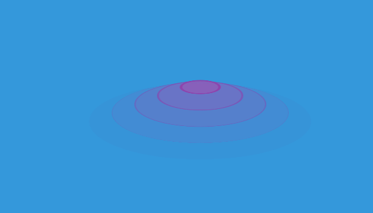

### 2020_03_04_技能栏UI悬停设计


### 2020_03_05_信封动画


### 2020_03_06_Glide插件的图片滚动效果


### 2020_03_07_滚动条美化


### 2020_03_09_登陆界面


### 2020_03_13_密码提示框的制作


### 2020_03_14_使用范围滑块更改页面亮度


### 2020_03_15_弹动加载动画


### 2020_03_16_使用jQuery制作颜色效果选择器

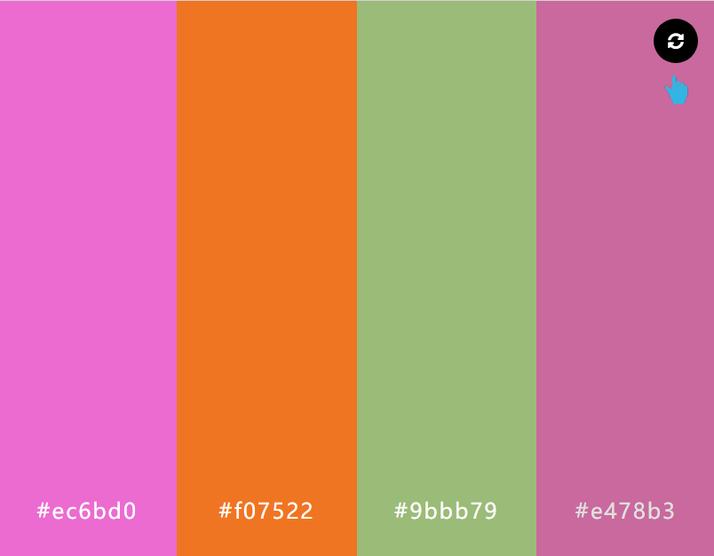

### 2020_03_17_jQuery制作扁平化动态技能栏

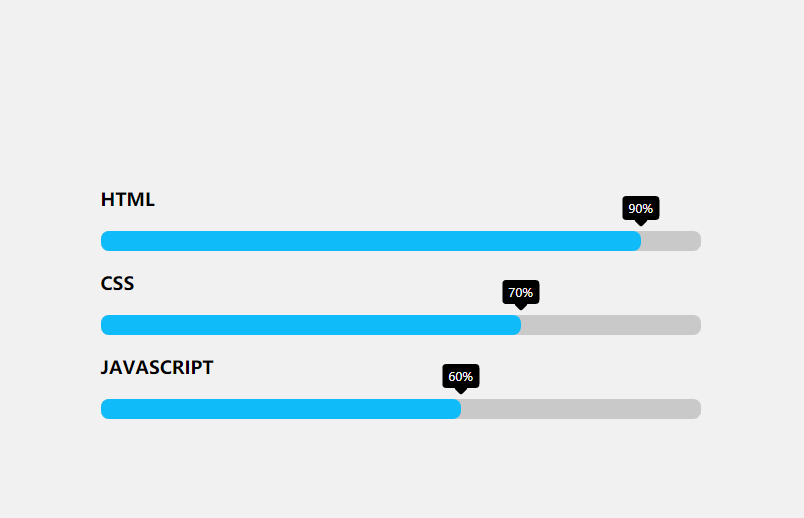

### 2020_03_18_响应式联系信息


### 2020_03_19_事件通信菜单


### 2020_03_20_带有社交图标的动画共享按钮


### 2020_03_21_CSS3 Neumorphic社交媒体图标


### 2020_03_22_CSS3制作带有子菜单的下拉菜单


### 2020_06_11_windows加载动画

